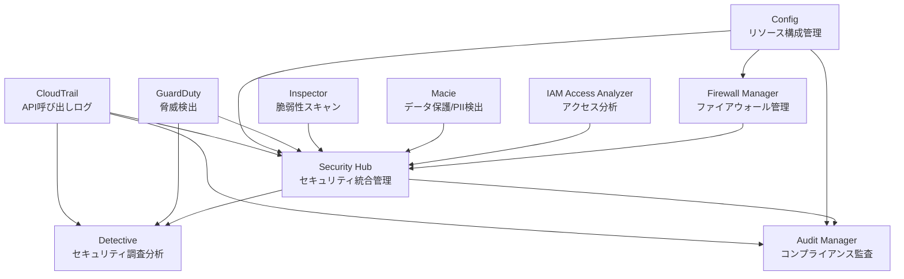
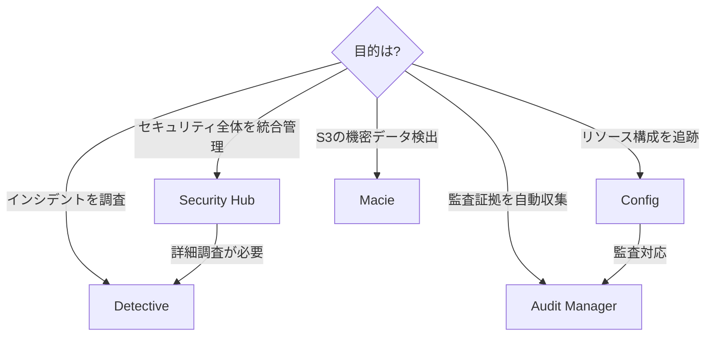

# AWSセキュリティ・コンプライアンスサービス

作成日: 2025-12-30

## 概要

AWS Security Hub、Config、Audit Manager、Detective、Macieは、それぞれ異なる目的を持つセキュリティ・コンプライアンスサービスです。これらは連携して包括的なセキュリティ管理を提供します。

## サービス間の関係図

## サービス比較表

| サービス | 主な用途 | データソース | 主要機能 | 自動修復 |
|---|---|---|---|---|
| **Security Hub** | セキュリティ検出結果の統合管理 | 複数AWSサービス | 統合ダッシュボード、コンプライアンスチェック | 〇（EventBridge連携） |
| **Config** | リソース構成の記録・評価 | AWSリソース設定 | 構成履歴、コンプライアンス評価 | 〇（SSM連携） |
| **Audit Manager** | 監査証拠の自動収集 | Config, CloudTrail等 | 監査レポート生成、証拠管理 | × |
| **Detective** | セキュリティインシデント調査 | GuardDuty, CloudTrail, VPC Flow Logs | グラフ分析、根本原因分析 | × |
| **Macie** | 機密データ検出・保護 | S3バケット | PII/機密データ検出、分類 | × |
| **GuardDuty** | 脅威検出 | CloudTrail, VPC Flow Logs, DNS | 異常検出、脅威インテリジェンス | × |
| **Inspector** | 脆弱性評価 | EC2, ECR, Lambda | 脆弱性スキャン、ネットワーク評価 | × |
| **IAM Access Analyzer** | 外部アクセス権限の分析 | IAMポリシー、リソースポリシー | 外部アクセスの検出、未使用アクセス分析 | × |
| **Firewall Manager** | ファイアウォールの一元管理 | WAF, Shield, SG, Network Firewall | マルチアカウント・ポリシー管理 | 〇（自動適用） |

## 各サービスの詳細

### Security Hub

**目的**: 複数のセキュリティサービスの検出結果を統合管理

| 項目 | 内容 |
|---|---|
| **統合先サービス** | GuardDuty, Inspector, Macie, IAM Access Analyzer, Firewall Manager, Config等 |
| **セキュリティ基準** | AWS基礎セキュリティベストプラクティス、CIS AWS Foundations、PCI DSS |
| **検出結果の重要度** | CRITICAL, HIGH, MEDIUM, LOW, INFORMATIONAL |
| **自動修復** | EventBridge + Lambda/SSM Automation |
| **リージョン** | リージョナル（集約リージョン設定可能） |
| **前提条件** | Config有効化推奨（一部のチェックで必須） |

**ユースケース**:
- 複数アカウント・サービスのセキュリティ状況を一元管理
- コンプライアンス基準への準拠状況確認
- セキュリティ検出結果の優先順位付けと対応

### Config

**目的**: AWSリソースの構成変更を記録・評価

| 項目 | 内容 |
|---|---|
| **記録対象** | EC2, S3, VPC, IAM等のAWSリソース |
| **Config Rules** | マネージド/カスタムルールでコンプライアンス評価 |
| **構成履歴** | リソース構成の時系列変更履歴 |
| **配信先** | S3バケット、SNS |
| **リージョン** | リージョナル（マルチアカウント・リージョン対応） |
| **修復** | SSM Automation Documentで自動修復 |

**ユースケース**:
- リソース構成変更の監査証跡
- セキュリティグループやIAMポリシーの変更追跡
- コンプライアンス違反の自動検出と修復

### Audit Manager

**目的**: 監査用の証拠を自動収集し、レポート生成

| 項目 | 内容 |
|---|---|
| **データソース** | Config, CloudTrail, Security Hub, License Manager |
| **フレームワーク** | PCI DSS, GDPR, HIPAA, SOC 2等の監査フレームワーク |
| **証拠収集** | 自動収集（日次/週次/月次） |
| **評価** | コントロールごとの証拠とコンプライアンス状況 |
| **レポート** | PDF/HTMLでの監査レポート出力 |
| **リージョン** | リージョナル |

**ユースケース**:
- 外部監査対応の効率化
- コンプライアンス証拠の継続的収集
- 監査準備作業の自動化

### Detective

**目的**: セキュリティインシデントの根本原因分析

| 項目 | 内容 |
|---|---|
| **データソース** | GuardDuty, VPC Flow Logs, CloudTrail, EKS監査ログ |
| **分析方法** | ML/グラフ理論による異常行動パターン分析 |
| **保持期間** | 最大1年間のデータ分析 |
| **可視化** | インタラクティブなグラフ可視化 |
| **調査対象** | IP、AWSアカウント、IAMユーザー、EC2インスタンス等 |
| **前提条件** | GuardDuty有効化が必須（48時間以上） |

**ユースケース**:
- GuardDutyの検出結果の詳細調査
- セキュリティインシデントの影響範囲特定
- 不審なアクティビティの時系列分析

### Macie

**目的**: S3内の機密データ検出と保護

| 項目 | 内容 |
|---|---|
| **検出対象** | PII（個人識別情報）、金融情報、認証情報等 |
| **スキャン方式** | 自動化検出ジョブ、サンプリング |
| **データ識別子** | マネージド（組み込み）/カスタム識別子 |
| **検出結果** | S3バケット単位、オブジェクト単位の機密度スコア |
| **通知** | EventBridge経由でSNS/Lambda等に通知 |
| **対象** | S3バケットのみ |

**ユースケース**:
- GDPR/CCPA等のデータプライバシー規制対応
- S3バケット内のPII検出と分類
- 意図しない機密データ公開の検出

### GuardDuty

**目的**: AWS環境の脅威を継続的に検出

| 項目 | 内容 |
|---|---|
| **データソース** | CloudTrail（管理/S3イベント）、VPC Flow Logs、DNS クエリログ、EKS監査ログ、RDS/Aurora/ECS Runtime Monitoring |
| **検出内容** | 異常なAPI呼び出し、不正アクセス、暗号通貨マイニング、データ流出 |
| **脅威インテリジェンス** | AWS脅威リスト、CrowdStrike、Proofpointなど |
| **重要度** | Low、Medium、High（0.1〜8.9のスコア） |
| **保護タイプ** | S3 Protection、EKS Protection、RDS Protection、Lambda Protection、Runtime Monitoring |
| **通知** | EventBridge経由でSNS/Lambda等 |

**ユースケース**:
- 不審なAPIアクティビティの検出
- EC2インスタンスの侵害検出
- データ流出の検出

### Inspector

**目的**: ワークロードの脆弱性を自動評価

| 項目 | 内容 |
|---|---|
| **評価対象** | EC2インスタンス、ECRコンテナイメージ、Lambda関数 |
| **スキャン内容** | ソフトウェア脆弱性（CVE）、ネットワーク到達可能性 |
| **スキャン方式** | 継続的スキャン（EC2/ECR）、デプロイ時スキャン（Lambda） |
| **脆弱性DB** | CVE（Common Vulnerabilities and Exposures） |
| **リスクスコア** | Inspector Score（CVSSベース、環境要因加味） |
| **前提条件** | SSM Agent（EC2）、ECRスキャン有効化 |

**ユースケース**:
- EC2/コンテナの脆弱性管理
- コンプライアンス要件（PCI DSS等）対応
- ソフトウェアパッチ適用の優先順位付け

### IAM Access Analyzer

**目的**: 外部エンティティからのアクセス権限を分析

| 項目 | 内容 |
|---|---|
| **分析対象** | IAMロール、S3バケット、KMSキー、Lambda、SQS、Secrets Manager等 |
| **検出内容** | 外部アカウント・パブリックアクセスの権限 |
| **分析タイプ** | External Access（外部アクセス）、Unused Access（未使用アクセス） |
| **ゾーン** | 信頼ゾーン（組織/アカウント）を定義 |
| **継続監視** | リソースポリシー変更を継続的に監視 |
| **統合** | Security Hubに検出結果を送信 |

**ユースケース**:
- 意図しない外部共有の検出
- 最小権限原則の実現（未使用アクセスの削除）
- パブリックアクセス設定の監視

### Firewall Manager

**目的**: 複数アカウントのファイアウォール設定を一元管理

| 項目 | 内容 |
|---|---|
| **管理対象** | WAF、Shield Advanced、セキュリティグループ、Network Firewall、DNS Firewall |
| **ポリシータイプ** | WAFルール、SGルール、Shield保護、ネットワークFW |
| **適用範囲** | AWS Organizations全体/特定OU |
| **自動適用** | 新しいリソースに自動でポリシー適用 |
| **コンプライアンス** | ポリシー違反を検出・レポート |
| **前提条件** | AWS Organizations、Config有効化 |

**ユースケース**:
- マルチアカウントのWAFルール統一管理
- セキュリティグループのベースライン強制
- DDoS保護（Shield Advanced）の一元管理

## サービス選択のポイント

## よくある質問（SAP試験頻出）

### Q1: Security HubとAudit Managerの違いは？

| 観点 | Security Hub | Audit Manager |
|---|---|---|
| **目的** | セキュリティ検出結果の統合管理 | 監査証拠の自動収集とレポート生成 |
| **対象** | セキュリティ脅威・コンプライアンス違反 | コンプライアンス監査の証拠 |
| **出力** | リアルタイムの検出結果とダッシュボード | 監査レポート（PDF/HTML） |
| **自動修復** | 可能（EventBridge連携） | 不可（証拠収集のみ） |
| **ユースケース** | 日常のセキュリティ運用 | 外部監査対応 |

**使い分け**:
- セキュリティ問題を**検出・修復**したい → **Security Hub**
- 監査のための**証拠収集・レポート作成**したい → **Audit Manager**

### Q2: Security HubとConfigの違いは？

| 観点 | Security Hub | Config |
|---|---|---|
| **範囲** | 複数サービスの検出結果を統合 | リソース構成のみ |
| **データソース** | GuardDuty, Macie, Inspector等 | AWSリソースの構成情報 |
| **評価基準** | セキュリティ基準（CIS, PCI DSS等） | Config Rules（カスタム可能） |
| **依存関係** | Configを利用する（一部チェック） | 独立動作 |

**使い分け**:
- 包括的なセキュリティ管理 → **Security Hub**（Configも併用）
- リソース構成の変更追跡・評価のみ → **Config**

### Q3: DetectiveとSecurity Hubの違いは？

| 観点 | Detective | Security Hub |
|---|---|---|
| **目的** | インシデントの根本原因分析 | 検出結果の統合管理 |
| **タイミング** | インシデント**発生後**の調査 | リアルタイム検出 |
| **分析方法** | ML/グラフ理論で時系列分析 | ルールベースのチェック |
| **前提条件** | GuardDuty必須（48時間以上） | なし（Config推奨） |
| **データ保持** | 最大1年間 | 90日間（デフォルト） |

**使い分け**:
- GuardDutyの検出を**詳しく調査**したい → **Detective**
- セキュリティ状況を**統合管理**したい → **Security Hub**

### Q4: ConfigとCloudTrailの違いは？

| 観点 | Config | CloudTrail |
|---|---|---|
| **記録対象** | リソースの**構成変更** | API**呼び出し** |
| **問いに答える** | 「どの**状態**だった？」 | 「誰が**何を**した？」 |
| **評価機能** | Config Rulesで評価可能 | なし（ログのみ） |
| **用途** | コンプライアンス評価 | 監査証跡、操作履歴 |

**例**:
- セキュリティグループが**いつ変更されたか**知りたい → **CloudTrail**
- セキュリティグループの**過去の設定内容**を知りたい → **Config**

### Q5: MacieとGuardDutyの違いは？

| 観点 | Macie | GuardDuty |
|---|---|---|
| **対象** | S3バケット内のデータ | AWS環境全体の脅威 |
| **検出内容** | PII/機密データ | 不審なアクティビティ、脅威 |
| **スキャン方式** | 能動的スキャン（ジョブ実行） | 受動的監視（継続的） |
| **データソース** | S3オブジェクト | CloudTrail, VPC Flow Logs, DNS |

**使い分け**:
- S3の**データ内容**を守りたい → **Macie**
- AWS環境の**セキュリティ脅威**を検出したい → **GuardDuty**

## SAP試験の重要ポイント

### Security Hub
- **統合ハブ**: 複数サービスの検出結果を一元管理
- **前提**: Config有効化が推奨（一部チェックで必須）
- **自動修復**: EventBridge + Lambda/SSM
- **集約**: クロスリージョン・クロスアカウント集約可能

### Config
- **記録**: リソース構成の変更履歴を記録
- **評価**: Config Rulesでコンプライアンス評価
- **修復**: SSM Automation Documentで自動修復
- **コスト**: 記録アイテム数と評価数で課金

### Audit Manager
- **証拠収集**: 自動的に監査証拠を収集
- **データソース**: Config, CloudTrail, Security Hub等
- **フレームワーク**: PCI DSS, HIPAA, GDPR等に対応
- **用途**: 外部監査対応の効率化

### Detective
- **前提**: GuardDuty有効化が必須（48時間以上）
- **分析**: ML/グラフ理論で根本原因分析
- **データ**: 最大1年間保持
- **用途**: GuardDutyの検出結果の詳細調査

### Macie
- **対象**: S3バケットのみ
- **検出**: PII、金融情報、認証情報等
- **識別子**: マネージド/カスタム識別子
- **用途**: データプライバシー規制対応

### GuardDuty
- **データソース**: CloudTrail、VPC Flow Logs、DNS、EKS監査ログ、Runtime Monitoring
- **検出**: 異常API呼び出し、不正アクセス、暗号通貨マイニング
- **脅威インテリジェンス**: AWS脅威リスト、サードパーティ統合
- **用途**: リアルタイムの脅威検出

### Inspector
- **評価対象**: EC2、ECR、Lambda
- **スキャン**: ソフトウェア脆弱性（CVE）、ネットワーク到達可能性
- **方式**: 継続的スキャン（EC2/ECR）、デプロイ時（Lambda）
- **用途**: 脆弱性管理、パッチ優先順位付け

### IAM Access Analyzer
- **分析タイプ**: External Access（外部アクセス）、Unused Access（未使用アクセス）
- **対象**: IAMロール、S3、KMS、Lambda、SQS等
- **ゾーン**: 信頼ゾーン（組織/アカウント）を定義
- **用途**: 最小権限原則の実現、外部共有検出

### Firewall Manager
- **管理対象**: WAF、Shield、セキュリティグループ、Network Firewall
- **前提**: AWS Organizations、Config有効化
- **自動適用**: 新リソースに自動でポリシー適用
- **用途**: マルチアカウントのファイアウォール統一管理
