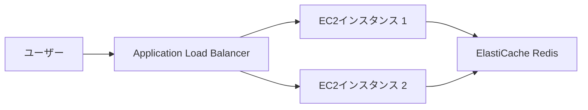
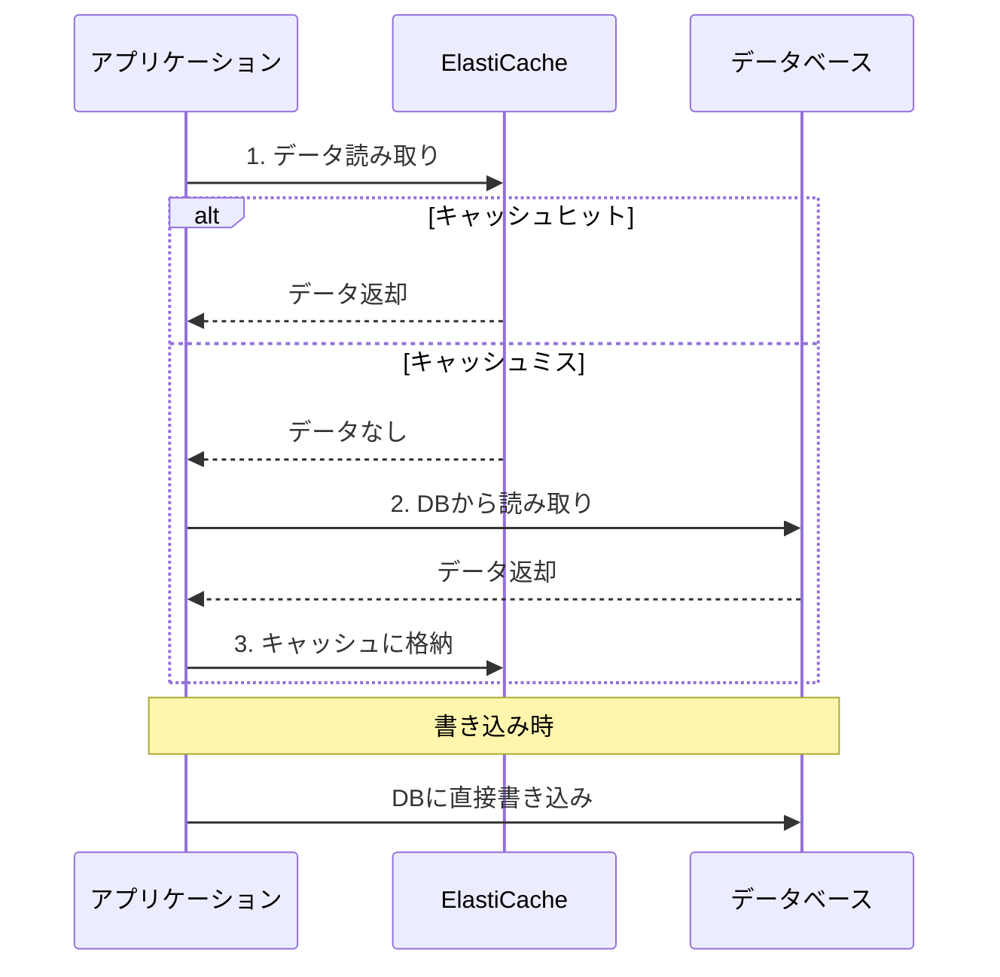
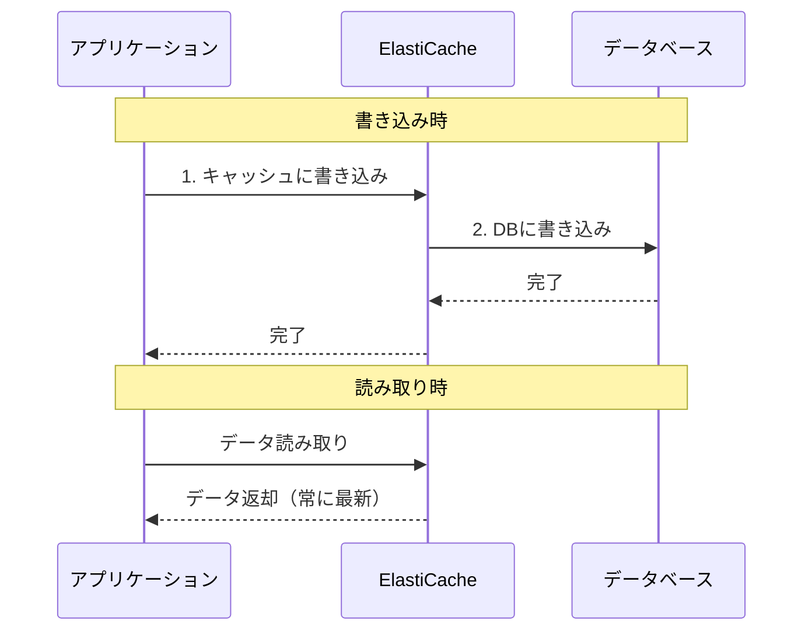

# Amazon ElastiCache

作成日: 2025-12-31

## 概要

Amazon ElastiCacheは、インメモリキャッシュを提供するフルマネージドサービスです。RedisとMemcachedの2つのエンジンをサポートし、データベース負荷の軽減やアプリケーションのパフォーマンス向上に使用されます。

## デプロイモード比較

| モード | 説明 | 管理 | スケーリング | 用途 |
|---|---|---|---|---|
| **セルフデザインクラスタ** | ノードタイプ・数を手動設定 | 手動 | 手動 | 予測可能なワークロード |
| **Serverless** | 容量を自動管理 | 自動 | 自動 | 変動するワークロード、開発環境 |

### ElastiCache Serverless（Redis）

| 項目 | 内容 |
|---|---|
| **容量管理** | 自動スケーリング（使用量に応じて） |
| **可用性** | マルチAZ、自動フェイルオーバー |
| **料金** | ECPUs（ElastiCache Processing Units）とストレージ使用量ベース |
| **最小容量** | 設定可能（コスト管理） |
| **最大容量** | 設定可能（上限管理） |
| **対応エンジン** | Redis のみ（Memcached非対応） |
| **データ永続化** | サポート |

**メリット**:
- キャパシティプランニング不要
- 使用量に応じた自動スケーリング
- アイドル時のコスト削減

**ユースケース**:
- トラフィックが予測不可能なアプリケーション
- 開発・テスト環境
- スタートアップ・新規プロジェクト

## エンジン比較表

| 項目 | Redis | Memcached |
|---|---|---|
| **データ構造** | 文字列、リスト、セット、ソート済みセット、ハッシュ等 | 文字列のみ（キー・バリュー） |
| **永続化** | 可能（スナップショット、AOF） | 不可 |
| **レプリケーション** | あり（マルチAZ対応） | なし |
| **自動フェイルオーバー** | あり | なし |
| **マルチスレッド** | シングルスレッド | マルチスレッド |
| **パブ/サブ** | あり | なし |
| **トランザクション** | あり | なし |
| **Lua スクリプト** | あり | なし |
| **ソート/ランキング** | あり | なし |
| **バックアップ/復元** | あり | なし |
| **スケーリング** | 垂直・水平（シャーディング） | 水平（ノード追加/削除） |

## Redis クラスタモード

### クラスタモード無効（Disabled）

| 項目 | 内容 |
|---|---|
| **構成** | 1つのプライマリノード + 最大5つのレプリカノード |
| **シャード数** | 1つ |
| **書き込み** | プライマリノードのみ |
| **読み取り** | プライマリ + レプリカ（読み取りエンドポイント） |
| **フェイルオーバー** | 自動（マルチAZ有効時） |
| **最大データサイズ** | 単一ノードのメモリサイズまで |
| **用途** | シンプルなキャッシュ、セッションストア |

### クラスタモード有効（Enabled）

| 項目 | 内容 |
|---|---|
| **構成** | 複数シャード（最大500） × （1プライマリ + 最大5レプリカ） |
| **シャード数** | 1〜500 |
| **書き込み** | 各シャードのプライマリノード |
| **読み取り** | 各シャードのプライマリ + レプリカ |
| **データ分散** | 自動（ハッシュスロット） |
| **フェイルオーバー** | シャード単位で自動 |
| **最大データサイズ** | シャード数 × ノードメモリサイズ |
| **用途** | 大規模データ、高スループット |

## マルチAZ構成

### Redis マルチAZ

| 機能 | 説明 |
|---|---|
| **自動フェイルオーバー** | プライマリノード障害時、レプリカを自動昇格 |
| **レプリケーション** | 同期レプリケーション（非同期もサポート） |
| **フェイルオーバー時間** | 通常数分以内 |
| **エンドポイント** | プライマリエンドポイント（DNS自動更新） |
| **読み取りエンドポイント** | 全レプリカへの負荷分散 |
| **前提条件** | 最低1つのレプリカノードが必要 |

### Memcached

- **マルチAZ非対応**: フェイルオーバー機能なし
- **可用性**: アプリケーション側で複数ノードを管理
- **ノード障害**: 該当ノードのデータは失われる

## セッション管理とスティッキーセッション

### ElastiCacheを使用したセッション管理



| アプローチ | 説明 | メリット | デメリット |
|---|---|---|---|
| **スティッキーセッション** | ALBのセッションアフィニティでユーザーを同一インスタンスに固定 | 実装シンプル | インスタンス障害時セッション喪失、負荷分散の偏り |
| **ElastiCache セッションストア** | セッションデータをRedisに保存、どのインスタンスからもアクセス可能 | 高可用性、完全な負荷分散、インスタンス障害に強い | 若干の複雑性、ネットワークレイテンシ |

**推奨**: ElastiCache Redisでのセッション管理（高可用性が必要な場合）

## キャッシング戦略

### 主要な戦略比較

| 戦略 | 読み取り | 書き込み | データ整合性 | キャッシュミス時 | 用途 |
|---|---|---|---|---|---|
| **Lazy Loading（遅延読み込み）** | キャッシュ確認 → ミス時DB取得 → キャッシュ格納 | DB直接書き込み | 結果整合性 | DB読み取り発生 | 読み取り中心、全データキャッシュ不要 |
| **Write-Through（ライトスルー）** | キャッシュから読み取り | キャッシュ + DB同時書き込み | 強整合性 | 初回読み取り時ミス | 書き込み中心、データ整合性重視 |
| **Adding TTL** | Lazy/Write-Through + TTL | 同上 | 同上 | 同上 | 古いデータ自動削除 |

### Lazy Loading（遅延読み込み）



#### 特徴

| 項目 | 内容 |
|---|---|
| **読み取りフロー** | 1. キャッシュ確認 → 2. ミス時DBから取得 → 3. キャッシュに格納 |
| **書き込みフロー** | DBに直接書き込み（キャッシュ更新なし） |
| **メリット** | 必要なデータのみキャッシュ、キャッシュ障害時もアプリ継続可能 |
| **デメリット** | 初回読み取り遅延、古いデータが残る可能性 |

#### コード例（擬似コード）

```python
def get_user(user_id):
    # 1. キャッシュ確認
    user = cache.get(user_id)

    if user is None:  # キャッシュミス
        # 2. DBから取得
        user = db.query("SELECT * FROM users WHERE id = ?", user_id)
        # 3. キャッシュに格納
        cache.set(user_id, user)

    return user

def update_user(user_id, data):
    # DBに直接書き込み（キャッシュ更新なし）
    db.update("UPDATE users SET ... WHERE id = ?", user_id, data)
```

### Write-Through（ライトスルー）



#### 特徴

| 項目 | 内容 |
|---|---|
| **書き込みフロー** | 1. キャッシュに書き込み → 2. DBに書き込み |
| **読み取りフロー** | キャッシュから読み取り（常に最新） |
| **メリット** | キャッシュ常に最新、読み取り高速 |
| **デメリット** | 書き込み遅延、使わないデータもキャッシュ、初回読み取りミス |

#### コード例（擬似コード）

```python
def update_user(user_id, data):
    # 1. DBに書き込み
    db.update("UPDATE users SET ... WHERE id = ?", user_id, data)
    # 2. キャッシュに書き込み
    cache.set(user_id, data)

def get_user(user_id):
    # キャッシュから読み取り
    user = cache.get(user_id)

    if user is None:  # 初回のみミス
        user = db.query("SELECT * FROM users WHERE id = ?", user_id)
        cache.set(user_id, user)

    return user
```

### Adding TTL（Time To Live）

| 項目 | 内容 |
|---|---|
| **役割** | Lazy/Write-Throughに加えて有効期限設定 |
| **効果** | 古いデータ自動削除、メモリ効率向上 |
| **設定例** | セッション: 30分、ユーザー情報: 1時間、商品情報: 24時間 |

#### コード例

```python
# TTL付きでキャッシュ格納
cache.set(user_id, user, ttl=3600)  # 1時間で期限切れ
```

### 戦略の組み合わせ（推奨）

| 組み合わせ | 説明 | 用途 |
|---|---|---|
| **Lazy Loading + TTL** | 遅延読み込み + 有効期限 | 一般的なキャッシュ（最も推奨） |
| **Write-Through + TTL** | ライトスルー + 有効期限 | 読み取り頻度高、書き込み少 |
| **Write-Through + Lazy Loading** | 重要データはライトスルー、その他は遅延 | ハイブリッド戦略 |

### Cache Invalidation（キャッシュ無効化）

| 方法 | 説明 | 用途 |
|---|---|---|
| **TTL** | 時間経過で自動削除 | 一般的 |
| **明示的削除** | 更新時にキャッシュ削除 | データ整合性重視 |
| **Write-Through** | 更新時にキャッシュも更新 | 読み取り性能重視 |

#### 明示的削除の例

```python
def update_user(user_id, data):
    # DBに書き込み
    db.update("UPDATE users SET ... WHERE id = ?", user_id, data)
    # キャッシュ削除（次回読み取り時に再取得）
    cache.delete(user_id)
```

### Thundering Herd Problem（キャッシュスタンピード）

| 問題 | 説明 |
|---|---|
| **発生条件** | 人気データのTTL期限切れ時、多数の同時リクエスト |
| **影響** | 全リクエストがDBアクセス → DB過負荷 |

#### 対策

| 対策 | 説明 |
|---|---|
| **ロック機構** | 最初のリクエストのみDB取得、他は待機 |
| **確率的早期再計算** | TTL期限前に一部リクエストで再取得 |
| **ジッター追加** | TTLに乱数追加（期限切れ分散） |

### ユースケース別推奨戦略

| ユースケース | 推奨戦略 | 理由 |
|---|---|---|
| **ECサイト商品情報** | Lazy Loading + TTL（1時間） | 全商品キャッシュ不要、在庫変動許容 |
| **ユーザープロフィール** | Lazy Loading + TTL（30分） | 更新頻度低、読み取り多 |
| **セッション管理** | Write-Through + TTL（30分） | 整合性重要、自動期限切れ |
| **リアルタイム在庫** | Write-Through + 明示的削除 | 整合性最重要 |
| **ニュースフィード** | Lazy Loading + TTL（5分） | 多少の遅延許容、アクセス集中 |
| **APIレート制限** | Write-Through + TTL | カウンター正確性重要 |

## バックアップと復元

### Redis

| 項目 | 内容 |
|---|---|
| **自動バックアップ** | 日次、保持期間1〜35日 |
| **手動スナップショット** | 任意のタイミングで作成可能 |
| **バックアップウィンドウ** | 指定可能（パフォーマンス影響を考慮） |
| **バックアップ元** | レプリカノードから取得（プライマリ負荷軽減） |
| **復元** | 新しいクラスタとして復元 |
| **エクスポート** | S3へのエクスポート可能 |

### Memcached

- **バックアップ機能なし**: データ永続化非対応

## スケーリング戦略

### 垂直スケーリング（ノードタイプ変更）

| エンジン | 方法 | ダウンタイム |
|---|---|---|
| **Redis（クラスタ無効）** | 新しいノードタイプでレプリカ作成 → フェイルオーバー | 最小限 |
| **Redis（クラスタ有効）** | オンラインでノードタイプ変更 | なし |
| **Memcached** | 新しいクラスタ作成 → 切り替え | あり |

### 水平スケーリング

| エンジン | スケールアウト | スケールイン |
|---|---|---|
| **Redis（クラスタ無効）** | レプリカ追加（読み取り性能向上） | レプリカ削除 |
| **Redis（クラスタ有効）** | シャード追加（容量・書き込み性能向上） | シャード削除 |
| **Memcached** | ノード追加（自動再配置） | ノード削除 |

## セキュリティ

| 機能 | Redis | Memcached |
|---|---|---|
| **暗号化（転送中）** | TLS対応 | TLS対応 |
| **暗号化（保管中）** | あり | なし |
| **認証** | Redis AUTH、RBAC（Redis 6.x以降） | SASL認証 |
| **VPC** | 必須（パブリックアクセス不可） | 必須（パブリックアクセス不可） |
| **セキュリティグループ** | 必須 | 必須 |

## ユースケース別推奨

| ユースケース | 推奨エンジン | 理由 |
|---|---|---|
| **セッションストア** | Redis（マルチAZ） | 永続化、フェイルオーバー対応 |
| **リーダーボード/ランキング** | Redis | ソート済みセット機能 |
| **パブ/サブメッセージング** | Redis | パブ/サブ機能 |
| **シンプルなキャッシュ（大量データ）** | Memcached | マルチスレッド、シンプル |
| **リアルタイム分析** | Redis | データ構造の豊富さ |
| **高可用性が必要** | Redis（マルチAZ） | 自動フェイルオーバー |

## SAP試験の重要ポイント

### Redis vs Memcached
- **永続化必要** → Redis
- **マルチAZ/フェイルオーバー必要** → Redis
- **複雑なデータ構造** → Redis
- **シンプル・高速・マルチスレッド** → Memcached

### クラスタモード
- **クラスタ無効**: 最大5レプリカ、シャード1つ、シンプル
- **クラスタ有効**: 最大500シャード、水平スケーリング、大規模データ

### マルチAZ
- **Redis**: 自動フェイルオーバー、レプリカ必須
- **Memcached**: 非対応

### セッション管理
- **スティッキーセッション**: ALB機能、インスタンス固定、障害に弱い
- **ElastiCache**: 分散セッション、高可用性、推奨

### スケーリング
- **垂直**: ノードタイプ変更
- **水平（Redis）**: レプリカ追加（読み取り）、シャード追加（書き込み・容量）
- **水平（Memcached）**: ノード追加/削除

### バックアップ
- **Redis**: 自動/手動バックアップ、S3エクスポート可能
- **Memcached**: バックアップ機能なし

### デプロイモード
- **Serverless**: Redis のみ、自動スケーリング、容量管理不要
- **セルフデザイン**: Redis/Memcached、手動管理、予測可能なワークロード

### キャッシング戦略
- **Lazy Loading（遅延読み込み）**: キャッシュミス時DB取得→格納、必要なデータのみキャッシュ、結果整合性
- **Write-Through（ライトスルー）**: 書き込み時キャッシュ+DB同時更新、強整合性、読み取り高速
- **TTL**: 有効期限設定、古いデータ自動削除、メモリ効率向上
- **推奨**: Lazy Loading + TTL（一般的）、Write-Through + TTL（整合性重視）
- **Cache Invalidation**: TTL、明示的削除、Write-Through
- **Thundering Herd対策**: ロック機構、確率的早期再計算、ジッター追加
