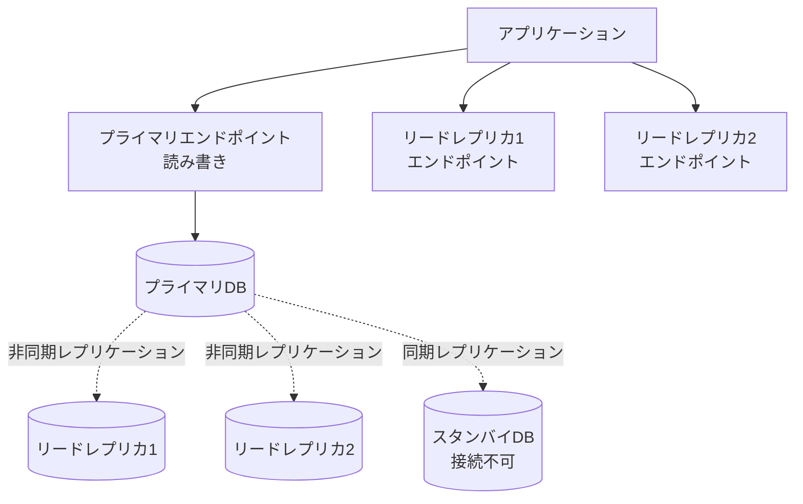
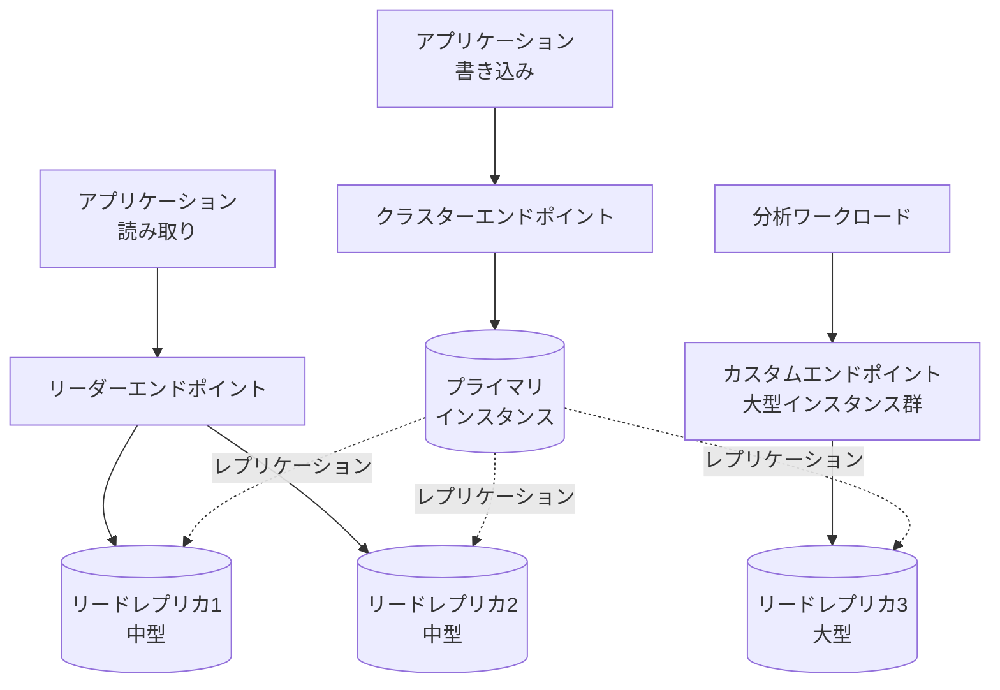

# RDS・Aurora エンドポイント

作成日: 2025-12-31

## 概要

RDSとAuroraは用途に応じた複数のエンドポイントを提供します。適切なエンドポイント選択により、読み取り負荷分散、フェイルオーバー対応、特定インスタンスへの接続が可能になります。

## RDS エンドポイント

### RDS（マルチAZ構成）

| エンドポイント種類 | 用途 | 接続先 | フェイルオーバー |
|---|---|---|---|
| **インスタンスエンドポイント** | プライマリインスタンスへの読み書き | プライマリDB | 自動でスタンバイに切り替わる（DNS更新） |
| **リードレプリカエンドポイント** | 読み取り専用 | 各リードレプリカ | なし（個別管理） |

**重要**:
- マルチAZのスタンバイには**直接接続不可**
- フェイルオーバー時、インスタンスエンドポイントのDNSが自動更新（60秒程度）
- リードレプリカは別リージョンにも配置可能

### RDS エンドポイント構成図

## Aurora エンドポイント

### Aurora エンドポイント一覧

| エンドポイント種類 | 用途 | 接続先 | フェイルオーバー | 負荷分散 |
|---|---|---|---|---|
| **クラスターエンドポイント** | 読み書き | プライマリインスタンス | 自動 | なし |
| **リーダーエンドポイント** | 読み取り専用 | 全リードレプリカ | なし | 自動（ラウンドロビン） |
| **カスタムエンドポイント** | 特定インスタンスグループ | 指定したインスタンス群 | 設定による | 自動 |
| **インスタンスエンドポイント** | 特定インスタンス | 個別インスタンス | なし | なし |

### 各エンドポイントの詳細

#### クラスターエンドポイント（Cluster Endpoint）

| 項目 | 内容 |
|---|---|
| **用途** | 書き込み操作（INSERT, UPDATE, DELETE） |
| **接続先** | 常にプライマリインスタンス |
| **フェイルオーバー** | 自動（新しいプライマリへDNS更新） |
| **形式** | `clustername.cluster-xxxxx.region.rds.amazonaws.com` |
| **推奨ユースケース** | 書き込みクエリの実行 |

#### リーダーエンドポイント（Reader Endpoint）

| 項目 | 内容 |
|---|---|
| **用途** | 読み取り操作（SELECT） |
| **接続先** | 全てのリードレプリカ（プライマリ除く） |
| **負荷分散** | 自動（接続レベルでラウンドロビン） |
| **フェイルオーバー** | リードレプリカ障害時、自動的に除外 |
| **形式** | `clustername.cluster-ro-xxxxx.region.rds.amazonaws.com` |
| **推奨ユースケース** | 読み取りクエリの負荷分散 |

**重要**: リーダーエンドポイントは接続時に負荷分散（クエリレベルではない）

#### カスタムエンドポイント（Custom Endpoint）

| 項目 | 内容 |
|---|---|
| **用途** | 特定の用途に合わせたインスタンスグループ化 |
| **接続先** | 指定したインスタンス群（プライマリ含む可能） |
| **負荷分散** | 指定したインスタンス間で自動 |
| **作成数** | クラスタあたり最大5つ |
| **形式** | `custom-name.cluster-custom-xxxxx.region.rds.amazonaws.com` |

**ユースケース例**:
- 分析クエリ用に大型インスタンスのみ指定
- 本番トラフィックと分析トラフィックの分離
- 異なるインスタンスタイプの使い分け

#### インスタンスエンドポイント（Instance Endpoint）

| 項目 | 内容 |
|---|---|
| **用途** | 特定インスタンスへの直接接続 |
| **接続先** | 指定したインスタンス1つ |
| **負荷分散** | なし |
| **形式** | `instance-name.xxxxx.region.rds.amazonaws.com` |
| **推奨ユースケース** | トラブルシューティング、特定インスタンスでの診断 |

## Aurora エンドポイント構成図

## フェイルオーバー時の動作

### RDS マルチAZ

| フェーズ | 動作 | 時間 |
|---|---|---|
| **障害検知** | プライマリインスタンスの障害を検知 | 数秒 |
| **DNS切り替え** | インスタンスエンドポイントのDNSをスタンバイに更新 | 60〜120秒 |
| **自動再接続** | アプリケーションが新しいプライマリに再接続 | クライアント依存 |

### Aurora

| フェーズ | 動作 | 時間 |
|---|---|---|
| **障害検知** | プライマリインスタンスの障害を検知 | 数秒 |
| **レプリカ昇格** | 優先度が最も高いリードレプリカを昇格 | 通常30秒以内 |
| **DNS切り替え** | クラスターエンドポイントを新プライマリに更新 | 即座 |

**Aurora優位性**: RDSより高速（30秒 vs 60〜120秒）

## 接続戦略のベストプラクティス

### RDS

| ワークロード | 推奨エンドポイント | 理由 |
|---|---|---|
| **書き込み** | プライマリエンドポイント | フェイルオーバー自動対応 |
| **読み取り（負荷分散）** | アプリケーション側で複数リードレプリカを管理 | RDSは自動負荷分散なし |
| **読み取り（単一）** | リードレプリカエンドポイント | レプリケーション遅延考慮 |

### Aurora

| ワークロード | 推奨エンドポイント | 理由 |
|---|---|---|
| **書き込み** | クラスターエンドポイント | フェイルオーバー自動対応 |
| **読み取り（汎用）** | リーダーエンドポイント | 自動負荷分散 |
| **読み取り（分析）** | カスタムエンドポイント | 大型インスタンスに振り分け |
| **診断・調査** | インスタンスエンドポイント | 特定インスタンスへの直接接続 |

## プロキシ経由の接続（RDS Proxy）

| 項目 | 内容 |
|---|---|
| **用途** | 接続プール管理、フェイルオーバー時間短縮 |
| **対応DB** | RDS（MySQL, PostgreSQL）、Aurora（MySQL, PostgreSQL） |
| **メリット** | 接続数削減、フェイルオーバー時間66%削減、IAM認証統合 |
| **エンドポイント** | プロキシ専用エンドポイント |
| **接続** | アプリケーション → RDS Proxy → DB |

## SAP試験の重要ポイント

### RDS
- **マルチAZ**: スタンバイは接続不可、プライマリエンドポイント経由
- **フェイルオーバー**: DNS更新で60〜120秒
- **リードレプリカ**: 各レプリカ専用エンドポイント、アプリ側で負荷分散

### Aurora
- **クラスターエンドポイント**: 常にプライマリ、書き込み用
- **リーダーエンドポイント**: 全リードレプリカに自動負荷分散、読み取り専用
- **カスタムエンドポイント**: 特定インスタンスグループ、最大5つ、ワークロード分離
- **フェイルオーバー**: 30秒以内、RDSより高速

### 負荷分散
- **RDS**: 自動負荷分散なし、アプリ側で実装
- **Aurora リーダー**: 接続レベルで自動ラウンドロビン
- **Aurora カスタム**: 指定インスタンス群で自動負荷分散

### ユースケース
- **書き込み**: クラスター/プライマリエンドポイント
- **読み取り負荷分散**: リーダーエンドポイント（Aurora）
- **ワークロード分離**: カスタムエンドポイント（Aurora）
- **診断**: インスタンスエンドポイント
