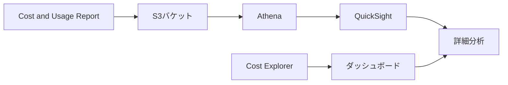

# AWSコスト管理サービス

作成日: 2026-01-01

## 概要

AWSでは複数のコスト管理・分析サービスを提供しています。Cost Explorer、Budgets、Cost and Usage Report、Forecastなどを組み合わせて、コストの可視化、予測、最適化が可能です。

## コスト管理サービス比較

| サービス | 主な用途 | 機能 | 予測 | 通知 |
|---|---|---|---|---|
| **Cost Explorer** | コスト分析・可視化 | 過去13ヶ月の分析、フィルタ、グループ化 | 3ヶ月先まで | なし |
| **AWS Budgets** | 予算管理・アラート | 予算設定、しきい値アラート | なし | あり（SNS/Email） |
| **Cost and Usage Report（CUR）** | 詳細なコストデータ | 時間単位の詳細データ、S3出力 | なし | なし |
| **Cost Anomaly Detection** | 異常検出 | ML による異常コスト検出 | なし | あり |
| **Compute Optimizer** | リソース最適化提案 | EC2/Lambda等の推奨サイジング | なし | なし |

## Cost Explorer

### 主要機能

| 機能 | 内容 |
|---|---|
| **データ期間** | 過去13ヶ月 + 未来3ヶ月（予測） |
| **粒度** | 日次、月次 |
| **フィルタ** | サービス、リージョン、タグ、アカウント等 |
| **グループ化** | サービス、リージョン、タグ、インスタンスタイプ等 |
| **保存レポート** | カスタムレポートの保存・共有 |
| **API** | プログラムアクセス可能 |
| **料金** | 基本無料、API使用は有料 |

### Cost Explorer の予測機能

| 項目 | 内容 |
|---|---|
| **予測期間** | 最大3ヶ月先 |
| **予測方法** | 過去の使用パターンに基づく機械学習 |
| **精度** | 過去データが多いほど精度向上（最低2週間のデータ必要） |
| **予測対象** | 月次コスト、サービス別コスト |
| **更新頻度** | 日次更新 |

**例**:
- 過去12ヶ月のデータから次の3ヶ月のコストを予測
- EC2、S3などサービス別の予測も可能

### 主な使用シナリオ

| シナリオ | 方法 |
|---|---|
| **月次コスト推移** | 月次グループ化、サービス別フィルタ |
| **特定タグのコスト** | コストタグでフィルタ |
| **リザーブドインスタンス利用率** | RI使用率レポート |
| **Savings Plans利用率** | Savings Plans使用率レポート |
| **予算超過リスク** | 予測機能で未来3ヶ月を確認 |

## AWS Budgets

### 予算タイプ

| タイプ | 監視対象 | 用途 |
|---|---|---|
| **Cost Budget** | 実際のコスト | 月次/四半期/年次コスト管理 |
| **Usage Budget** | 使用量（時間、GB等） | サービス使用量管理 |
| **Reservation Budget** | RI/Savings Plans利用率・カバレッジ | RI最適化 |
| **Savings Plans Budget** | Savings Plans利用率・カバレッジ | Savings Plans最適化 |

### アラート設定

| 項目 | 内容 |
|---|---|
| **しきい値** | 予算の50%、80%、100%、120%等（カスタム可能） |
| **通知先** | Email、SNS |
| **アクション** | IAMポリシー適用、SCPポリシー適用、EC2/RDS停止（Lambda経由） |
| **料金** | 最初の2つの予算は無料、以降$0.02/日/予算 |

### 予測ベースのアラート

| 機能 | 内容 |
|---|---|
| **予測アラート** | 月末予測値がしきい値を超える場合に通知 |
| **タイミング** | 月初～月中で早期警告 |
| **精度** | Cost Explorerの予測機能を利用 |

**例**:
- 予算$1,000、しきい値80%設定
- 月中時点で月末予測が$850（85%）の場合、アラート発生

## Cost and Usage Report（CUR）

### 特徴

| 項目 | 内容 |
|---|---|
| **詳細度** | 時間単位、リソース単位の詳細データ |
| **出力先** | S3バケット |
| **形式** | CSV、Parquet |
| **更新頻度** | 日次、時間単位 |
| **データ統合** | Athena、QuickSight、Redshift等で分析 |
| **料金** | 無料（S3ストレージコストのみ） |

### ユースケース

| ユースケース | 方法 |
|---|---|
| **カスタム分析** | CUR → S3 → Athena → QuickSight |
| **チャージバック** | タグ別にコスト配分、部門請求 |
| **詳細なコスト追跡** | リソースID単位でコスト確認 |
| **外部ツール連携** | CloudHealth、CloudCheckr等のサードパーティツール |

## Cost Anomaly Detection

### 主要機能

| 機能 | 内容 |
|---|---|
| **検出方法** | 機械学習による異常パターン検出 |
| **モニタ単位** | アカウント全体、サービス別、コストカテゴリ別 |
| **通知** | Email、SNS |
| **しきい値** | 異常の影響度（ドル額）で設定可能 |
| **料金** | 無料 |

**検出例**:
- 通常$100/日のEC2コストが突然$500/日に増加
- S3データ転送が通常の10倍に急増

## Amazon Forecast（別サービス）

### 概要

| 項目 | 内容 |
|---|---|
| **用途** | 時系列予測（需要予測、在庫最適化、リソース計画等） |
| **技術** | 機械学習ベースの予測サービス |
| **データソース** | S3にアップロードした時系列データ |
| **予測期間** | カスタム（数週間～数ヶ月） |
| **料金** | データ処理量、予測生成数で課金 |

**Cost Explorerとの違い**:

| 項目 | Cost Explorer予測 | Amazon Forecast |
|---|---|---|
| **対象** | AWSコストのみ | 任意の時系列データ |
| **予測期間** | 最大3ヶ月 | カスタム（制限なし） |
| **データ** | AWS自動収集 | ユーザーがアップロード |
| **設定** | 不要（自動） | モデル構築・トレーニング必要 |
| **用途** | AWSコスト予測 | ビジネス全般の予測 |

**Forecastのユースケース**:
- EC2リソース需要予測（トラフィックパターンから）
- アプリケーション利用者数予測
- 在庫管理、需要予測（非AWS用途）

## Compute Optimizer

### 最適化推奨

| リソース | 推奨内容 |
|---|---|
| **EC2** | インスタンスタイプのサイジング |
| **EBS** | ボリュームタイプ・サイズ |
| **Lambda** | メモリ設定 |
| **Auto Scaling** | グループ設定 |
| **ECS on Fargate** | CPU/メモリ設定 |

### 推奨の根拠

| 項目 | 内容 |
|---|---|
| **データ元** | CloudWatch メトリクス（14日以上） |
| **分析** | CPU、メモリ、ネットワーク使用率 |
| **推奨ランク** | Optimized、Under-provisioned、Over-provisioned |
| **節約見込み** | 推定月額コスト削減額 |
| **料金** | 無料 |

## コスト最適化のベストプラクティス

### 1. 可視化

### 2. 監視・アラート

| ツール | 用途 |
|---|---|
| **Budgets** | 予算超過アラート |
| **Cost Anomaly Detection** | 異常コスト検出 |
| **CloudWatch アラーム** | リソース使用率監視 |

### 3. 最適化

| アクション | ツール |
|---|---|
| **サイジング最適化** | Compute Optimizer |
| **購入オプション最適化** | Cost Explorer（RI/SP推奨） |
| **未使用リソース削除** | Trusted Advisor、Cost Explorer |
| **ストレージクラス最適化** | S3 Storage Class Analysis |

## SAP試験の重要ポイント

### Cost Explorer
- **予測機能**: 最大3ヶ月先まで予測可能
- **データ期間**: 過去13ヶ月
- **粒度**: 日次・月次
- **料金**: 基本無料、API有料

### AWS Budgets
- **予算タイプ**: Cost、Usage、Reservation、Savings Plans
- **予測アラート**: 月末予測値でアラート可能
- **アクション**: SNS通知、IAMポリシー、Lambda起動
- **料金**: 最初2つ無料、以降$0.02/日

### CUR
- **詳細度**: 時間単位、リソース単位
- **出力先**: S3（Athena/QuickSightで分析）
- **用途**: カスタム分析、チャージバック

### Amazon Forecast
- **別サービス**: Cost Explorerとは別のML予測サービス
- **用途**: 任意の時系列データ予測（需要予測、リソース計画等）
- **Cost Explorerとの違い**: AWSコスト専用 vs 汎用時系列予測

### Cost Anomaly Detection
- **無料**: 機械学習による異常検出
- **通知**: Email、SNS
- **用途**: 予期しないコスト急増の早期検出

### 組み合わせ戦略
- **Cost Explorer**: 過去分析 + 3ヶ月予測
- **Budgets**: アラート + 自動アクション
- **CUR**: 詳細分析・チャージバック
- **Compute Optimizer**: リソース最適化推奨
