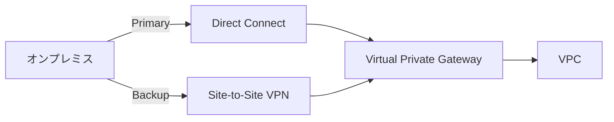

# ネットワーク帯域・Direct Connect

作成日: 2026-01-01

## 概要

AWSへのデータ転送には複数の接続オプションがあり、それぞれ帯域幅、コスト、セキュリティが異なります。Direct Connect、VPN、インターネット接続の特性を理解し、データ量と転送時間要件に応じた選択が重要です。

## 接続オプション比較

| 接続方法 | 帯域幅 | レイテンシ | コスト | セキュリティ | 用途 |
|---|---|---|---|---|---|
| **インターネット** | ISP依存（数Mbps〜数Gbps） | 変動あり | 低（データ転送料のみ） | 暗号化推奨 | 小規模・不定期転送 |
| **Site-to-Site VPN** | 最大1.25Gbps/トンネル | 変動あり | 低（$0.05/時間） | IPsec暗号化 | 中規模・セキュア転送 |
| **Direct Connect** | 50Mbps〜100Gbps | 安定・低レイテンシ | 高（専用線費用） | プライベート接続 | 大規模・継続的転送 |
| **Direct Connect + VPN** | Direct Connect帯域 | 安定 | 中〜高 | IPsec + プライベート | コンプライアンス要件 |

## AWS Direct Connect

### 専用接続（Dedicated Connection）

| 帯域幅 | ポート速度 | 用途 |
|---|---|---|
| **1Gbps** | 1000BASE-LX | 中規模ワークロード |
| **10Gbps** | 10GBASE-LR | 大規模ワークロード |
| **100Gbps** | 100GBASE-LR4 | 超大規模ワークロード |

### ホスト型接続（Hosted Connection）

| 帯域幅 | 提供形態 | 特徴 |
|---|---|---|
| **50Mbps〜10Gbps** | AWSパートナー経由 | 柔軟な帯域選択、低コスト |

### Direct Connect の特徴

| 項目 | 内容 |
|---|---|
| **接続先** | AWSロケーション（データセンター） |
| **冗長性** | 複数接続推奨（SLA 99.99%） |
| **仮想インターフェース（VIF）** | プライベートVIF（VPC）、パブリックVIF（S3等）、トランジットVIF（Transit Gateway） |
| **BGP** | BGPルーティング必須 |
| **リージョン** | 複数リージョン対応（Direct Connect Gateway経由） |
| **セットアップ時間** | 数週間〜数ヶ月 |

### 料金構成

| 項目 | 料金 |
|---|---|
| **ポート時間料金** | $0.30/時間（1Gbps）、$2.25/時間（10Gbps）等 |
| **データ転送料（アウト）** | リージョンにより異なる（〜$0.02/GB） |
| **データ転送料（イン）** | 無料 |

## Site-to-Site VPN

### VPNトンネル仕様

| 項目 | 内容 |
|---|---|
| **帯域幅** | 最大1.25Gbps/トンネル |
| **トンネル数** | 2トンネル/VPN接続（冗長化） |
| **合計帯域** | 最大2.5Gbps（ECMP使用時） |
| **暗号化** | IPsec（AES-256） |
| **プロトコル** | IKEv1、IKEv2 |

### VPN接続の種類

| 種類 | 説明 | 帯域 |
|---|---|---|
| **Static VPN** | 静的ルーティング | 最大1.25Gbps/トンネル |
| **Dynamic VPN（BGP）** | BGPルーティング、ECMP対応 | 最大2.5Gbps（2トンネル） |

### VPN Accelerated

| 項目 | 内容 |
|---|---|
| **帯域幅** | 最大1.25Gbps/トンネル（通常VPNと同じ） |
| **特徴** | AWS Global Accelerator使用、パフォーマンス向上 |
| **レイテンシ** | 改善（最適経路選択） |
| **追加料金** | あり（$0.05/時間 + データ転送料） |

## データ転送時間計算

### 帯域幅と転送速度の関係

| 帯域幅 | 実効転送速度（理論値） | 備考 |
|---|---|---|
| 1Gbps | 125MB/秒 = 450GB/時 | 1Gbps ÷ 8 = 125MB/s |
| 10Gbps | 1,250MB/秒 = 4.5TB/時 | 10Gbps ÷ 8 = 1,250MB/s |
| 100Gbps | 12,500MB/秒 = 45TB/時 | 100Gbps ÷ 8 = 12,500MB/s |

**注意**: 実効速度は理論値の60〜80%程度（オーバーヘッド、再送等）

### データ量別転送時間（理論値）

#### 1Gbps接続の場合

| データ量 | 転送時間（理論値） | 転送時間（実効80%） |
|---|---|---|
| 100GB | 13分 | 17分 |
| 1TB | 2.2時間 | 2.8時間 |
| 10TB | 22時間 | 28時間 |
| 100TB | 9.3日 | 11.6日 |
| 1PB | 93日 | 116日 |

#### 10Gbps接続の場合

| データ量 | 転送時間（理論値） | 転送時間（実効80%） |
|---|---|---|
| 100GB | 1.3分 | 1.7分 |
| 1TB | 13分 | 17分 |
| 10TB | 2.2時間 | 2.8時間 |
| 100TB | 22時間 | 28時間 |
| 1PB | 9.3日 | 11.6日 |

#### 100Gbps接続の場合

| データ量 | 転送時間（理論値） | 転送時間（実効80%） |
|---|---|---|
| 1TB | 1.3分 | 1.7分 |
| 10TB | 13分 | 17分 |
| 100TB | 2.2時間 | 2.8時間 |
| 1PB | 22時間 | 28時間 |
| 10PB | 9.3日 | 11.6日 |

### 簡易計算式

```
転送時間（秒） = データ量（GB） × 8 ÷ 帯域幅（Gbps）
転送時間（時間） = データ量（TB） × 8000 ÷ 帯域幅（Gbps） ÷ 3600
```

**例**: 10TBを1Gbpsで転送
```
10TB × 8000 ÷ 1Gbps ÷ 3600 = 22.2時間（理論値）
実効80%の場合: 22.2 ÷ 0.8 = 27.8時間
```

## 接続方法の選択基準

### データ量・転送頻度による選択

| データ量 | 転送頻度 | 推奨方法 | 理由 |
|---|---|---|---|
| **〜100GB** | 不定期 | インターネット | コスト効率的 |
| **100GB〜10TB** | 月次 | Site-to-Site VPN | セキュア、中コスト |
| **10TB〜100TB** | 週次以上 | Direct Connect（1Gbps） | 安定した転送速度 |
| **100TB以上** | 日次 | Direct Connect（10Gbps以上） | 大容量・継続的転送 |
| **10PB以上** | 一度きり | AWS Snowball/Snowmobile | ネットワーク転送非現実的 |

### レイテンシ要件による選択

| 要件 | 推奨方法 | レイテンシ目安 |
|---|---|---|
| **リアルタイム処理** | Direct Connect | 1〜10ms |
| **バッチ処理** | Site-to-Site VPN | 10〜100ms |
| **バックアップ** | インターネット | 変動あり |

## ハイブリッド構成

### Direct Connect + VPN



| メリット | 説明 |
|---|---|
| **高可用性** | Direct Connect障害時にVPNへフェイルオーバー |
| **暗号化** | Direct Connect上でVPN（MACsec or IPsec） |
| **コスト最適化** | Direct Connectメイン、VPNはバックアップ |

### Direct Connect Gateway

| 項目 | 内容 |
|---|---|
| **接続先** | 複数リージョンのVPC（最大10） |
| **用途** | グローバルネットワーク、マルチリージョン |
| **Transit Gateway統合** | 複数VPCへの接続簡素化 |

## 転送の最適化

### マルチパート転送（S3）

| 項目 | 内容 |
|---|---|
| **並列アップロード** | ファイルを分割して並列転送 |
| **推奨サイズ** | 100MB以上のファイル |
| **パート数** | 最大10,000パート |
| **効果** | 帯域の有効活用、転送時間短縮 |

### AWS DataSync

| 項目 | 内容 |
|---|---|
| **最適化** | 自動並列化、圧縮、増分転送 |
| **帯域制御** | 帯域幅制限設定可能 |
| **接続** | Direct Connect、VPN、インターネット対応 |
| **料金** | $0.0125/GB |

### Transfer Acceleration（S3）

| 項目 | 内容 |
|---|---|
| **仕組み** | CloudFrontエッジロケーション経由 |
| **高速化** | 長距離転送で最大50〜500%高速化 |
| **対象** | グローバルユーザーからのアップロード |
| **追加料金** | $0.04〜$0.08/GB |

## SAP試験の重要ポイント

### 帯域幅

- **Direct Connect**: 1Gbps、10Gbps、100Gbps（専用）、50Mbps〜10Gbps（ホスト型）
- **Site-to-Site VPN**: 最大1.25Gbps/トンネル、ECMP使用で2.5Gbps
- **1Gbps**: 約450GB/時（理論値）、実効は360GB/時程度

### 転送時間目安

- **1TB @ 1Gbps**: 約2.8時間（実効）
- **10TB @ 1Gbps**: 約28時間（実効）
- **100TB @ 10Gbps**: 約28時間（実効）

### 接続方法選択

- **〜10TB、不定期**: インターネット or VPN
- **10TB〜100TB、定期**: Direct Connect（1Gbps）
- **100TB以上、日次**: Direct Connect（10Gbps以上）
- **PB規模、一度きり**: Snowball/Snowmobile

### Direct Connect

- **セットアップ**: 数週間〜数ヶ月
- **冗長性**: 複数接続でSLA 99.99%
- **VIF種類**: プライベート（VPC）、パブリック（S3等）、トランジット（TGW）
- **Direct Connect Gateway**: 複数リージョン接続

### VPN

- **暗号化**: IPsec（AES-256）
- **冗長性**: 2トンネル/接続
- **料金**: $0.05/時間 + データ転送料

### 最適化

- **DataSync**: 自動最適化、$0.0125/GB
- **S3 Transfer Acceleration**: 長距離で高速化、$0.04〜$0.08/GB
- **マルチパート**: 100MB以上のファイルで並列転送
