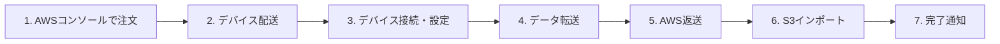

# AWS Snow Family

作成日: 2026-01-01

## 概要

AWS Snow Familyは、大量データの物理転送とエッジコンピューティングを提供するデバイスファミリーです。ネットワーク転送が非現実的な場合や、エッジ環境での処理が必要な場合に使用されます。

## 現行製品ラインナップ（2024年以降）

| デバイス | ストレージ容量 | 用途 | コンピュート | 提供形態 |
|---|---|---|---|---|
| **Snowcone** | 8TB HDD / 14TB SSD | 小規模転送、エッジ | 2 vCPU、4GB | デバイス貸出 |
| **Snowcone SSD** | 14TB SSD | 小規模転送、エッジ | 2 vCPU、4GB | デバイス貸出 |
| **Snowball Edge Storage Optimized** | 80TB（使用可能） | 大規模データ移行 | 40 vCPU、80GB | デバイス貸出 |
| **Snowball Edge Compute Optimized** | 28TB NVMe（使用可能） | エッジコンピューティング | 104 vCPU、416GB | デバイス貸出 |
| **Snowmobile** | 100PB | 超大規模データセンター移行 | なし | トラック型コンテナ |

## 廃止・変更された製品

### Snowball（初代）- **廃止**

| 項目 | 内容 |
|---|---|
| **容量** | 50TB / 80TB |
| **廃止時期** | 2020年頃 |
| **後継** | Snowball Edge Storage Optimized |
| **理由** | エッジコンピューティング機能なし、Snowball Edgeに統合 |

### 容量変更の履歴

| デバイス | 旧容量 | 現行容量 | 変更時期 |
|---|---|---|---|
| **Snowball Edge Storage Optimized** | 80TB（総容量100TB） | 80TB（使用可能） | 継続 |
| **Snowball Edge Compute Optimized** | 42TB（旧型） | 28TB NVMe（現行） | 2021年 |
| **Snowcone** | 8TB HDD のみ | 8TB HDD / 14TB SSD | 2021年（SSD追加） |

## 各デバイスの詳細比較

### Snowcone / Snowcone SSD

| 項目 | Snowcone（HDD） | Snowcone SSD |
|---|---|---|
| **ストレージ** | 8TB HDD | 14TB SSD |
| **サイズ** | 227mm × 148mm × 82mm（約2.1kg） | 同左 |
| **コンピュート** | 2 vCPU、4GB RAM | 同左 |
| **ネットワーク** | 10Gbps、Wi-Fi | 同左 |
| **耐環境性** | -20°C〜45°C | 同左 |
| **用途** | IoTデータ収集、小規模移行、ドローン等 | 同左（高速ストレージ必要時） |
| **DataSync Agent** | サポート（オンライン転送可能） | サポート |

**特徴**:
- 最小のSnowデバイス
- バッテリー別売り（オプション）
- オンラインモード対応（AWS DataSync）

### Snowball Edge Storage Optimized

| 項目 | 内容 |
|---|---|
| **ストレージ** | 80TB（使用可能容量）、総容量100TB |
| **vCPU** | 40 vCPU |
| **メモリ** | 80GB RAM |
| **ネットワーク** | 10Gbps、25Gbps、40Gbps、100Gbps（オプション） |
| **サイズ** | ラック搭載可能サイズ（約23kg） |
| **EC2インスタンス** | sbe1（Storage Optimized）インスタンス |
| **用途** | 大規模データ移行、ローカルストレージ |

**ユースケース**:
- ペタバイト規模のクラウド移行
- ビデオライブラリ転送
- データセンター閉鎖時の移行

### Snowball Edge Compute Optimized

| 項目 | 内容 |
|---|---|
| **ストレージ** | 28TB NVMe SSD（使用可能）、42TB総容量 |
| **vCPU** | 104 vCPU（52コア） |
| **メモリ** | 416GB RAM |
| **GPU** | オプション（NVIDIA Tesla V100） |
| **ネットワーク** | 10Gbps、25Gbps、40Gbps、100Gbps |
| **EC2インスタンス** | sbe-c（Compute Optimized）、sbe-g（GPU） |
| **用途** | エッジML推論、動画処理、IoT分析 |

**ユースケース**:
- 工場でのML推論
- 自動運転車データ処理
- 医療画像分析
- リモートサイトでのデータ処理

### Snowmobile

| 項目 | 内容 |
|---|---|
| **容量** | 100PB（1台あたり） |
| **形態** | 45フィートコンテナトラック |
| **転送速度** | 最大1Tbps |
| **セキュリティ** | GPS追跡、24時間監視、暗号化 |
| **電源要件** | 専用電源（350kVA） |
| **使用期間** | 数週間〜数ヶ月 |
| **最小データ量** | 10PB以上推奨 |

**ユースケース**:
- データセンター全体の移行
- エクサバイト規模のデータ移行
- メディア会社の大規模アーカイブ移行

## データ転送の選択基準

### 転送方法の比較

| データ量 | 推奨方法 | 転送時間（目安） |
|---|---|---|
| **〜10TB** | Direct Connect、インターネット | 数時間〜数日 |
| **10TB〜80TB** | Snowcone、Snowball Edge | 1週間前後 |
| **80TB〜ペタバイト** | Snowball Edge（複数台）| 数週間 |
| **10PB以上** | Snowmobile | 数週間〜数ヶ月 |

### ネットワーク転送との比較

**1Gbps回線での転送時間**（理論値）:

| データ量 | 転送時間 |
|---|---|
| 1TB | 約2.3時間 |
| 10TB | 約23時間 |
| 100TB | 約10日 |
| 1PB | 約100日 |

**結論**: 数十TB以上はSnowデバイスが効率的

## 主要機能

### エッジコンピューティング（Snowball Edge、Snowcone）

| 機能 | 内容 |
|---|---|
| **EC2互換インスタンス** | AMIを実行可能 |
| **Lambda関数** | AWS IoT Greengrass経由 |
| **S3互換ストレージ** | オブジェクトストレージ API |
| **EBS互換ボリューム** | ブロックストレージ |
| **クラスタリング** | 複数台で容量・可用性向上 |

### セキュリティ

| 機能 | 内容 |
|---|---|
| **暗号化** | 256-bit暗号化（自動） |
| **キー管理** | AWS KMS（Snowball Edgeロック前に設定） |
| **不正開封検知** | Trusted Platform Module（TPM） |
| **データ消去** | AWS返却後、NIST準拠の消去 |
| **追跡** | E Ink発送ラベル、SNS通知 |

## Snow Familyの運用フロー

### クラスタリング（Snowball Edge）

| 構成 | 台数 | メリット |
|---|---|---|
| **単体** | 1台 | シンプル |
| **クラスタ** | 3〜10台 | 容量拡張、可用性向上（2台障害まで耐性） |

**クラスタの耐障害性**:
- 3〜5台: 1台の障害に耐性
- 6〜10台: 2台の障害に耐性

## DataSync との連携（Snowcone）

| 項目 | 内容 |
|---|---|
| **オンライン転送** | Snowcone上でDataSync Agent実行 |
| **用途** | オフラインでデータ収集後、オンラインで転送 |
| **メリット** | 物理返送不要、継続的データ転送 |

## よくある使い分け

| シナリオ | 推奨デバイス | 理由 |
|---|---|---|
| **ドローンデータ収集** | Snowcone | 軽量、バッテリー駆動可能 |
| **工場IoT処理** | Snowball Edge Compute Optimized | 高コンピュート、GPU |
| **ビデオアーカイブ移行** | Snowball Edge Storage Optimized | 大容量ストレージ |
| **データセンター全体移行** | Snowmobile | 超大容量 |
| **船舶・リモート環境** | Snowcone（オンライン） | DataSync連携 |
| **ML推論（エッジ）** | Snowball Edge Compute Optimized（GPU） | GPU搭載可能 |

## SAP試験の重要ポイント

### デバイス選択
- **Snowcone**: 8TB/14TB、最軽量、IoT/ドローン
- **Snowball Edge Storage**: 80TB、大規模移行
- **Snowball Edge Compute**: 28TB、104 vCPU、GPU、エッジML
- **Snowmobile**: 100PB、10PB以上推奨

### 廃止情報
- **初代Snowball**: 廃止、Snowball Edgeに統合
- **現行**: すべてSnowball Edge（Storage/Compute）

### 転送時間
- **100TB**: ネットワーク約10日 vs Snowball約1週間
- **10PB以上**: Snowmobile推奨

### エッジコンピューティング
- **Snowcone/Snowball Edge**: EC2、Lambda（Greengrass）、S3互換
- **クラスタリング**: 3〜10台、2台障害耐性（6台以上）

### セキュリティ
- **暗号化**: 256-bit、自動
- **キー管理**: AWS KMS
- **データ消去**: NIST準拠

### DataSync連携
- **Snowcone**: オンライン転送可能（DataSync Agent内蔵）
- **オフライン収集 → オンライン転送**: 物理返送不要
