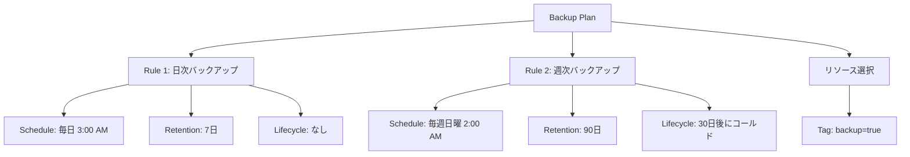
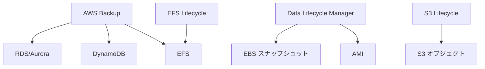

# バックアップ・ライフサイクル管理サービス

作成日: 2026-01-02

## 概要

AWSのバックアップ・ライフサイクル管理サービスには、AWS Backup（統合バックアップ）、Data Lifecycle Manager（EBS/AMIスナップショット自動化）、S3 Lifecycle（オブジェクトライフサイクル）、Amazon EFS Lifecycle Management等があります。それぞれ対象リソース、自動化レベル、保持ポリシーが異なります。

## 主要サービス比較

| サービス | 対象リソース | 主な機能 | クロスリージョン | クロスアカウント |
|---|---|---|---|---|
| **AWS Backup** | EBS、RDS、DynamoDB、EFS、EC2、Storage Gateway等（15種類以上） | 統合バックアップ管理、自動スケジュール、保持、暗号化 | ✓ | ✓ |
| **Data Lifecycle Manager (DLM)** | EBS スナップショット、AMI | スナップショット自動作成・削除、AMI廃止 | ✓ | ✓ |
| **S3 Lifecycle** | S3 オブジェクト | ストレージクラス移行、削除 | ✓（レプリケーション併用） | ✓（レプリケーション併用） |
| **EFS Lifecycle Management** | EFS ファイル | IA/Archive移行 | - | - |
| **RDS自動バックアップ** | RDS/Aurora | 自動スナップショット、PITR | ✓（手動） | ✗ |

## AWS Backup

### 概要

| 項目 | 内容 |
|---|---|
| **役割** | 複数AWSサービスの統合バックアップ管理 |
| **スコープ** | クロスリージョン、クロスアカウント |
| **料金** | バックアップストレージ（GBあたり）+ リストア（GBあたり） |

### 対応リソース（主要なもの）

| リソース | バックアップ単位 | 特記事項 |
|---|---|---|
| **EBS** | ボリューム | スナップショット |
| **EC2** | インスタンス | AMI + EBSスナップショット |
| **RDS/Aurora** | DBインスタンス/クラスタ | スナップショット |
| **DynamoDB** | テーブル | フルバックアップ |
| **EFS** | ファイルシステム | 増分バックアップ |
| **FSx** | ファイルシステム | スナップショット |
| **Storage Gateway** | ボリューム | - |
| **S3** | バケット | 継続的バックアップ（PITR） |
| **DocumentDB** | クラスタ | スナップショット |
| **Neptune** | クラスタ | スナップショット |

### 主要機能

| 機能 | 説明 |
|---|---|
| **バックアッププラン** | スケジュール、保持期間、ライフサイクル、タグベース選択 |
| **バックアップボルト** | バックアップ保存先（暗号化、アクセス制御） |
| **自動スケジュール** | cron式、頻度指定（時間、日、週、月） |
| **保持期間** | 日数指定、永久保持 |
| **ライフサイクル** | コールドストレージへ移行（90日以降等） |
| **クロスリージョンコピー** | 自動で別リージョンにコピー |
| **クロスアカウントバックアップ** | AWS Organizations統合 |
| **AWS Backup Vault Lock** | WORM（Write Once Read Many）、削除防止 |
| **バックアップモニタリング** | CloudWatch、EventBridge統合 |

### バックアッププラン構成例

### バックアップボルト

| 項目 | 内容 |
|---|---|
| **役割** | バックアップ保存先の論理コンテナ |
| **暗号化** | AWS KMS（必須） |
| **アクセス制御** | リソースベースポリシー |
| **Vault Lock** | 削除防止、コンプライアンス対応（WORM） |
| **通知** | SNS統合 |

### ライフサイクル管理

| 項目 | 内容 |
|---|---|
| **ウォームストレージ** | 通常のバックアップストレージ |
| **コールドストレージ** | 低コスト、取り出し遅い（Glacier相当） |
| **移行条件** | X日後にコールドへ移行 |
| **最小期間** | コールド移行後、90日間はコールドに保持必須 |

**例**: 7日間はウォーム、その後コールドへ移行、合計90日保持

### 料金

| 項目 | 料金（例: EBS） |
|---|---|
| **ウォームストレージ** | $0.05/GB/月 |
| **コールドストレージ** | $0.01/GB/月 |
| **リストア（ウォーム）** | $0.02/GB |
| **リストア（コールド）** | $0.02/GB |

## Data Lifecycle Manager（DLM）

### 概要

| 項目 | 内容 |
|---|---|
| **役割** | EBSスナップショット、AMIの自動作成・削除 |
| **スコープ** | リージョン内、クロスリージョンコピー可能 |
| **料金** | 無料（スナップショットストレージ料のみ） |

### ライフサイクルポリシー種類

| ポリシー | 対象 | 用途 |
|---|---|---|
| **EBSスナップショットポリシー** | EBSボリューム | 自動スナップショット作成・削除 |
| **EBS-backed AMIポリシー** | EC2インスタンス | AMI自動作成・廃止 |
| **クロスアカウントコピー** | スナップショット | DR用に別アカウントへコピー |

### EBSスナップショットポリシー

| 項目 | 内容 |
|---|---|
| **ターゲット** | タグベース（例: backup=daily） |
| **スケジュール** | 時間、日、週、月単位 |
| **保持** | カウントベース（最新X個）or 期間ベース（X日） |
| **クロスリージョン** | 別リージョンへコピー |
| **タグ付け** | 自動タグ付け |
| **Fast Snapshot Restore** | FSR有効化可能 |

### AMIポリシー

| 項目 | 内容 |
|---|---|
| **ターゲット** | タグベース |
| **スケジュール** | 日次、週次等 |
| **保持** | カウントベース |
| **AMI廃止** | 古いAMI自動廃止（deregister） |
| **スナップショット削除** | AMI廃止時にスナップショットも削除 |

### AWS Backup vs DLM

| 項目 | AWS Backup | DLM |
|---|---|---|
| **対象リソース** | 15種類以上（EBS、RDS、DynamoDB等） | EBS、AMIのみ |
| **統合管理** | 複数サービスを一元管理 | EBS/AMI専用 |
| **クロスアカウント** | AWS Organizations統合 | 限定的（コピーのみ） |
| **コールドストレージ** | あり | なし |
| **Vault Lock** | あり | なし |
| **料金** | バックアップストレージ + リストア | 無料（スナップショット料のみ） |
| **用途** | 統合バックアップ戦略 | EBS/AMI特化、シンプル |

## S3 Lifecycle

### 概要

| 項目 | 内容 |
|---|---|
| **役割** | S3オブジェクトのストレージクラス移行・削除 |
| **スコープ** | バケット、プレフィックス、タグ単位 |
| **料金** | 無料（ストレージ料のみ） |

### ライフサイクルアクション

| アクション | 説明 |
|---|---|
| **移行** | ストレージクラス変更（Standard → IA → Glacier等） |
| **削除** | オブジェクト削除 |
| **不完全マルチパート削除** | 未完了マルチパートアップロード削除 |
| **以前のバージョン削除** | バージョニング有効時の旧バージョン削除 |

### ライフサイクルルール例

| ルール | 条件 | アクション |
|---|---|---|
| **ログアーカイブ** | 30日経過 | Standard → Glacier Flexible Retrieval |
| **ログアーカイブ** | 365日経過 | Glacier Flexible → Glacier Deep Archive |
| **ログアーカイブ** | 2555日経過（7年） | 削除 |
| **一時ファイル削除** | 7日経過 | 削除 |
| **旧バージョン削除** | 90日経過 | 非現行バージョン削除 |

### S3 Intelligent-Tiering

| 項目 | 内容 |
|---|---|
| **自動移行** | アクセスパターンに基づく自動移行 |
| **階層** | Frequent → Infrequent (30日) → Archive (90日) → Deep Archive (180日) |
| **料金** | 監視料金（$0.0025/1,000オブジェクト/月） |
| **用途** | アクセスパターン不明な場合 |

## EFS Lifecycle Management

### 概要

| 項目 | 内容 |
|---|---|
| **役割** | EFSファイルの自動階層移行 |
| **階層** | Standard、Infrequent Access（IA）、Archive |
| **スコープ** | ファイルシステム単位 |
| **料金** | 無料（ストレージ料のみ） |

### ライフサイクルポリシー

| ポリシー | 説明 |
|---|---|
| **Standard → IA** | X日間アクセスなしでIA移行（1/7/14/30/60/90日） |
| **IA → Standard** | アクセス時に自動でStandardへ復帰 |
| **Standard/IA → Archive** | X日間アクセスなしでArchive移行（1/7/14/30/60/90/180/270/365日） |

### ストレージクラス比較

| クラス | 料金（us-east-1） | レイテンシ | 用途 |
|---|---|---|---|
| **Standard** | $0.30/GB/月 | ミリ秒 | 頻繁アクセス |
| **IA** | $0.025/GB/月 | ミリ秒 | 低頻度アクセス |
| **Archive** | $0.008/GB/月 | ミリ秒〜分 | アーカイブ |

**注意**: IA/Archiveはアクセス時に取り出し料金（$0.01/GB）

## RDS/Aurora自動バックアップ

### 概要

| 項目 | 内容 |
|---|---|
| **役割** | RDS/Auroraの自動バックアップ |
| **スコープ** | DBインスタンス/クラスタ単位 |
| **料金** | 無料（DBストレージと同容量まで） |

### バックアップ機能

| 機能 | 内容 |
|---|---|
| **自動スナップショット** | 日次、保持期間1〜35日 |
| **PITR** | ポイントインタイムリカバリ（5分前まで） |
| **バックアップウィンドウ** | バックアップ実行時間指定 |
| **手動スナップショット** | 無期限保持可能 |
| **クロスリージョンコピー** | 手動スナップショットのみ |

### Aurora Backtrack

| 項目 | 内容 |
|---|---|
| **機能** | データベースを過去の時点に巻き戻し |
| **対象** | Aurora MySQLのみ |
| **速度** | 数分（スナップショットより高速） |
| **保持期間** | 最大72時間 |
| **料金** | 変更レコードのストレージ料 |

## バックアップ戦略の組み合わせ

### 統合バックアップ戦略

### ユースケース別推奨

| ユースケース | 推奨サービス | 理由 |
|---|---|---|
| **複数サービスの統合管理** | AWS Backup | 一元管理、クロスアカウント |
| **EBS/AMI自動化** | DLM | シンプル、無料 |
| **コンプライアンス（WORM）** | AWS Backup Vault Lock | 削除防止、不変性 |
| **S3ログアーカイブ** | S3 Lifecycle | ストレージクラス自動移行 |
| **EFS コスト最適化** | EFS Lifecycle | 自動IA/Archive移行 |
| **RDS 短期PITR** | RDS自動バックアップ | 5分単位PITR |
| **Aurora 高速リカバリ** | Aurora Backtrack | 数分で巻き戻し |
| **DR（災害対策）** | AWS Backup + クロスリージョン | 自動コピー、暗号化 |

## 保持期間とコンプライアンス

### AWS Backup Vault Lock

| 項目 | 内容 |
|---|---|
| **WORM** | Write Once Read Many |
| **削除防止** | 保持期間中は削除不可（ルートユーザーでも） |
| **最小保持期間** | 指定可能 |
| **最大保持期間** | 指定可能 |
| **用途** | コンプライアンス（HIPAA、SEC Rule 17a-4等） |

### 保持期間設定例

| データ種類 | 保持期間 | ストレージ | サービス |
|---|---|---|---|
| **本番DB** | 35日（PITR） | ウォーム | AWS Backup |
| **週次DB** | 1年 | コールド（30日後） | AWS Backup |
| **年次DB** | 7年 | コールド | AWS Backup（Vault Lock） |
| **監査ログ** | 7年 | Glacier Deep Archive | S3 Lifecycle |
| **開発環境** | 7日 | ウォーム | DLM |

## 料金比較例

### EBS 100GBのバックアップ（1ヶ月）

| サービス | 構成 | 月額料金（概算） |
|---|---|---|
| **DLM** | 日次、7世代保持 | $35（700GB × $0.05/GB） |
| **AWS Backup** | 日次7日（ウォーム）、週次4週（コールド） | 7日 × $5 + 4週 × $1 = $39 |
| **手動スナップショット** | 週次、4世代 | $20（400GB × $0.05/GB） |

**注意**: スナップショットは増分のため、実際のストレージ使用量は少ない

## SAP試験の重要ポイント

### AWS Backup

- **対象**: 15種類以上（EBS、RDS、DynamoDB、EFS等）
- **クロスリージョン/アカウント**: 対応
- **ライフサイクル**: コールドストレージ移行（90日最小保持）
- **Vault Lock**: WORM、削除防止、コンプライアンス
- **料金**: バックアップストレージ + リストア

### Data Lifecycle Manager（DLM）

- **対象**: EBS スナップショット、AMI
- **料金**: 無料（スナップショット料のみ）
- **保持**: カウントベース or 期間ベース
- **クロスリージョン**: コピー可能
- **用途**: EBS/AMI特化、シンプル

### S3 Lifecycle

- **アクション**: ストレージクラス移行、削除
- **料金**: 無料（ストレージ料のみ）
- **Intelligent-Tiering**: 自動移行（監視料$0.0025/1,000オブジェクト）

### EFS Lifecycle

- **階層**: Standard、IA、Archive
- **移行**: アクセスなし期間で自動移行
- **復帰**: アクセス時に自動でStandardへ

### 使い分け

- **統合管理**: AWS Backup
- **EBS/AMI**: DLM（シンプル、無料）
- **コンプライアンス**: AWS Backup Vault Lock
- **S3**: S3 Lifecycle
- **EFS**: EFS Lifecycle Management
- **Aurora高速リカバリ**: Aurora Backtrack（数分）
