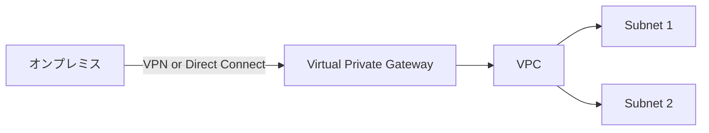
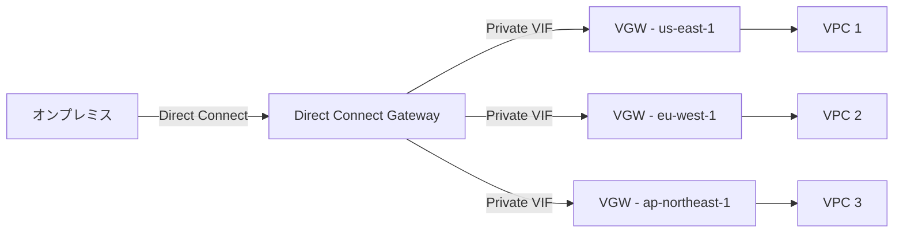
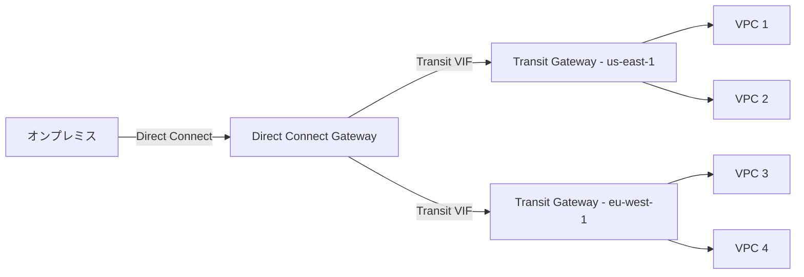
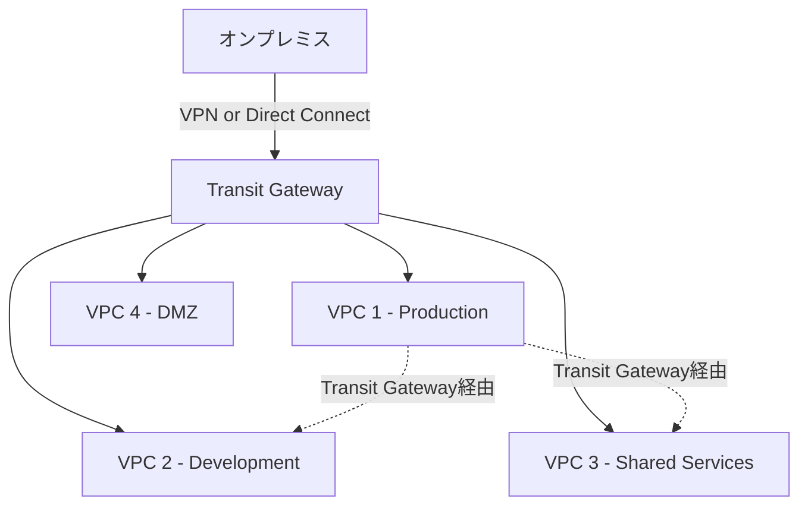
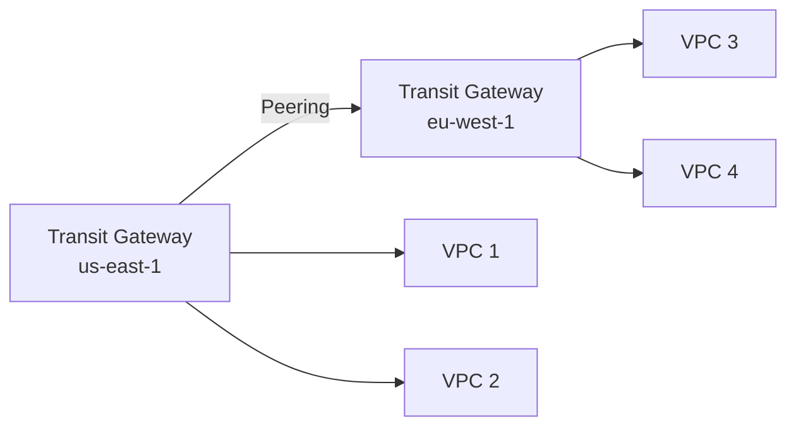
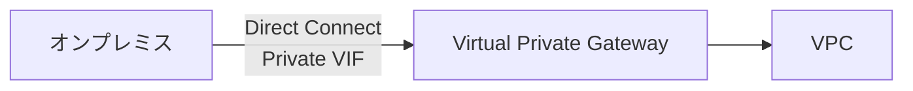
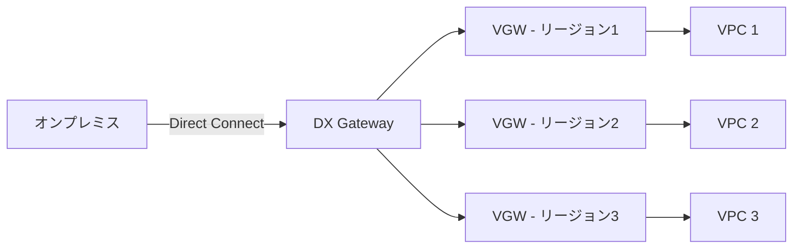
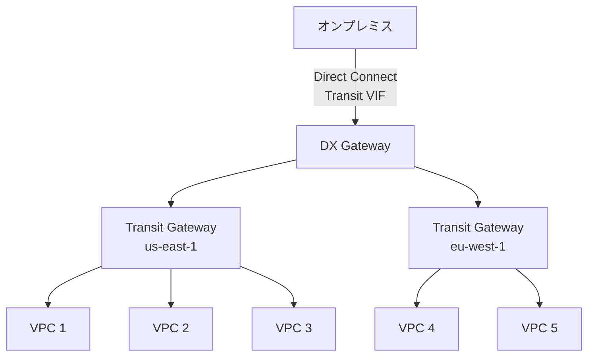
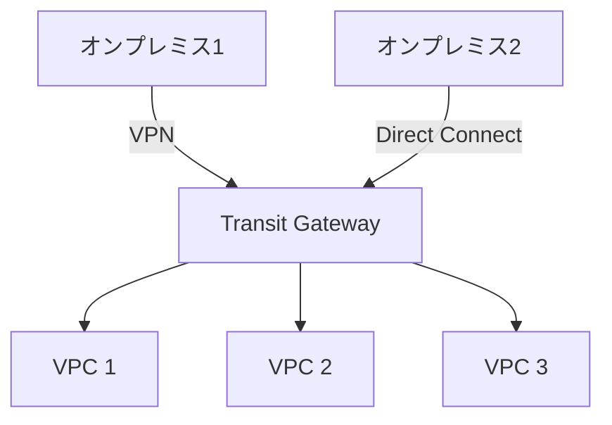

# ゲートウェイ比較（VGW・DX Gateway・Transit Gateway）

作成日: 2026-01-02

## 概要

AWSのネットワークゲートウェイには、Virtual Private Gateway（VGW）、Direct Connect Gateway（DX Gateway）、Transit Gateway（TGW）があります。それぞれオンプレミス接続、マルチリージョン接続、ハブ&スポーク構成で異なる役割を持ちます。

## 基本比較

| 項目 | Virtual Private Gateway (VGW) | Direct Connect Gateway | Transit Gateway (TGW) |
|---|---|---|---|
| **スコープ** | 単一VPC | 複数リージョンのVPC（最大10） | 単一リージョン内の複数VPC |
| **接続先** | 1VPC | 最大10 VPC/VGW | 最大5,000 VPC |
| **用途** | VPN/Direct Connect終端 | マルチリージョンDirect Connect | ハブ&スポーク、集中管理 |
| **ルーティング** | BGP | BGP | BGP、静的 |
| **VPC Peering不要** | N/A | N/A | VPC間通信可能 |
| **Transit VIF** | 不可 | 不可 | 必須 |
| **料金** | 無料（データ転送料のみ） | 無料（DX料金のみ） | $0.05/アタッチメント/時間 + データ処理料 |

## Virtual Private Gateway（VGW）

### 概要

| 項目 | 内容 |
|---|---|
| **役割** | VPCのゲートウェイ（VPN/Direct Connect終端） |
| **アタッチ先** | 1つのVPC |
| **接続方法** | Site-to-Site VPN、Direct Connect（Private VIF） |
| **ルート伝播** | VPC route tableへのBGPルート自動伝播 |
| **冗長性** | 自動（2つのAZに冗長構成） |

### 構成図

### VGWの制限

| 制限 | 内容 |
|---|---|
| **VPC数** | 1つのVPCのみ |
| **VPN接続数** | 最大10/VGW |
| **Direct Connect接続** | プライベートVIF経由 |
| **ルートエントリ** | 100（デフォルト）、1,000（拡張可能） |

### VPN接続（Site-to-Site VPN）

| 項目 | 内容 |
|---|---|
| **トンネル数** | 2（冗長化） |
| **帯域幅** | 最大1.25Gbps/トンネル |
| **ルーティング** | 静的 or BGP |
| **暗号化** | IPsec |
| **料金** | $0.05/時間/VPN接続 |

## Direct Connect Gateway（DX Gateway）

### 概要

| 項目 | 内容 |
|---|---|
| **役割** | 複数リージョンのVPCへのDirect Connect接続 |
| **接続先** | 最大10 VPC（VGW経由）または 3 Transit Gateway |
| **リージョン** | クロスリージョン対応 |
| **接続方法** | Private VIF or Transit VIF |
| **用途** | グローバルネットワーク、マルチリージョン接続 |

### 構成図（Private VIF）

### 構成図（Transit VIF）

### DX Gatewayの制限

| 制限 | 内容 |
|---|---|
| **VGW数** | 最大10（Private VIF使用時） |
| **Transit Gateway数** | 最大3（Transit VIF使用時） |
| **VIF数** | 最大30/DX Gateway |
| **重複CIDR** | 接続先VPCのCIDRは重複不可 |

### Private VIF vs Transit VIF

| 項目 | Private VIF | Transit VIF |
|---|---|---|
| **接続先** | VGW | Transit Gateway |
| **最大VPC数** | 10（VGW経由） | 無制限（TGW経由、TGW制限内） |
| **VPC間通信** | 不可 | 可能（TGW経由） |
| **用途** | シンプルなマルチリージョン接続 | 大規模ネットワーク、ハブ&スポーク |

## Transit Gateway（TGW）

### 概要

| 項目 | 内容 |
|---|---|
| **役割** | リージョン内のネットワークハブ |
| **接続先** | VPC、VPN、Direct Connect、TGW（Peering） |
| **最大VPC数** | 5,000 |
| **最大帯域** | 50Gbps/アタッチメント |
| **ルーティング** | ルートテーブル複数作成可能 |
| **用途** | 大規模ネットワーク、セグメント分離 |

### 構成図（基本）

### TGWアタッチメント種類

| アタッチメント | 説明 | 用途 |
|---|---|---|
| **VPCアタッチメント** | VPCとTGWを接続 | VPC間通信 |
| **VPNアタッチメント** | Site-to-Site VPN終端 | オンプレミス接続（VPN） |
| **Direct Connectアタッチメント** | Transit VIF経由 | オンプレミス接続（専用線） |
| **Peeringアタッチメント** | 別リージョンのTGWと接続 | クロスリージョン接続 |
| **Connect アタッチメント** | サードパーティアプライアンス接続 | SD-WAN統合 |

### ルートテーブル（複数作成可能）

| 特徴 | 内容 |
|---|---|
| **ルートテーブル数** | 無制限（実質的には数百） |
| **セグメント分離** | ルートテーブルごとに異なるルーティング |
| **アソシエーション** | アタッチメントを1つのルートテーブルに関連付け |
| **プロパゲーション** | アタッチメントからのルート自動伝播 |

**例**: Production VPCはShared Services VPCとのみ通信、Development VPCは全VPCと通信

### TGW Peeringによるクロスリージョン接続

| 項目 | 内容 |
|---|---|
| **帯域幅** | 最大50Gbps |
| **レイテンシ** | リージョン間の物理的距離に依存 |
| **暗号化** | 自動（AWSバックボーン） |
| **料金** | データ処理料 + リージョン間転送料 |

### TGWの料金

| 料金要素 | 料金 |
|---|---|
| **アタッチメント** | $0.05/時間/アタッチメント |
| **データ処理** | $0.02/GB |
| **Peering（リージョン間）** | データ転送料（$0.02/GB） |

**例**: 10 VPC、100GB/日の場合、約$400/月

## 組み合わせ構成

### VGW + Direct Connect（シンプル）

**用途**: 単一VPCへのDirect Connect接続

### DX Gateway + VGW（マルチリージョン）

**用途**: 複数リージョンのVPCへの単一Direct Connect接続

### DX Gateway + Transit Gateway（大規模）

**用途**: グローバル大規模ネットワーク、数百VPC

### Transit Gateway + VPN（ハイブリッド）

**用途**: VPNとDirect Connectの混在環境

## ユースケース別推奨

| ユースケース | 推奨構成 | 理由 |
|---|---|---|
| **単一VPC + VPN** | VGW | シンプル、コスト効率的 |
| **単一VPC + Direct Connect** | VGW + Private VIF | シンプル、低コスト |
| **複数リージョン + Direct Connect** | DX Gateway + VGW | マルチリージョン対応 |
| **リージョン内の多数VPC** | Transit Gateway | ハブ&スポーク、VPC Peering不要 |
| **大規模グローバルネットワーク** | DX Gateway + Transit Gateway | スケーラビリティ、柔軟性 |
| **セグメント分離** | Transit Gateway（複数ルートテーブル） | Production/Dev分離 |
| **VPC間通信多数** | Transit Gateway | VPC Peeringより管理容易 |
| **オンプレ複数拠点** | Transit Gateway + VPN | 集中管理 |

## ルーティングの比較

### VGW

| 項目 | 内容 |
|---|---|
| **ルート伝播** | VPC route tableへ自動伝播 |
| **BGP** | サポート |
| **静的ルート** | サポート |
| **ルート数** | 100（デフォルト）、1,000（拡張） |

### DX Gateway

| 項目 | 内容 |
|---|---|
| **ルート伝播** | VGWへ伝播 |
| **BGP** | 必須 |
| **Allowed Prefixes** | VPC CIDRを指定（広告制御） |
| **重複CIDR** | 不可 |

### Transit Gateway

| 項目 | 内容 |
|---|---|
| **ルートテーブル** | 複数作成可能 |
| **BGP** | サポート |
| **静的ルート** | サポート |
| **ブラックホールルート** | 特定トラフィックを破棄 |
| **ルート伝播** | アタッチメントごとに制御 |

## 接続数の比較

| ゲートウェイ | 最大VPC数 | 最大VPN接続数 | 最大Direct Connect数 |
|---|---|---|---|
| **VGW** | 1 | 10 | 1（Private VIF） |
| **DX Gateway** | 10（VGW経由） | - | 30（VIF） |
| **Transit Gateway** | 5,000 | 無制限（実質数百） | 無制限（Transit VIF経由） |

## SAP試験の重要ポイント

### Virtual Private Gateway（VGW）

- **スコープ**: 1つのVPCのみ
- **接続**: Site-to-Site VPN、Direct Connect（Private VIF）
- **VPN**: 最大10接続、1.25Gbps/トンネル
- **料金**: 無料（データ転送料のみ）
- **冗長性**: 自動（2AZ）

### Direct Connect Gateway

- **マルチリージョン**: 最大10 VPC（VGW経由）、3 TGW（Transit VIF経由）
- **VIF種類**: Private VIF（VGW向け）、Transit VIF（TGW向け）
- **重複CIDR**: 不可
- **料金**: 無料（Direct Connect料金のみ）
- **用途**: グローバルネットワーク

### Transit Gateway

- **スコープ**: リージョン内
- **最大VPC**: 5,000
- **ルートテーブル**: 複数作成可能（セグメント分離）
- **Peering**: クロスリージョンTGW接続
- **料金**: $0.05/時間/アタッチメント + $0.02/GB
- **用途**: ハブ&スポーク、大規模ネットワーク

### 使い分け

- **単一VPC**: VGW
- **マルチリージョン（〜10 VPC）**: DX Gateway + VGW
- **リージョン内多数VPC**: Transit Gateway
- **大規模グローバル**: DX Gateway + Transit Gateway
- **セグメント分離**: Transit Gateway（複数ルートテーブル）
