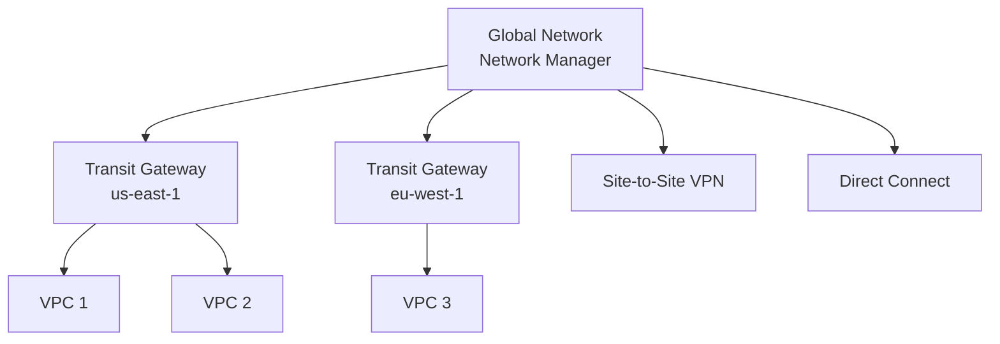
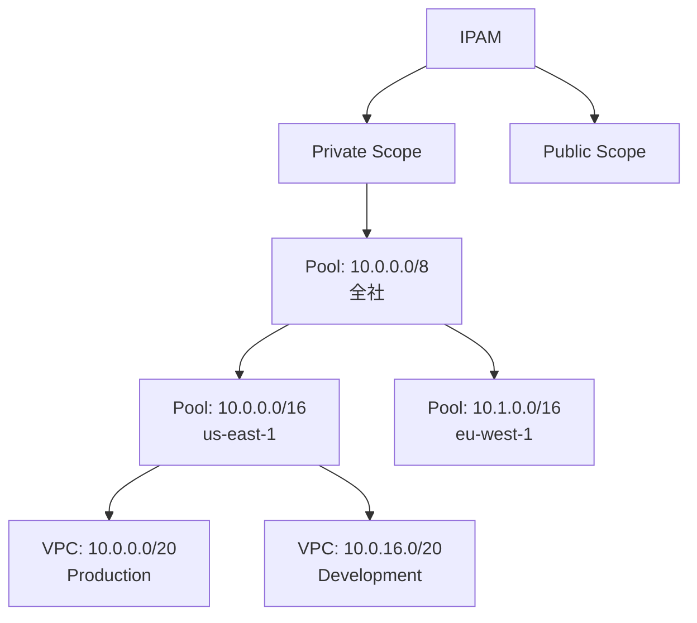
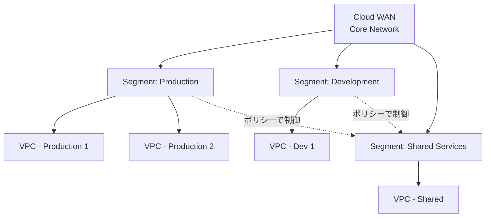
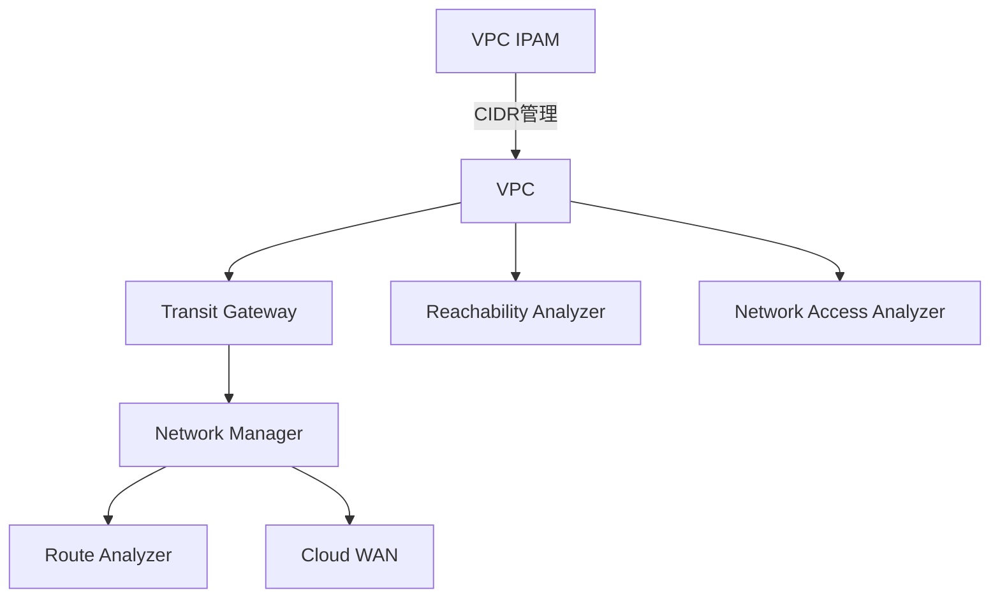

# ネットワーク管理サービス（Manager系）

作成日: 2026-01-02

## 概要

AWSのネットワーク管理サービスには、Transit Gateway Network Manager、VPC IP Address Manager（IPAM）、Network Manager（Route Analyzer含む）、CloudWAN等があります。それぞれグローバルネットワーク監視、IPアドレス管理、ネットワーク分析、SD-WAN機能を提供します。

## 主要サービス比較

| サービス | 主な用途 | スコープ | 主要機能 |
|---|---|---|---|
| **Transit Gateway Network Manager** | グローバルネットワーク監視・管理 | グローバル（複数リージョン） | TGW・VPN・Direct Connect統合監視 |
| **VPC IPAM** | IPアドレス管理 | グローバル（複数リージョン） | CIDR自動割り当て、重複検出 |
| **Network Manager Route Analyzer** | ルート分析 | グローバル | 到達性チェック、経路可視化 |
| **AWS Cloud WAN** | SD-WAN | グローバル | セグメント分離、自動ルーティング |
| **VPC Reachability Analyzer** | VPC到達性分析 | リージョン内 | セキュリティグループ・NACLパス分析 |
| **Network Access Analyzer** | 意図しないアクセス検出 | リージョン内 | ネットワークアクセス検証 |

## Transit Gateway Network Manager

### 概要

| 項目 | 内容 |
|---|---|
| **役割** | グローバルネットワークの可視化・監視・管理 |
| **対象リソース** | Transit Gateway、VPN、Direct Connect、SD-WAN |
| **スコープ** | グローバル（全リージョン） |
| **料金** | 無料（リソース利用料のみ） |

### 主要機能

| 機能 | 説明 |
|---|---|
| **グローバルネットワークビュー** | 全リージョンのTGW、VPN、DXを統合表示 |
| **トポロジー可視化** | ネットワーク構成の可視化 |
| **イベント監視** | 接続状態変化、ヘルスチェック |
| **メトリクス** | 帯域幅、パケットロス、レイテンシ |
| **Route Analyzer** | ルート分析、到達性確認 |
| **CloudWatch統合** | メトリクスとアラーム |

### 登録可能なリソース

| リソース | 説明 |
|---|---|
| **Transit Gateway** | 複数リージョンのTGW |
| **Site-to-Site VPN** | VPN接続 |
| **Direct Connect** | Direct Connect Gateway |
| **Connect アタッチメント** | サードパーティSD-WAN（Cisco等） |
| **オンプレミスデバイス** | カスタマーゲートウェイデバイス |
| **リンク** | 物理的な接続（帯域幅、プロバイダ情報） |

### グローバルネットワーク構成例

### Route Analyzer

| 項目 | 内容 |
|---|---|
| **機能** | 送信元から宛先への経路分析 |
| **分析対象** | Transit Gateway、VPN、Direct Connect |
| **出力** | ホップバイホップの経路、ルートテーブル情報 |
| **用途** | ルーティング問題のトラブルシューティング |

## VPC IP Address Manager（IPAM）

### 概要

| 項目 | 内容 |
|---|---|
| **役割** | IPアドレス空間の計画・追跡・管理 |
| **スコープ** | グローバル（複数リージョン、複数アカウント） |
| **料金** | アクティブIP/時間（$0.00027/IP/時間） |

### 主要機能

| 機能 | 説明 |
|---|---|
| **CIDR自動割り当て** | VPC作成時に自動でCIDR割り当て |
| **重複検出** | CIDR重複の自動検出・防止 |
| **使用状況追跡** | IPアドレス使用率の可視化 |
| **階層管理** | リージョン・アカウント・環境別にプール管理 |
| **コンプライアンス** | IP割り当てルールの強制 |
| **AWS Organizations統合** | 組織全体のIP管理 |

### IPAM階層構造

### IPAMの主要コンセプト

| 概念 | 説明 |
|---|---|
| **Scope** | プライベートIP or パブリックIP |
| **Pool** | CIDR範囲の管理単位（階層化可能） |
| **Allocation** | プールからのCIDR割り当て |
| **Rule** | 割り当てルール（最小/最大CIDR、タグ必須等） |

### 自動割り当て例

| 項目 | 設定 |
|---|---|
| **プール** | 10.0.0.0/16（us-east-1用） |
| **ルール** | 最小CIDR: /24、最大CIDR: /20 |
| **VPC作成時** | 自動で10.0.0.0/20を割り当て |
| **次回VPC** | 10.0.16.0/20を割り当て（重複なし） |

## AWS Cloud WAN

### 概要

| 項目 | 内容 |
|---|---|
| **役割** | グローバルWANの構築・管理（SD-WAN） |
| **スコープ** | グローバル |
| **ベース** | Transit Gateway Network Manager |
| **料金** | アタッチメント時間 + データ処理料 |

### 主要機能

| 機能 | 説明 |
|---|---|
| **セグメント** | ネットワークセグメント分離（Production/Dev等） |
| **自動ルーティング** | セグメント間の自動ルーティングポリシー |
| **グローバルネットワーク** | AWSバックボーンを活用した低レイテンシ |
| **統合管理** | 複数リージョン・アカウントを一元管理 |
| **セントラルポリシー** | コアネットワークポリシーで集中管理 |

### Cloud WANのセグメント

### セグメント分離例

| セグメント | 含まれるVPC | 通信許可 |
|---|---|---|
| **Production** | 本番環境VPC | Shared Services、他Production |
| **Development** | 開発環境VPC | Shared Services、他Development |
| **Shared Services** | 共有サービスVPC | 全セグメント |

**ポリシー**: Production ↔ Development間は通信不可

### Transit GatewayとCloud WANの違い

| 項目 | Transit Gateway | Cloud WAN |
|---|---|---|
| **スコープ** | リージョン単位 | グローバル |
| **セグメント** | ルートテーブルで手動設定 | セグメントポリシーで自動 |
| **管理** | リージョンごとに個別 | 中央集中管理 |
| **SD-WAN統合** | Connect アタッチメント | ネイティブ対応 |
| **用途** | リージョン内ハブ | グローバルWAN |

## VPC Reachability Analyzer

### 概要

| 項目 | 内容 |
|---|---|
| **役割** | VPC内の到達性分析 |
| **スコープ** | リージョン内 |
| **料金** | $0.10/分析 |

### 主要機能

| 機能 | 説明 |
|---|---|
| **パス分析** | 送信元から宛先への経路分析（成功/失敗） |
| **設定検証** | セキュリティグループ、NACL、ルートテーブル |
| **ホップバイホップ** | 各コンポーネントでのパケット処理を表示 |
| **失敗原因特定** | ブロックされた箇所を特定 |

### 分析対象

| リソース | 説明 |
|---|---|
| **ENI** | EC2、RDS等のネットワークインターフェース |
| **Internet Gateway** | IGW |
| **NAT Gateway** | NAT GW |
| **VPC Peering** | VPC Peering接続 |
| **Transit Gateway** | TGWアタッチメント |
| **VPN Gateway** | VGW |

### 分析例

| シナリオ | 送信元 | 宛先 | 結果 |
|---|---|---|---|
| **Web→DB通信** | EC2 (10.0.1.10) | RDS (10.0.2.20) | 成功（セキュリティグループ許可） |
| **外部アクセス** | EC2 (10.0.1.10) | Internet (8.8.8.8) | 失敗（IGW未アタッチ） |
| **VPC間通信** | EC2 (10.0.1.10) | EC2 (10.1.1.10) | 成功（TGW経由） |

## Network Access Analyzer

### 概要

| 項目 | 内容 |
|---|---|
| **役割** | 意図しないネットワークアクセスの検出 |
| **スコープ** | リージョン内 |
| **料金** | 無料 |

### 主要機能

| 機能 | 説明 |
|---|---|
| **アクセス要件定義** | 許可すべきアクセスパスを定義 |
| **自動検証** | 実際の設定と要件を比較 |
| **違反検出** | 意図しないアクセスパスを発見 |
| **継続的監視** | 設定変更を継続的にチェック |

### 検出例

| 検出内容 | 説明 |
|---|---|
| **インターネット公開** | プライベートサブネットが誤ってインターネットに公開 |
| **過度な許可** | セキュリティグループが0.0.0.0/0を許可 |
| **意図しないVPC間通信** | 分離すべきVPC間で通信可能 |

## その他のManager系サービス

### AWS Systems Manager（SSM）

| 項目 | 内容 |
|---|---|
| **役割** | インスタンス管理、パッチ管理、パラメータストア |
| **ネットワーク機能** | Session Manager（SSH/RDP不要）、VPCエンドポイント経由アクセス |
| **用途** | EC2/オンプレミスサーバー管理 |

### AWS Resource Access Manager（RAM）

| 項目 | 内容 |
|---|---|
| **役割** | リソース共有（Transit Gateway、サブネット等） |
| **共有対象** | TGW、Prefix List、Route 53 Resolver Rules等 |
| **スコープ** | AWS Organizations内アカウント間 |

## ユースケース別推奨

| ユースケース | 推奨サービス | 理由 |
|---|---|---|
| **グローバルネットワーク監視** | Transit Gateway Network Manager | 全リージョンTGW統合監視 |
| **IPアドレス管理** | VPC IPAM | CIDR自動割り当て、重複防止 |
| **ルート問題調査** | Network Manager Route Analyzer | 経路のホップバイホップ分析 |
| **VPC内通信問題** | VPC Reachability Analyzer | セキュリティグループ・NACL検証 |
| **セキュリティ検証** | Network Access Analyzer | 意図しないアクセス検出 |
| **グローバルSD-WAN** | AWS Cloud WAN | セグメント分離、中央管理 |
| **リソース共有** | AWS RAM | TGW・サブネット共有 |

## 組み合わせ例

### グローバルネットワーク管理

| サービス | 役割 |
|---|---|
| **IPAM** | IPアドレス空間の計画・割り当て |
| **Network Manager** | TGWの監視・可視化 |
| **Route Analyzer** | グローバルルート分析 |
| **Reachability Analyzer** | VPC内到達性検証 |
| **Network Access Analyzer** | セキュリティ検証 |
| **Cloud WAN** | グローバルSD-WAN |

## SAP試験の重要ポイント

### Transit Gateway Network Manager

- **スコープ**: グローバル（全リージョン）
- **対象**: TGW、VPN、Direct Connect、SD-WAN
- **料金**: 無料（リソース利用料のみ）
- **Route Analyzer**: ルート経路のホップバイホップ分析

### VPC IPAM

- **機能**: CIDR自動割り当て、重複検出
- **階層**: Scope → Pool → Allocation
- **料金**: $0.00027/IP/時間
- **Organizations統合**: 組織全体のIP管理

### Cloud WAN

- **役割**: グローバルSD-WAN
- **セグメント**: Production/Dev等を分離
- **ポリシー**: セントラルポリシーで自動ルーティング
- **vs Transit Gateway**: TGWはリージョン単位、Cloud WANはグローバル

### VPC Reachability Analyzer

- **スコープ**: リージョン内VPC
- **分析**: セキュリティグループ、NACL、ルートテーブル
- **料金**: $0.10/分析
- **出力**: ホップバイホップパス、失敗原因

### Network Access Analyzer

- **機能**: 意図しないアクセス検出
- **料金**: 無料
- **用途**: セキュリティ検証、コンプライアンス

### 使い分け

- **グローバルネットワーク監視**: Transit Gateway Network Manager
- **IPアドレス管理**: VPC IPAM
- **ルート調査（グローバル）**: Route Analyzer
- **到達性調査（VPC内）**: Reachability Analyzer
- **セキュリティ検証**: Network Access Analyzer
- **グローバルSD-WAN**: Cloud WAN
