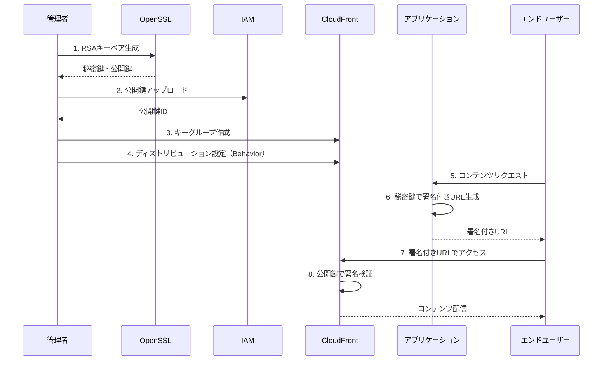
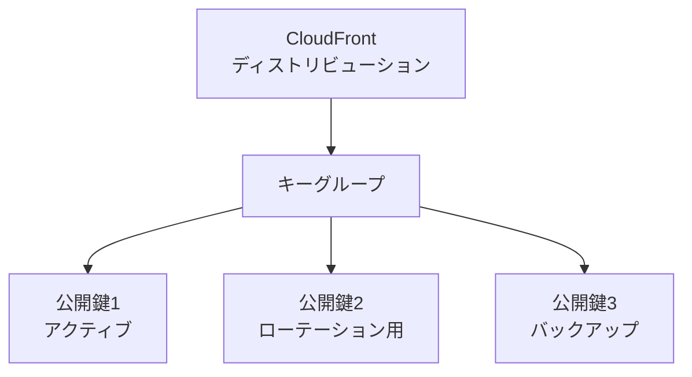
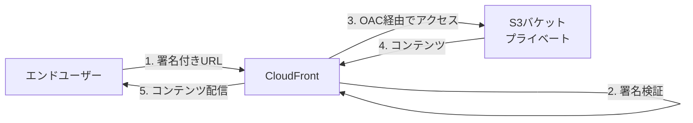

# CloudFront 署名付きURL・キーグループ

作成日: 2026-01-03

## 概要

CloudFrontの署名付きURL/Cookieは、プライベートコンテンツへのアクセス制御を実現します。キーグループ（推奨）または信頼された署名者（レガシー）を使用して、RSA公開鍵/秘密鍵ペアで署名を生成・検証します。

## 署名付きURL vs 署名付きCookie

| 項目 | 署名付きURL | 署名付きCookie |
|---|---|---|
| **用途** | 個別ファイルへのアクセス | 複数ファイルへのアクセス |
| **例** | 動画ファイル1つをダウンロード | ストリーミングサイトの全動画 |
| **URL変更** | 必要（署名パラメータ追加） | 不要（Cookieで制御） |
| **推奨ケース** | 単一リソース、ダウンロード | 複数リソース、Webサイト全体 |
| **実装** | URLに署名パラメータ追加 | Set-CookieヘッダーでCookie設定 |

### 署名付きURLの構成

```
https://d123.cloudfront.net/video.mp4?
  Expires=1234567890&
  Signature=abc123...&
  Key-Pair-Id=APKABC123
```

| パラメータ | 説明 |
|---|---|
| **Expires** | URLの有効期限（Unixタイムスタンプ） |
| **Signature** | 秘密鍵で生成した署名 |
| **Key-Pair-Id** | CloudFrontキーペアID |

## キーグループ vs 信頼された署名者

| 項目 | キーグループ（推奨） | 信頼された署名者（レガシー） |
|---|---|---|
| **推奨度** | ○（新規はこちら） | △（非推奨） |
| **キー管理** | IAMで公開鍵を管理 | AWSアカウントルートユーザーのキーペア |
| **キー数** | 最大5個/キーグループ | 2個/AWSアカウント |
| **キーローテーション** | 容易（複数キー同時使用可能） | 困難（最大2個のみ） |
| **マルチアカウント** | 対応（異なるAWSアカウントの公開鍵使用可能） | 限定的 |
| **セキュリティ** | ルートユーザー不要 | ルートユーザー必要（セキュリティリスク） |

## キーグループの設定手順

### 全体フロー



### 手順詳細

| ステップ | 内容 |
|---|---|
| **1. RSAキーペア生成** | OpenSSLでRSA-2048秘密鍵・公開鍵を生成 |
| **2. 公開鍵をIAMに登録** | IAMで公開鍵をアップロード（公開鍵IDを取得） |
| **3. キーグループ作成** | CloudFrontでキーグループを作成し、公開鍵を追加 |
| **4. ディストリビューション設定** | Behaviorでキーグループを指定（プライベートコンテンツ化） |
| **5. 署名付きURL生成** | アプリケーションで秘密鍵を使って署名付きURL生成 |
| **6. CloudFrontで検証** | CloudFrontが公開鍵で署名を検証してコンテンツ配信 |

### コマンド例

#### 1. RSAキーペア生成

```bash
# 秘密鍵生成（2048ビット）
openssl genrsa -out private_key.pem 2048

# 公開鍵生成
openssl rsa -pubout -in private_key.pem -out public_key.pem
```

#### 2. 署名付きURL生成（Python例）

```python
from cryptography.hazmat.primitives import hashes, serialization
from cryptography.hazmat.primitives.asymmetric import padding
import base64
import json
import time

def create_signed_url(url, key_pair_id, private_key_path, expiration_time):
    # ポリシー作成
    policy = {
        "Statement": [{
            "Resource": url,
            "Condition": {
                "DateLessThan": {"AWS:EpochTime": expiration_time}
            }
        }]
    }

    # 秘密鍵読み込み
    with open(private_key_path, 'rb') as key_file:
        private_key = serialization.load_pem_private_key(
            key_file.read(), password=None
        )

    # 署名生成
    policy_json = json.dumps(policy).encode('utf-8')
    signature = private_key.sign(policy_json, padding.PKCS1v15(), hashes.SHA1())

    # Base64エンコード
    signature_b64 = base64.b64encode(signature).decode('utf-8')

    # 署名付きURL生成
    signed_url = f"{url}?Expires={expiration_time}&Signature={signature_b64}&Key-Pair-Id={key_pair_id}"
    return signed_url

# 使用例
url = "https://d123.cloudfront.net/video.mp4"
key_pair_id = "APKABC123"
private_key_path = "private_key.pem"
expiration_time = int(time.time()) + 3600  # 1時間後

signed_url = create_signed_url(url, key_pair_id, private_key_path, expiration_time)
```

## キーグループの構成

### キーグループ管理



| 項目 | 内容 |
|---|---|
| **キーグループ名** | 任意の名前（例: production-key-group） |
| **公開鍵** | 最大5個登録可能 |
| **キーローテーション** | 新しい公開鍵追加 → 古い秘密鍵で生成したURL失効前に切替 |
| **複数キー同時使用** | 5個全て有効（ローテーション時のダウンタイムなし） |

## ディストリビューション設定

### Behavior設定

| 設定項目 | 内容 |
|---|---|
| **Restrict Viewer Access** | Yes（プライベートコンテンツ化） |
| **Trusted Authorization Type** | Trusted Key Groups（推奨） |
| **Key Groups** | 作成したキーグループを選択 |

### オリジンアクセス制御との組み合わせ



| レイヤー | 保護方法 |
|---|---|
| **エンドユーザー → CloudFront** | 署名付きURL/Cookie（キーグループ） |
| **CloudFront → S3** | OAC（Origin Access Control） |

## ポリシーステートメント

### Canned Policy（定義済みポリシー）

| 項目 | 内容 |
|---|---|
| **構成** | URL + 有効期限のみ |
| **用途** | シンプルなアクセス制御 |
| **署名URL例** | `?Expires=123&Signature=abc&Key-Pair-Id=APK` |

### Custom Policy（カスタムポリシー）

| 項目 | 内容 |
|---|---|
| **構成** | URL + 有効期限 + 開始時刻 + IPアドレス制限 |
| **用途** | 詳細なアクセス制御 |
| **追加条件** | DateGreaterThan（開始時刻）、IpAddress（IP制限） |

#### Custom Policy例

```json
{
  "Statement": [{
    "Resource": "https://d123.cloudfront.net/video/*",
    "Condition": {
      "DateLessThan": {"AWS:EpochTime": 1234567890},
      "DateGreaterThan": {"AWS:EpochTime": 1234560000},
      "IpAddress": {"AWS:SourceIp": "203.0.113.0/24"}
    }
  }]
}
```

| 条件 | 説明 |
|---|---|
| **DateLessThan** | 有効期限（必須） |
| **DateGreaterThan** | 開始時刻（オプション） |
| **IpAddress** | 許可するIPアドレス範囲（オプション） |

## ユースケース

| シナリオ | 推奨方法 | 理由 |
|---|---|---|
| **有料動画配信（単一ファイル）** | 署名付きURL | ファイルごとにアクセス制御 |
| **会員制Webサイト** | 署名付きCookie | 複数ページ・リソースに一度にアクセス |
| **ソフトウェアダウンロード** | 署名付きURL + IP制限 | 特定ネットワークからのみダウンロード可能 |
| **時限公開コンテンツ** | Custom Policy（開始時刻指定） | 特定日時からアクセス可能 |
| **企業内資料配信** | 署名付きCookie + IP制限 | 社内ネットワークのみアクセス |

## キーローテーション戦略

### 手順

| ステップ | 内容 |
|---|---|
| **1. 新しいキーペア生成** | OpenSSLで新しいRSAキーペア生成 |
| **2. 公開鍵をキーグループに追加** | 既存キーグループに新しい公開鍵追加（最大5個） |
| **3. アプリケーション更新** | 新しい秘密鍵で署名付きURL生成開始 |
| **4. 古いURL失効待ち** | 古い秘密鍵で生成したURLの有効期限切れを待つ |
| **5. 古い公開鍵削除** | キーグループから古い公開鍵を削除 |

### メリット

| メリット | 説明 |
|---|---|
| **ダウンタイムなし** | 複数の公開鍵を同時に有効化可能 |
| **段階的移行** | 新旧の鍵を並行運用しながら移行 |
| **セキュリティ向上** | 定期的なキーローテーションで鍵の漏洩リスク低減 |

## 制限事項

| 項目 | 制限 |
|---|---|
| **公開鍵数/キーグループ** | 最大5個 |
| **キーグループ数/ディストリビューション** | 制限なし（実質） |
| **公開鍵サイズ** | RSA-2048ビット |
| **署名付きURLの長さ** | 約500文字（Custom Policyで長くなる） |
| **有効期限** | Unix時間（秒単位、最大2038年問題に注意） |

## S3署名付きURLとの違い

| 項目 | CloudFront署名付きURL | S3署名付きURL |
|---|---|---|
| **署名主体** | CloudFrontキーグループ（RSA公開鍵） | IAMユーザー/ロール（AWS認証情報） |
| **CDN** | ○（エッジキャッシュ利用） | ×（S3直接アクセス） |
| **グローバル配信** | ○（低レイテンシ） | △（S3リージョンからのみ） |
| **キー管理** | 公開鍵/秘密鍵（RSA） | AWSアクセスキー/シークレットキー |
| **有効期限** | ポリシーで指定 | クエリパラメータで指定 |
| **用途** | 大規模配信、低レイテンシ | シンプルなプライベートアクセス |

## セキュリティベストプラクティス

| 項目 | 推奨事項 |
|---|---|
| **秘密鍵の保管** | AWS Secrets Manager、AWS Systems Manager Parameter Store |
| **有効期限** | 必要最小限（数時間〜数日） |
| **キーローテーション** | 年1〜2回定期的に実施 |
| **IP制限** | 可能な場合はCustom PolicyでIP制限 |
| **HTTPS** | 必須（署名付きURLもHTTPSで配信） |
| **ログ監視** | CloudFront ログで不正アクセス検知 |

## SAP試験の重要ポイント

### 署名付きURL/Cookie
- **用途**: プライベートコンテンツへのアクセス制御
- **署名付きURL**: 単一ファイル（動画ダウンロード等）
- **署名付きCookie**: 複数ファイル（会員制サイト等）
- **ポリシー**: Canned（シンプル）、Custom（IP制限・開始時刻指定可能）

### キーグループ（推奨）
- **RSA公開鍵/秘密鍵**: 2048ビット
- **公開鍵**: IAMで管理、最大5個/キーグループ
- **秘密鍵**: アプリケーションで管理（Secrets Manager推奨）
- **キーローテーション**: 複数鍵同時使用可能、ダウンタイムなし
- **マルチアカウント**: 対応

### 信頼された署名者（レガシー）
- **非推奨**: 新規はキーグループ使用
- **ルートユーザー**: AWSアカウントルートユーザーのキーペア必要
- **キー数**: 最大2個/アカウント

### CloudFront + S3
- **エンドユーザー → CloudFront**: 署名付きURL/Cookie
- **CloudFront → S3**: OAC（Origin Access Control）
- **2重保護**: CloudFrontとS3バケットポリシーで保護

### ユースケース
- **有料動画配信**: 署名付きURL
- **会員制サイト**: 署名付きCookie
- **時限公開**: Custom Policy（DateGreaterThan）
- **IP制限**: Custom Policy（IpAddress）
