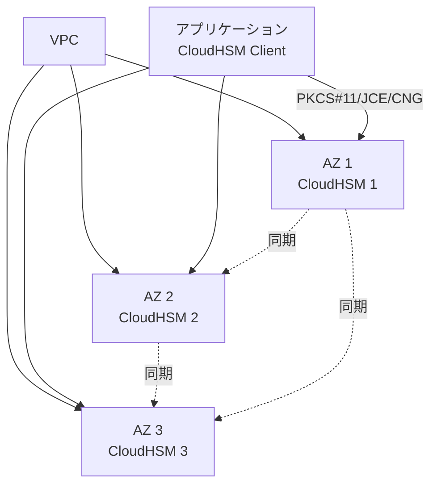
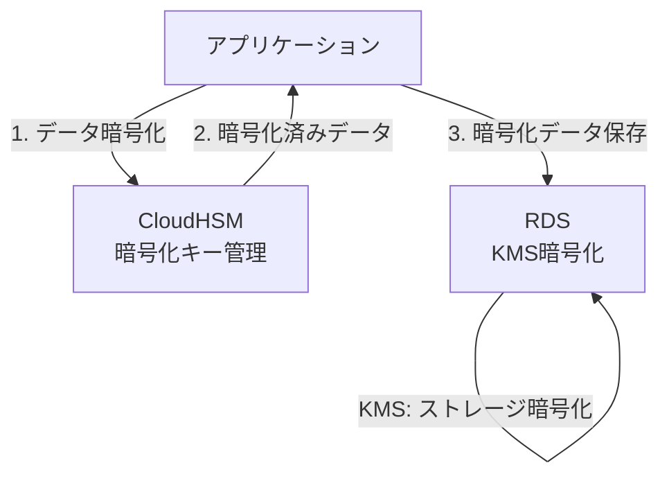
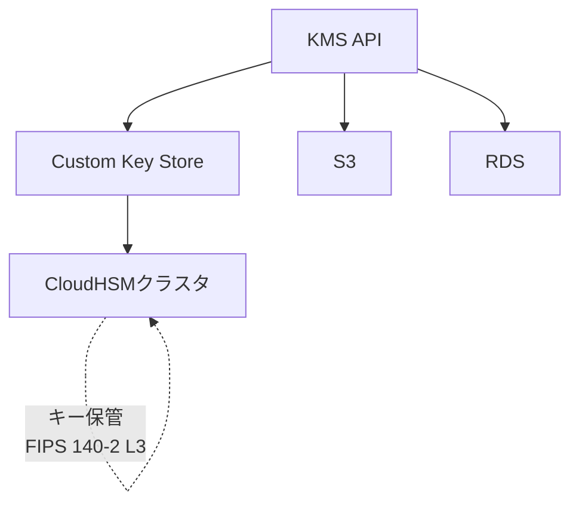

# AWS CloudHSM・KMS比較

作成日: 2026-01-03

## 概要

AWS CloudHSMとKMS（Key Management Service）は、どちらも暗号化キー管理サービスですが、制御レベル、コンプライアンス要件、コスト、AWSサービスとの統合において大きく異なります。CloudHSMはFIPS 140-2 Level 3準拠のハードウェアセキュリティモジュールで、完全なユーザー管理が可能です。

## CloudHSM vs KMS比較

| 項目 | AWS KMS | AWS CloudHSM |
|---|---|---|
| **制御レベル** | AWS管理（マルチテナント） | ユーザー完全管理（シングルテナント） |
| **FIPS 140-2** | Level 2（一部Level 3） | Level 3 |
| **キー管理** | AWS管理、カスタマー管理 | ユーザー専有HSM |
| **コンプライアンス** | 多くの規制対応 | 厳格な規制（金融、医療等） |
| **AWSサービス統合** | ネイティブ統合（S3、EBS、RDS等） | 限定的（手動統合が必要） |
| **料金** | $1/月/キー + API呼び出し料 | $1.45/時間/HSM（約$1,000/月） |
| **可用性** | 自動マルチAZ | 手動クラスタ構築（最低2台推奨） |
| **暗号化アルゴリズム** | 対称/非対称（RSA、ECC） | 幅広い（AES、RSA、ECC、ECDSA等） |
| **API** | AWS SDK統合 | PKCS#11、JCE、CNG |

## AWS CloudHSM詳細

### 概要

| 項目 | 内容 |
|---|---|
| **定義** | FIPS 140-2 Level 3準拠のハードウェアセキュリティモジュール |
| **用途** | 暗号化キーの生成・保管・使用（ユーザー専有） |
| **シングルテナント** | 専有HSMクラスタ（他ユーザーと共有なし） |
| **制御** | ユーザーが完全制御（AWSはハードウェアのみ管理） |

### FIPS 140-2レベル比較

| レベル | 要件 | 該当サービス |
|---|---|---|
| **Level 1** | 基本的な暗号化 | - |
| **Level 2** | 物理的な改ざん検知 | AWS KMS |
| **Level 3** | 改ざん時のキー削除、強固な物理セキュリティ | **AWS CloudHSM** |
| **Level 4** | 環境攻撃への耐性 | - |

### CloudHSMクラスタ構成

### 主要機能

| 機能 | 内容 |
|---|---|
| **暗号化キー管理** | AES、RSA、ECC、ECDSA等のキー生成・保管 |
| **暗号化操作** | 署名、検証、暗号化、復号化 |
| **クラスタ同期** | マルチAZ間でキー自動同期 |
| **API** | PKCS#11、Java JCE、Microsoft CNG |
| **バックアップ** | 暗号化されたバックアップ（S3保存） |

### 料金

| 項目 | 料金 |
|---|---|
| **HSM** | $1.45/時間（約$1,044/月） |
| **最低構成（2台）** | 約$2,088/月 |
| **推奨構成（3台、マルチAZ）** | 約$3,132/月 |

## RDSとの統合

### RDS暗号化オプション

| 暗号化方法 | KMS | CloudHSM |
|---|---|---|
| **RDS暗号化対応** | ○（ネイティブ対応） | ×（直接統合不可） |
| **理由** | - | RDSはKMSのみ対応 |
| **代替方法** | - | アプリケーション層暗号化 + CloudHSM |

### なぜRDSはCloudHSMに対応していないか

| 理由 | 説明 |
|---|---|
| **アーキテクチャ** | RDSはマネージドサービスでKMSと密接に統合 |
| **透過的暗号化** | RDSの透過的データ暗号化（TDE）はKMS前提 |
| **運用の複雑性** | CloudHSMはユーザー管理が必要（RDSの設計思想と不一致） |
| **CloudHSMの用途** | アプリケーション層での暗号化操作が主目的 |

### CloudHSMを使いたい場合の設計

| アプローチ | 説明 |
|---|---|
| **アプリケーション層暗号化** | CloudHSMでデータを暗号化してからRDSに保存 |
| **RDSはKMS暗号化** | ストレージレベルの暗号化はKMS使用 |
| **2重暗号化** | CloudHSM（カラムレベル）+ KMS（ディスクレベル） |

## AWSサービスとの統合

### KMS統合サービス（ネイティブ対応）

| サービス | KMS統合 | CloudHSM統合 |
|---|---|---|
| **S3** | ○（SSE-KMS） | △（カスタム実装） |
| **EBS** | ○（透過的暗号化） | × |
| **RDS** | ○（透過的暗号化） | × |
| **DynamoDB** | ○（暗号化保存） | × |
| **Lambda** | ○（環境変数暗号化） | △（カスタム実装） |
| **Redshift** | ○（クラスタ暗号化） | ○（HSMクライアント） |
| **EC2** | - | ○（アプリ実装） |

### CloudHSM適用パターン

| ユースケース | 実装方法 |
|---|---|
| **SSL/TLS証明書の秘密鍵** | CloudHSMで鍵管理、Webサーバーと統合 |
| **Oracle/SQL Server TDE** | EC2上のデータベースでCloudHSM使用 |
| **コード署名** | CloudHSMで署名鍵管理 |
| **カスタムアプリケーション暗号化** | PKCS#11/JCE/CNGでCloudHSM統合 |

## ユースケース別推奨

| 要件 | 推奨サービス | 理由 |
|---|---|---|
| **S3、RDS、EBS暗号化** | KMS | ネイティブ統合、低コスト、運用シンプル |
| **FIPS 140-2 Level 3必須** | CloudHSM | 金融、医療等の厳格な規制要件 |
| **キー完全制御が必要** | CloudHSM | シングルテナント、AWSはハードウェアのみ管理 |
| **SSL/TLS秘密鍵管理** | CloudHSM | Webサーバーと統合、鍵流出防止 |
| **Oracle/SQL Server TDE（EC2）** | CloudHSM | EC2上のデータベースで使用可能 |
| **低コスト、マネージド** | KMS | $1/月/キー、自動マルチAZ |
| **多数のAWSサービス統合** | KMS | S3、RDS、Lambda等とシームレス統合 |

## KMS Custom Key Store（CloudHSMバックエンド）

### 概要

| 項目 | 内容 |
|---|---|
| **定義** | CloudHSMをバックエンドとして使用するKMS |
| **目的** | KMSの使いやすさ + CloudHSMの制御レベル |
| **キー保管** | CloudHSMクラスタ内（FIPS 140-2 Level 3） |
| **AWS統合** | KMS APIで操作可能 |
| **制限** | 一部KMS機能非対応（自動キーローテーション等） |

### Custom Key Store構成

### Custom Key Storeのメリット・デメリット

| メリット | デメリット |
|---|---|
| KMS APIで操作可能（S3、RDS等と統合） | 自動キーローテーション非対応 |
| CloudHSMでキー保管（FIPS 140-2 Level 3） | 追加のCloudHSMコスト |
| キーの完全制御 | 設定・運用が複雑 |

## 制限事項

### CloudHSM

| 制限 | 内容 |
|---|---|
| **最小構成** | 2台（マルチAZ推奨で3台） |
| **VPC内配置** | VPC内のみ、インターネット直接アクセス不可 |
| **バックアップ** | 手動バックアップ推奨（自動は日次） |
| **監査ログ** | CloudWatch Logsに出力（要設定） |

### KMS

| 制限 | 内容 |
|---|---|
| **APIスロットリング** | リージョンごとに制限（GenerateDataKey: 5,500/秒等） |
| **キーポリシー** | 最大32KB |
| **マルチリージョンキー** | プライマリキー1つ + レプリカキー（リージョンごと） |

## SAP試験の重要ポイント

### CloudHSM
- **FIPS 140-2 Level 3**: 金融・医療等の厳格な規制要件
- **シングルテナント**: 専有HSM、完全なユーザー制御
- **RDS非対応**: RDS暗号化はKMSのみ対応
- **料金**: 約$1,045/月/HSM、最低2台推奨
- **API**: PKCS#11、JCE、CNG（標準暗号化API）
- **マルチAZ**: 手動クラスタ構築、キー自動同期

### KMS
- **FIPS 140-2 Level 2**: 多くのコンプライアンス要件に対応
- **AWS統合**: S3、RDS、EBS、Lambda等とネイティブ統合
- **料金**: $1/月/キー + API呼び出し料
- **自動ローテーション**: カスタマー管理キーで年1回自動ローテーション可能
- **マルチリージョン**: マルチリージョンキーで複数リージョンで同一キーID使用

### RDS暗号化
- **KMSのみ**: RDS透過的暗号化はKMSのみ対応
- **CloudHSM代替**: アプリケーション層でCloudHSM暗号化 + RDSはKMS暗号化
- **Custom Key Store**: CloudHSMバックエンドのKMSでRDS暗号化可能

### ユースケース
- **S3/RDS/EBS暗号化**: KMS（ネイティブ統合）
- **厳格な規制（FIPS 140-2 Level 3）**: CloudHSM
- **SSL/TLS秘密鍵管理**: CloudHSM
- **EC2上のOracle/SQL Server TDE**: CloudHSM
- **低コスト・マネージド**: KMS
