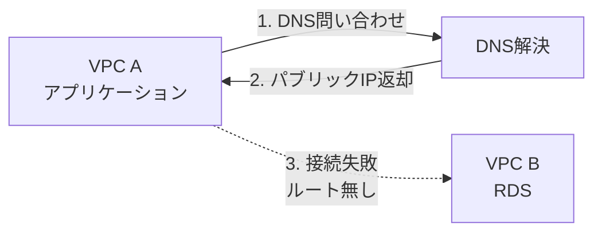
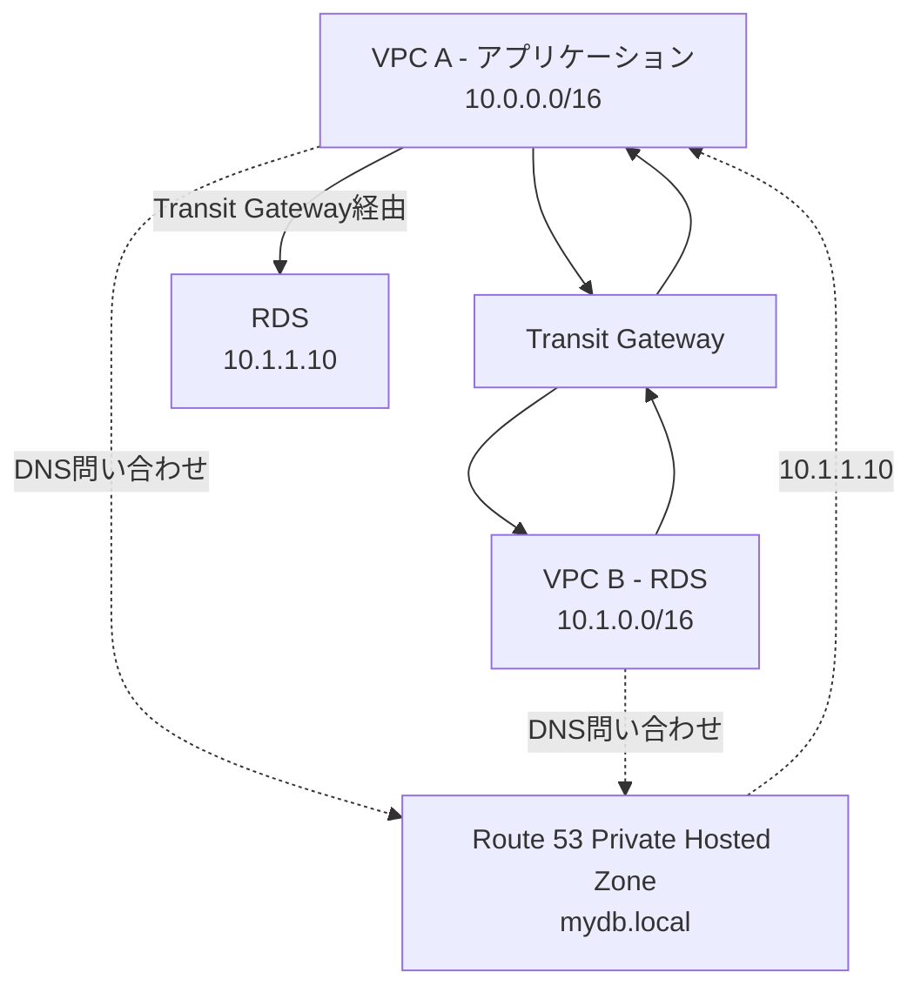
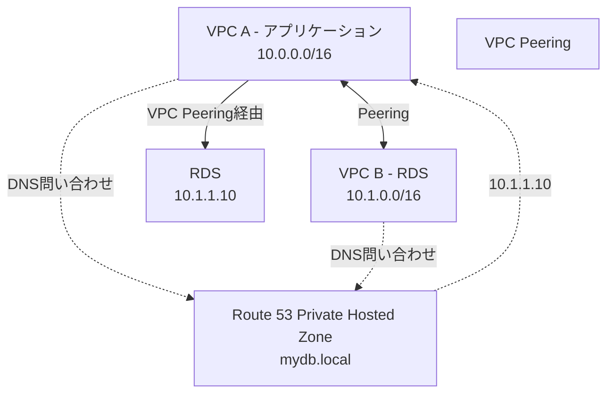
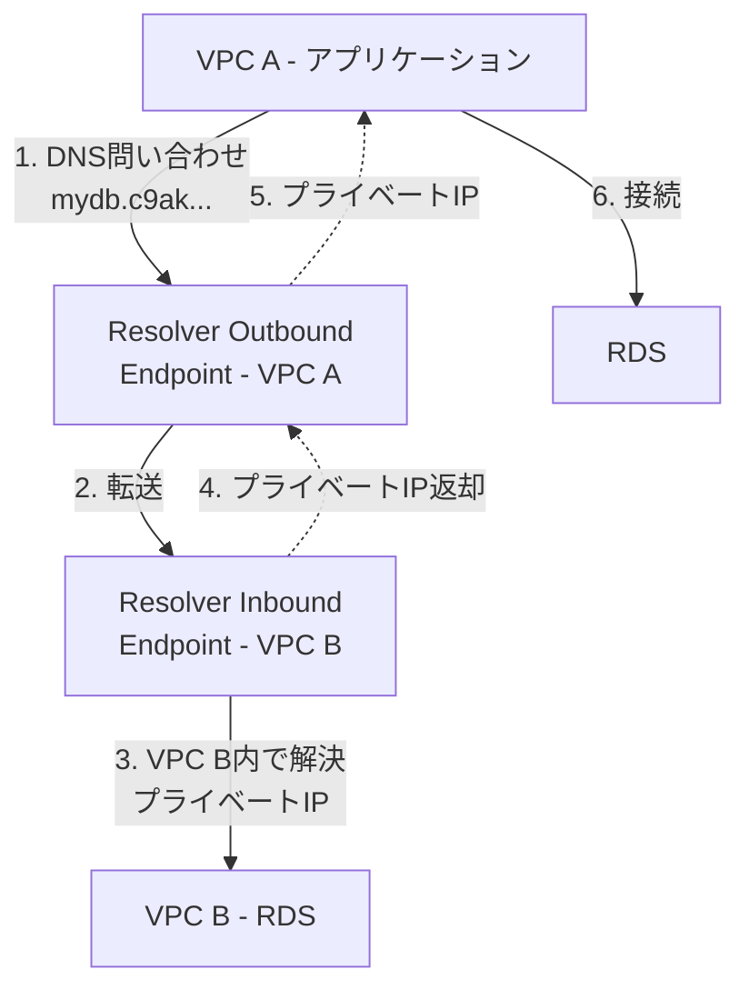
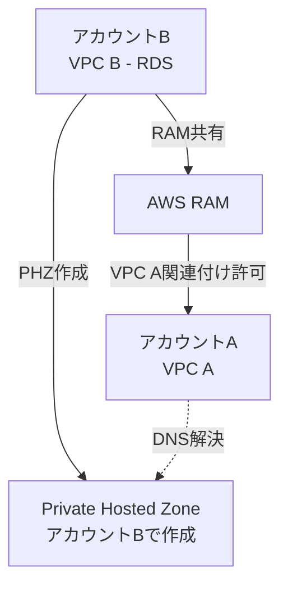

# クロスVPC DNS・RDS接続

作成日: 2026-01-03

## 概要

異なるVPCのプライベートサブネットにあるRDSへの接続では、ネットワーク接続（Transit Gateway、VPC Peering）とDNS解決（Route 53 Private Hosted Zone）の両方が必要です。RDSエンドポイントのDNS解決がVPC固有のため、適切な設定が重要です。

## 問題の背景

### RDSエンドポイントとDNS

| 項目 | 内容 |
|---|---|
| **エンドポイント形式** | `mydb.c9akciq32.ap-northeast-1.rds.amazonaws.com` |
| **DNS応答** | VPC内からのみプライベートIPを返す |
| **VPC外からの解決** | パブリックIPを返す（プライベートサブネット内RDSの場合、接続不可） |
| **問題** | 他VPCから解決するとパブリックIP返却 → ルーティング不可 |

### 基本的な課題

**原因**: RDSのDNS解決はVPC固有。VPC Aから解決するとパブリックIPが返却されるが、プライベートサブネットのRDSには接続不可。

## 解決方法の比較

| 方法 | ネットワーク | DNS解決 | 複雑度 | コスト | 推奨 |
|---|---|---|---|---|---|
| **Transit Gateway + Route 53 PHZ** | Transit Gateway | Private Hosted Zone共有 | 高 | 中〜高 | 大規模環境 |
| **VPC Peering + Route 53 PHZ** | VPC Peering | Private Hosted Zone共有 | 中 | 低 | 中規模環境 |
| **VPC Peering + DNS転送** | VPC Peering | Route 53 Resolver Endpoint | 中 | 低 | 特定ケース |
| **PrivateLink** | VPC Endpoint Service | エンドポイント名 | 低 | 中 | サービス提供 |

## Transit Gateway + Route 53 Private Hosted Zone

### 構成

### 設定手順

| ステップ | 内容 |
|---|---|
| **1. Transit Gateway作成** | VPC A、VPC Bをアタッチ |
| **2. ルートテーブル設定** | 各VPCのルートテーブルに相手VPCのCIDR → TGW |
| **3. Private Hosted Zone作成** | ドメイン名（例: `mydb.local`） |
| **4. PHZをVPC A、Bに関連付け** | 両VPCでDNS解決可能に |
| **5. Aレコード作成** | `mydb.mydb.local` → RDSのプライベートIP（10.1.1.10） |
| **6. アプリケーション接続** | `mydb.mydb.local`で接続 |

### Route 53 Private Hosted Zone設定

| 項目 | 設定 |
|---|---|
| **ドメイン名** | `mydb.local` |
| **VPC関連付け** | VPC A、VPC B |
| **Aレコード** | `mydb.mydb.local` A 10.1.1.10 |
| **TTL** | 300秒（推奨） |

### メリット・デメリット

| メリット | デメリット |
|---|---|
| 複数VPC（最大5,000）対応 | Transit Gateway料金（$0.05/時間/アタッチメント + データ処理料） |
| 中央集中管理 | 設定複雑 |
| スケーラブル | - |

## VPC Peering + Route 53 Private Hosted Zone

### 構成

### 設定手順

| ステップ | 内容 |
|---|---|
| **1. VPC Peering作成** | VPC A ↔ VPC B |
| **2. ルートテーブル設定** | 各VPCのルートテーブルに相手VPCのCIDR → Peering |
| **3. セキュリティグループ** | RDSのSGでVPC AのCIDR（10.0.0.0/16）を許可 |
| **4. Private Hosted Zone作成** | ドメイン名（例: `mydb.local`） |
| **5. PHZをVPC A、Bに関連付け** | 両VPCでDNS解決可能に |
| **6. Aレコード作成** | `mydb.mydb.local` → RDSのプライベートIP（10.1.1.10） |

### メリット・デメリット

| メリット | デメリット |
|---|---|
| 低コスト（データ転送料のみ） | 1対1接続（複数VPCはメッシュ構成必要） |
| シンプル | 推移的Peeringなし |
| 低レイテンシ | CIDR重複不可 |

## CNAMEによる既存エンドポイント活用

### 構成

既存のRDSエンドポイント（`mydb.c9akciq32.ap-northeast-1.rds.amazonaws.com`）を利用する場合。

| 方法 | 設定 | 問題 |
|---|---|---|
| **PHZでCNAME** | `mydb.local` CNAME `mydb.c9akciq32...rds.amazonaws.com` | VPC Aからの解決でパブリックIPが返る（失敗） |
| **PHZでAレコード** | `mydb.local` A `10.1.1.10` | 正常に動作（推奨） |

**結論**: Private Hosted ZoneではAレコードでプライベートIPを直接指定する。

## Route 53 Resolver Endpoint（DNS転送）

### 構成

### 設定手順

| ステップ | 内容 |
|---|---|
| **1. VPC Peering or TGW** | ネットワーク接続確立 |
| **2. Inbound Endpoint作成（VPC B）** | VPC B内にResolver Inbound Endpoint |
| **3. Outbound Endpoint作成（VPC A）** | VPC A内にResolver Outbound Endpoint |
| **4. 転送ルール作成（VPC A）** | `*.rds.amazonaws.com` → Inbound EndpointのIP |
| **5. アプリケーション接続** | RDSの元のエンドポイント名で接続 |

### Resolver Endpoint料金

| 項目 | 料金 |
|---|---|
| **Inbound Endpoint** | $0.125/時間 + $0.40/100万クエリ |
| **Outbound Endpoint** | $0.125/時間 + $0.40/100万クエリ |

### メリット・デメリット

| メリット | デメリット |
|---|---|
| 既存エンドポイント名そのまま利用可能 | 追加コスト（Endpoint料金） |
| 複雑なドメイン転送対応 | 設定複雑 |

## Private Hosted Zone共有（AWS RAM）

### 概要

| 項目 | 内容 |
|---|---|
| **機能** | Private Hosted ZoneをAWS Organizations内で共有 |
| **用途** | 複数アカウント間でのDNS共有 |
| **設定** | AWS Resource Access Manager（RAM）で共有 |

### 構成

### 設定手順

| ステップ | 内容 |
|---|---|
| **1. PHZ作成（アカウントB）** | RDSが存在するアカウントで作成 |
| **2. RAM共有設定** | PHZをアカウントAに共有 |
| **3. VPC A関連付け（アカウントA）** | アカウントAのVPC AをPHZに関連付け |

## 実装パターン別推奨

| シナリオ | 推奨方法 | 理由 |
|---|---|---|
| **2〜3 VPC間接続** | VPC Peering + PHZ | 低コスト、シンプル |
| **多数VPC（10+）** | Transit Gateway + PHZ | スケーラブル、中央管理 |
| **クロスアカウント** | VPC Peering/TGW + PHZ（RAM共有） | アカウント間DNS共有 |
| **既存エンドポイント名維持** | Resolver Endpoint | エンドポイント名変更不要 |
| **サービス提供** | PrivateLink | DNSエンドポイント自動割り当て |

## 注意点とトラブルシューティング

### DNS解決確認

| 確認項目 | コマンド | 期待結果 |
|---|---|---|
| **DNS解決** | `nslookup mydb.mydb.local` | プライベートIP（10.1.1.10） |
| **接続確認** | `telnet mydb.mydb.local 3306` | 接続成功 |
| **VPC DNS設定** | VPC設定確認 | `enableDnsHostnames: true`、`enableDnsSupport: true` |

### よくある問題

| 問題 | 原因 | 解決方法 |
|---|---|---|
| **DNS解決でパブリックIP** | PHZが関連付けられていない | VPC AをPHZに関連付け |
| **DNS解決失敗** | VPC DNS無効 | VPC設定で`enableDnsSupport: true` |
| **接続タイムアウト** | ルートテーブル設定不足 | TGW/Peeringへのルート追加 |
| **接続拒否** | セキュリティグループ | RDS SGでVPC AのCIDRを許可 |

### VPC DNS設定

| 設定 | 必要性 | 説明 |
|---|---|---|
| **enableDnsSupport** | 必須 | Amazon提供DNS（VPC+2アドレス）有効化 |
| **enableDnsHostnames** | 推奨 | パブリックIPのDNSホスト名自動割り当て |

## SAP試験の重要ポイント

### RDS DNS問題
- **VPC固有**: RDSエンドポイントのDNS解決はVPC固有
- **他VPCから**: パブリックIPが返却される（プライベートRDSは接続不可）
- **解決方法**: Route 53 Private Hosted ZoneでAレコード作成

### Route 53 Private Hosted Zone
- **VPC関連付け**: 複数VPCに関連付け可能
- **Aレコード**: プライベートIP直接指定（推奨）
- **CNAME**: 既存RDSエンドポイントへのCNAMEは不可（パブリックIP返却）
- **AWS RAM**: Organizations内でPHZ共有可能

### Transit Gateway vs VPC Peering
- **TGW**: 多数VPC、中央管理、コスト高
- **VPC Peering**: 少数VPC、低コスト、1対1

### Route 53 Resolver Endpoint
- **用途**: DNS転送、既存エンドポイント名維持
- **料金**: $0.125/時間/Endpoint + クエリ料金
- **構成**: Outbound（送信元VPC）+ Inbound（RDS VPC）

### VPC DNS設定
- **enableDnsSupport**: 必須（Amazon DNS有効化）
- **enableDnsHostnames**: 推奨（DNS名自動割り当て）

### 実装パターン
- **2〜3 VPC**: VPC Peering + PHZ
- **多数VPC**: Transit Gateway + PHZ
- **クロスアカウント**: RAM共有PHZ
- **既存名維持**: Resolver Endpoint
