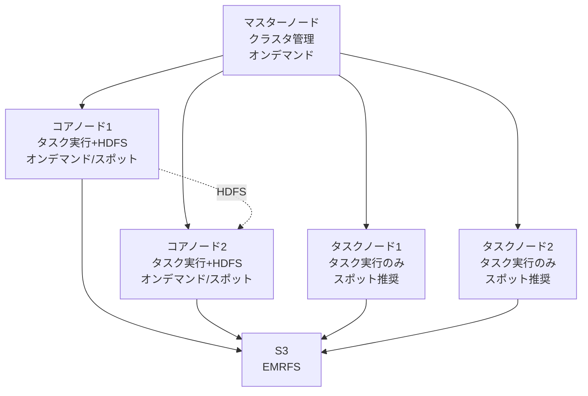

# Amazon EMR（Elastic MapReduce）

作成日: 2026-01-03

## 概要

Amazon EMRは、Apache Hadoop、Spark等のビッグデータフレームワークを簡単に実行できるマネージドサービスです。マスターノード、コアノード、タスクノードで構成され、スポットインスタンス活用によるコスト最適化、サーバーレスオプション（EMR Serverless）も提供します。

## EMRクラスタ構成

### ノードタイプ

| ノードタイプ | 役割 | 台数 | データ保存 | スポット推奨 |
|---|---|---|---|---|
| **マスターノード** | クラスタ管理、タスク調整、YARN ResourceManager | 1台（または3台HA） | × | × |
| **コアノード** | タスク実行 + HDFS データ保存 | 1台以上 | ○ | △ |
| **タスクノード** | タスク実行のみ（データ保存なし） | 0台以上（オプション） | × | ○ |

### ノード詳細

#### マスターノード（Master Node）

| 項目 | 内容 |
|---|---|
| **役割** | クラスタ管理、ジョブスケジューリング、ヘルスモニタリング |
| **台数** | 1台（単一障害点）または3台（高可用性） |
| **重要性** | 停止するとクラスタ全体停止 |
| **スポット使用** | 不可（オンデマンドのみ） |
| **HA構成** | 3台のマスターノード（クォーラムベース） |

#### コアノード（Core Node）

| 項目 | 内容 |
|---|---|
| **役割** | タスク実行 + HDFS データ保存 |
| **台数** | 1台以上（スケール可能） |
| **データ** | HDFSデータを保持（永続化） |
| **スポット使用** | 可能だがリスクあり（データ損失の可能性） |
| **スケーリング** | 手動または自動スケーリング |
| **削除** | データ損失リスクがあるため慎重に |

#### タスクノード（Task Node）

| 項目 | 内容 |
|---|---|
| **役割** | タスク実行のみ（データ保存なし） |
| **台数** | 0台以上（完全にオプション） |
| **データ** | 保存しない（処理のみ） |
| **スポット使用** | ○推奨（コスト削減、中断されても影響小） |
| **スケーリング** | 柔軟にスケール（ワークロード変動対応） |
| **用途** | 一時的な処理能力追加 |

### クラスタ構成図

## スポットインスタンス戦略

### ノード別推奨

| ノード | スポット使用 | 理由 |
|---|---|---|
| **マスターノード** | × 不可 | 停止でクラスタ全停止 |
| **コアノード** | △ 慎重に | データ保存あり、中断でデータ損失リスク |
| **タスクノード** | ○ 推奨 | データ保存なし、中断されても再実行可能 |

### スポット活用パターン

| パターン | 構成 | メリット | デメリット |
|---|---|---|---|
| **保守的** | マスター:オンデマンド、コア:オンデマンド、タスク:スポット | 安定性高、一部コスト削減 | コスト削減効果は限定的 |
| **バランス型** | マスター:オンデマンド、コア:50%スポット、タスク:スポット | コストと安定性のバランス | コア中断でデータ損失リスク |
| **積極的（S3使用）** | マスター:オンデマンド、コア:最小限、タスク:大量スポット + EMRFS(S3) | 最大コスト削減 | S3 I/Oコスト、レイテンシ |

### スポット中断対策

| 対策 | 説明 |
|---|---|
| **タスクノード中心** | タスクノードをスポットにしてスケールアウト |
| **EMRFS（S3）** | HDFSの代わりにS3をストレージに使用（データ永続化） |
| **複数インスタンスタイプ** | スポットフリート（複数インスタンスタイプで中断リスク分散） |
| **自動スケーリング** | スポット中断時に自動で他のインスタンス起動 |

## ストレージオプション

### HDFS vs EMRFS（S3）

| 項目 | HDFS | EMRFS（S3） |
|---|---|---|
| **保存場所** | コアノードのローカルディスク | S3バケット |
| **パフォーマンス** | 高速（ローカルI/O） | 中速（ネットワークI/O） |
| **永続性** | コアノード削除で消失 | 永続的（クラスタ削除後も保持） |
| **コスト** | EBS料金 | S3料金 + リクエスト料金 |
| **スポット適性** | 低（データ損失リスク） | 高（データ永続化） |
| **用途** | 一時データ、高速処理 | 永続データ、クラスタ間共有 |

### 推奨構成

| ユースケース | ストレージ | 理由 |
|---|---|---|
| **一時的な分析** | HDFS | 高速、クラスタ削除後不要 |
| **継続的な分析** | EMRFS（S3） | データ永続化、クラスタ削除可能 |
| **スポット活用** | EMRFS（S3） | データ損失リスクなし |
| **ハイブリッド** | HDFS + S3 | 中間データはHDFS、結果はS3 |

## EMRデプロイオプション

### EMR on EC2（従来型）

| 項目 | 内容 |
|---|---|
| **構成** | マスター/コア/タスクノードをEC2で構築 |
| **制御** | 完全な制御（インスタンスタイプ、設定等） |
| **スケーリング** | 手動または自動スケーリング |
| **料金** | EC2料金 + EMR料金（約25%追加） |
| **用途** | カスタマイズが必要、長時間実行 |

### EMR Serverless

| 項目 | 内容 |
|---|---|
| **構成** | サーバー管理不要（完全マネージド） |
| **制御** | 自動リソース管理（AWSが最適化） |
| **スケーリング** | 自動（ワークロードに応じて） |
| **料金** | 使用した計算・メモリリソースのみ課金 |
| **用途** | 断続的なジョブ、運用負荷削減 |
| **起動時間** | 高速（事前ウォーム不要） |

### EMR on EKS

| 項目 | 内容 |
|---|---|
| **構成** | EKSクラスタ上でEMRジョブ実行 |
| **制御** | Kubernetes管理、複数チーム共有 |
| **スケーリング** | Kubernetesオートスケーリング |
| **料金** | EKS + EMR on EKS料金 |
| **用途** | マルチテナント、既存EKS活用 |

### EMR on Outposts

| 項目 | 内容 |
|---|---|
| **構成** | オンプレミスOutposts上でEMR実行 |
| **用途** | データ主権、低レイテンシ要件 |

## アプリケーションフレームワーク

| フレームワーク | 用途 |
|---|---|
| **Hadoop** | 分散データ処理（MapReduce） |
| **Spark** | 高速インメモリ処理、機械学習 |
| **Hive** | SQL-likeクエリ（HiveQL） |
| **Presto** | 高速対話型クエリ |
| **HBase** | NoSQL データベース |
| **Flink** | ストリーム処理 |
| **Zeppelin/Jupyter** | ノートブック（対話的分析） |

## EMRクラスタ起動モード

| モード | 説明 | 用途 |
|---|---|---|
| **長時間実行** | クラスタを長期間維持 | 継続的な処理、対話的分析 |
| **一時的** | ジョブ完了後に自動終了 | バッチ処理、コスト最適化 |

## 自動スケーリング

### マネージドスケーリング（推奨）

| 項目 | 内容 |
|---|---|
| **管理** | AWSが自動管理 |
| **対象** | コアノード、タスクノード |
| **基準** | YARN メトリクス（CPU、メモリ使用率） |
| **推奨** | ○（最適化された動作） |

### カスタムスケーリング

| 項目 | 内容 |
|---|---|
| **管理** | ユーザーがCloudWatch アラームで設定 |
| **柔軟性** | 高（独自メトリクス使用可能） |
| **複雑度** | 高 |

## セキュリティ

| 機能 | 内容 |
|---|---|
| **暗号化（保存時）** | EBS、S3（SSE-S3/KMS）、HDFS暗号化 |
| **暗号化（転送時）** | TLS（ノード間通信） |
| **認証** | Kerberos、IAM、Lake Formation |
| **VPC** | プライベートサブネット内配置 |
| **Security Group** | ノード間通信制御 |

## SAP試験の重要ポイント

### ノードタイプ
- **マスター**: クラスタ管理、1台または3台（HA）、オンデマンドのみ
- **コア**: タスク実行 + HDFS、1台以上、スポット可（リスクあり）
- **タスク**: タスク実行のみ、オプション、スポット推奨

### スポット戦略
- **マスター**: スポット不可（停止でクラスタ全停止）
- **コア**: スポット慎重に（データ損失リスク）
- **タスク**: スポット推奨（データなし、コスト削減）
- **S3使用**: EMRFS（S3）でデータ永続化、スポット活用可能

### ストレージ
- **HDFS**: コアノードローカル、高速、クラスタ削除で消失
- **EMRFS（S3）**: 永続的、クラスタ間共有、スポット適性高

### デプロイオプション
- **EMR on EC2**: 従来型、完全制御、EC2 + EMR料金
- **EMR Serverless**: サーバーレス、自動スケーリング、使用分のみ課金
- **EMR on EKS**: EKS上で実行、マルチテナント
- **EMR on Outposts**: オンプレミス

### コスト最適化
- **タスクノード + スポット**: 処理能力をスポットで追加
- **EMRFS（S3）**: コアノード最小化、データはS3
- **一時的クラスタ**: ジョブ完了後に自動終了
- **マネージドスケーリング**: 自動で最適なリソース割り当て

### ユースケース
- **バッチ処理**: 一時的クラスタ + EMRFS（S3）
- **対話的分析**: 長時間実行 + HDFS
- **スポット活用**: タスクノード中心 + EMRFS（S3）
- **断続的ジョブ**: EMR Serverless
