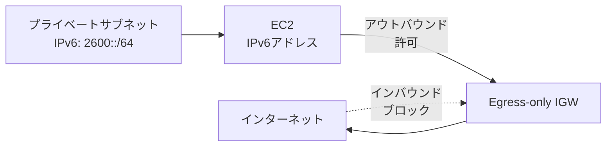
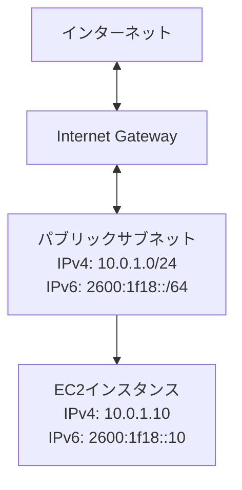
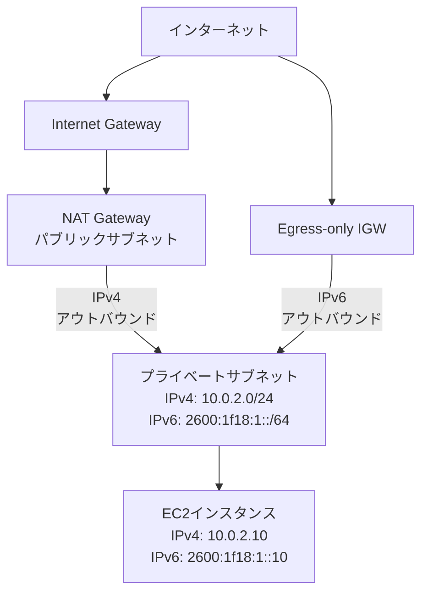

# VPC IPv6対応

作成日: 2026-01-03

## 概要

VPCはIPv4とIPv6のデュアルスタック構成をサポートします。IPv6ではグローバルユニキャストアドレスが自動割り当てされ、Egress-only Internet Gateway（EIGW）によりアウトバウンド専用通信が可能です。

## IPv4 vs IPv6比較

| 項目 | IPv4 | IPv6 |
|---|---|---|
| **アドレス長** | 32ビット | 128ビット |
| **アドレス表記** | 10.0.1.5 | 2600:1f18:1234:5678::1 |
| **VPC CIDR** | 手動設定（/16〜/28） | AWS割り当て（/56固定） |
| **サブネットCIDR** | 手動設定 | /64固定 |
| **プライベートIP** | 可能（RFC1918） | なし（全てグローバル） |
| **NAT** | 必要（プライベートIP用） | 不要（グローバル直接通信） |
| **Egress専用** | NAT Gateway | Egress-only IGW |

## VPCでのIPv6設定

### IPv6 CIDR割り当て

| 項目 | 内容 |
|---|---|
| **CIDR範囲** | /56固定（AWS自動割り当て） |
| **サブネット** | /64固定 |
| **アドレス数** | 約1.8 × 10^19アドレス/サブネット |
| **割り当て方法** | Amazon提供 or BYOIP（Bring Your Own IP） |
| **デュアルスタック** | IPv4とIPv6を同時使用可能 |

### サブネット設定

| 項目 | IPv4 | IPv6 |
|---|---|---|
| **CIDR設定** | 手動（例: 10.0.1.0/24） | 自動（VPCの/56から/64を割り当て） |
| **自動割り当て** | オプション | オプション（有効化推奨） |
| **パブリックIP** | Elastic IP or 自動割り当て | グローバルユニキャスト（常時） |

### EC2インスタンスのIPv6

| 項目 | 内容 |
|---|---|
| **IPv6アドレス** | サブネットから自動割り当て |
| **プライマリIP** | IPv4（必須） |
| **デュアルスタック** | IPv4 + IPv6同時利用 |
| **DNS** | AAAA レコード（IPv6）、A レコード（IPv4） |

## Internet Gateway（IGW）

### IPv4とIPv6の動作

| 項目 | IPv4 | IPv6 |
|---|---|---|
| **役割** | NAT（プライベート↔パブリック） | ルーティングのみ |
| **インバウンド** | パブリックIPへの通信 | グローバルIPv6への直接通信 |
| **アウトバウンド** | パブリックIPから発信 | グローバルIPv6から直接発信 |
| **NATの必要性** | あり（プライベートIP用） | なし |

### ルートテーブル設定

```
IPv4:
0.0.0.0/0 → igw-xxxxx（パブリックサブネット）

IPv6:
::/0 → igw-xxxxx（パブリックサブネット）
```

## Egress-only Internet Gateway（EIGW）

### 概要

| 項目 | 内容 |
|---|---|
| **役割** | IPv6アウトバウンド専用ゲートウェイ |
| **プロトコル** | IPv6のみ |
| **インバウンド** | ブロック（インターネットから接続不可） |
| **アウトバウンド** | 許可（VPCからインターネットへ） |
| **ステートフル** | はい（レスポンストラフィックは許可） |

### NAT Gateway vs EIGW

| 項目 | NAT Gateway（IPv4） | Egress-only IGW（IPv6） |
|---|---|---|---|
| **対象プロトコル** | IPv4 | IPv6 |
| **用途** | プライベートサブネットのアウトバウンド | IPv6のアウトバウンド専用 |
| **インバウンド** | 不可 | 不可 |
| **アウトバウンド** | 可 | 可 |
| **ステートフル** | はい | はい |
| **料金** | 時間料金 + データ処理料 | 無料 |
| **可用性** | AZ単位（冗長化推奨） | VPC全体で自動冗長化 |

### EIGW構成図



### ルートテーブル設定

```
プライベートサブネット（IPv6アウトバウンド専用）:
::/0 → eigw-xxxxx
```

### ユースケース

| シナリオ | 推奨ゲートウェイ | 理由 |
|---|---|---|
| **パブリックサブネット（双方向通信）** | Internet Gateway | インバウンド・アウトバウンド両方必要 |
| **プライベートサブネット（アウトバウンドのみ）** | Egress-only IGW（IPv6）+ NAT Gateway（IPv4） | セキュリティ、アウトバウンド専用 |
| **完全プライベート** | なし or VPC Endpoint | インターネット接続不要 |

## セキュリティグループとNACL

### セキュリティグループ

| 項目 | IPv4 | IPv6 |
|---|---|---|
| **ルール指定** | 0.0.0.0/0 | ::/0 |
| **個別IP** | 203.0.113.5/32 | 2600:1f18::1/128 |
| **動作** | ステートフル（戻りトラフィック自動許可） | 同左 |

**例**:
```
インバウンド:
  HTTP  0.0.0.0/0   ポート80
  HTTP  ::/0        ポート80

アウトバウンド:
  All   0.0.0.0/0
  All   ::/0
```

### NACL

| 項目 | IPv4 | IPv6 |
|---|---|---|
| **ルール** | 0.0.0.0/0 | ::/0 |
| **動作** | ステートレス（戻りトラフィックも明示的許可必要） | 同左 |

## デュアルスタック構成

### パブリックサブネット



**ルートテーブル**:
```
0.0.0.0/0  → igw-xxxxx
::/0       → igw-xxxxx
```

### プライベートサブネット



**ルートテーブル**:
```
0.0.0.0/0  → nat-xxxxx（IPv4アウトバウンド）
::/0       → eigw-xxxxx（IPv6アウトバウンド）
```

## IPv6移行戦略

### 段階的移行

| ステップ | 内容 |
|---|---|
| **1. VPCにIPv6 CIDR追加** | 既存VPCにIPv6 /56を関連付け |
| **2. サブネットにIPv6 CIDR追加** | 各サブネットに/64を割り当て |
| **3. ルートテーブル更新** | ::/0をIGW or EIGWに追加 |
| **4. セキュリティグループ更新** | ::/0ルールを追加 |
| **5. EC2起動時にIPv6有効化** | 新規インスタンスでIPv6自動割り当て |
| **6. アプリケーション対応** | IPv6対応コード、DNS（AAAA）設定 |

### IPv6のみ構成（VPC）

| 項目 | 内容 |
|---|---|
| **対応時期** | 2021年以降サポート |
| **VPC CIDR** | IPv6のみ（IPv4不要） |
| **制限** | EC2、ECS、Lambda等は対応済み、一部サービス非対応 |
| **用途** | 新規構築、IPv4アドレス枯渇対策 |

## 料金

| 項目 | 料金 |
|---|---|
| **IPv6 CIDR割り当て** | 無料 |
| **Egress-only IGW** | 無料 |
| **Internet Gateway（IPv6）** | 無料（データ転送料のみ） |
| **NAT Gateway** | $0.045/時間 + $0.045/GB |

## 制限事項

| 制限 | 内容 |
|---|---|
| **VPC CIDR** | /56固定（変更不可） |
| **サブネットCIDR** | /64固定 |
| **VPC Peering** | IPv6対応済み |
| **VPN** | IPv6トンネルは非対応（IPv4のみ） |
| **Direct Connect** | IPv6対応済み |
| **Transit Gateway** | IPv6対応済み |

## SAP試験の重要ポイント

### IPv6の特徴
- **CIDR**: VPC /56固定、サブネット /64固定（AWS自動割り当て）
- **全てグローバル**: プライベートIPv6アドレスなし
- **NAT不要**: 直接グローバル通信
- **デュアルスタック**: IPv4 + IPv6同時利用可能

### Egress-only IGW
- **用途**: IPv6アウトバウンド専用
- **インバウンド**: ブロック（セキュリティ向上）
- **ステートフル**: レスポンストラフィック自動許可
- **料金**: 無料
- **冗長性**: VPC全体で自動冗長化

### NAT Gateway vs EIGW
- **NAT Gateway**: IPv4アウトバウンド、時間料金+データ処理料
- **EIGW**: IPv6アウトバウンド、無料、自動冗長化

### ゲートウェイの使い分け
- **パブリックサブネット**: Internet Gateway（IPv4/IPv6双方向）
- **プライベートサブネット（IPv4）**: NAT Gateway
- **プライベートサブネット（IPv6）**: Egress-only IGW

### セキュリティ
- **セキュリティグループ**: ::/0（全IPv6）、ステートフル
- **NACL**: ::/0、ステートレス（明示的な戻りルール必要）

### 移行
- **段階的移行**: 既存VPCにIPv6 CIDR追加可能
- **IPv6のみVPC**: 2021年以降対応、一部サービス制限
