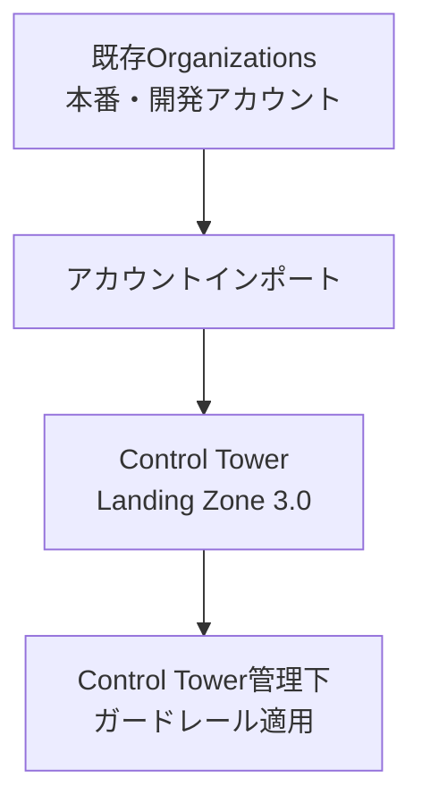
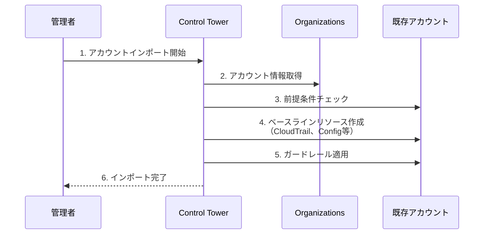
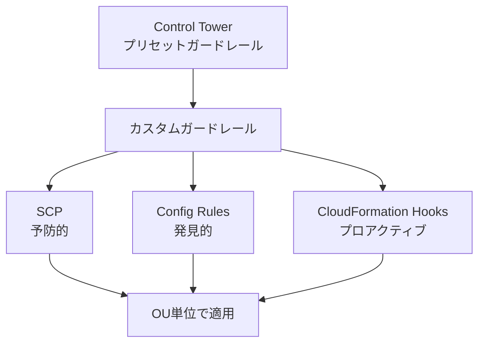
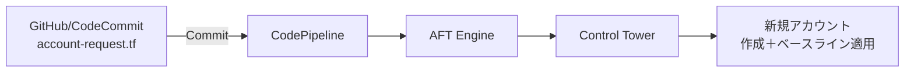
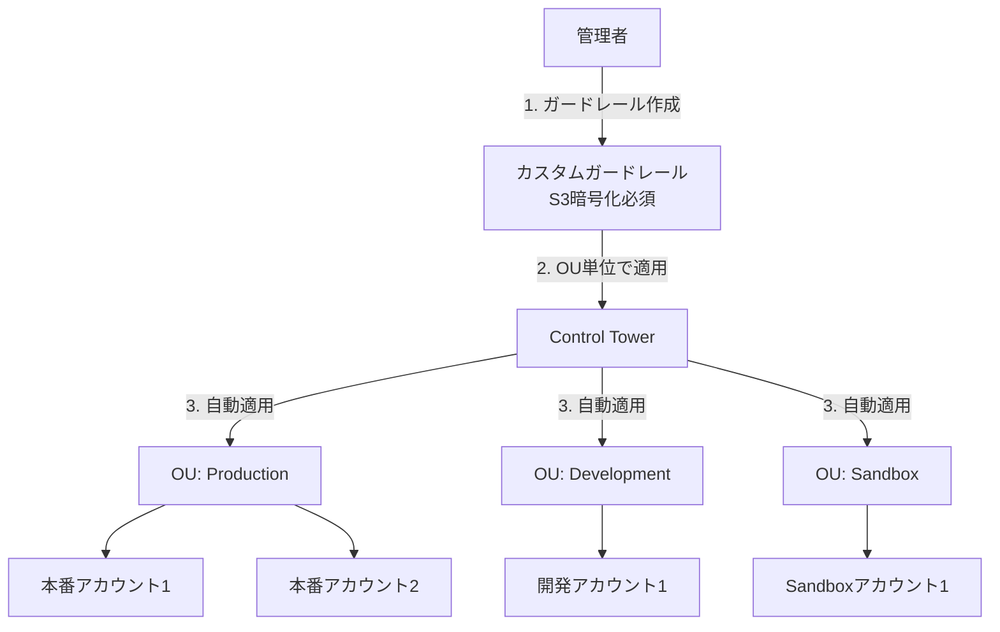
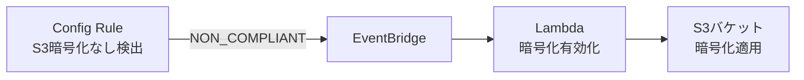
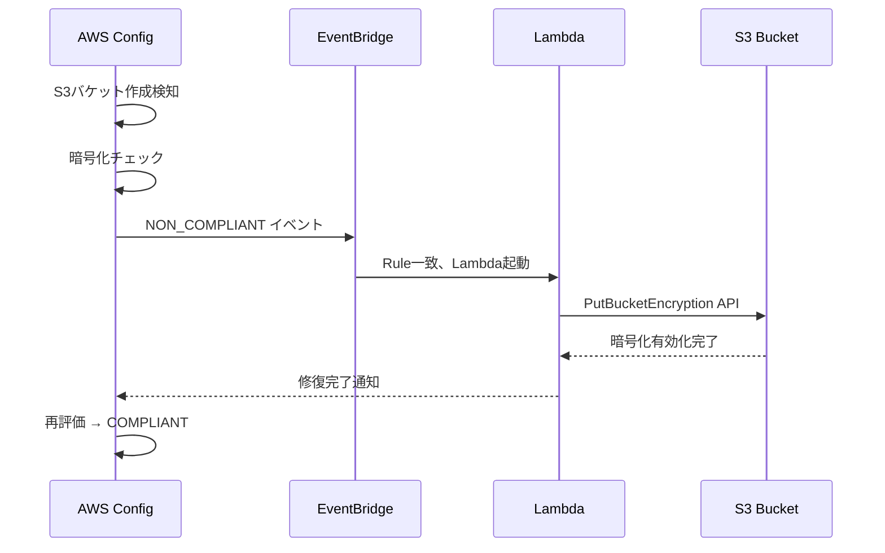
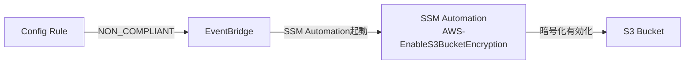

# AWS Control Tower Landing Zone 3.0以降

作成日: 2026-01-06

## 概要

AWS Control Tower Landing Zone 3.0以降（2023年後半〜2024年リリース）は、マルチアカウント管理の自動化を大幅に強化しました。**既存アカウントのインポート**、**カスタムガードレールの柔軟な適用**、**統制の自動展開**がSAP試験の頻出ポイントです。

## Landing Zone 2.x vs 3.0以降の違い

| 項目 | Landing Zone 2.x（旧） | Landing Zone 3.0以降（新） |
|---|---|---|
| **既存アカウント** | 新規アカウントのみ対応 | 既存Organizations配下のアカウントをインポート可能 |
| **カスタマイズ** | 制限あり | Terraform/CloudFormationでカスタマイズ可能 |
| **ガードレール** | プリセットのみ | カスタムガードレール（Config Rules、SCP）を追加可能 |
| **Account Factory** | Service Catalogベース | Account Factory for Terraform (AFT) 対応 |
| **移行** | 既存環境からの移行困難 | 段階的移行・インポートが容易 |
| **API対応** | 限定的 | Control Tower API で自動化強化 |

## Landing Zone 3.0の主要機能

### 1. 既存アカウントのインポート（重要）

#### 従来の問題点

Landing Zone 2.xでは、**既存のAWS Organizationsアカウントを管理下に置くことが困難**でした:

```
既存Organizations:
  - 本番アカウント（10個）
  - 開発アカウント（5個）
  → Control Towerで管理したい

Landing Zone 2.x:
  ✗ 既存アカウントはインポート不可
  ✗ 新規アカウントのみ作成可能
  → 既存アカウントを削除して再作成する必要がある（現実的でない）
```

#### Landing Zone 3.0の解決策

**既存アカウントを管理下にインポート可能**になりました:



| 項目 | 内容 |
|---|---|
| **インポート対象** | 既存のOrganizations配下の任意のアカウント |
| **前提条件** | アカウントがOrganizations配下にあること |
| **インポート後** | ガードレール自動適用、Control Towerの管理対象になる |
| **リソース保持** | 既存リソースはそのまま保持（削除不要） |
| **利点** | 段階的にControl Tower管理を拡大できる |

#### インポート手順



| ステップ | 内容 | 詳細 |
|---|---|---|
| **1. 前提条件確認** | アカウントがOrganizationsの配下か確認 | ルートアカウントではなくOUに所属 |
| **2. インポート実行** | Control Towerコンソールから「Enroll account」 | または AWS CLI/API |
| **3. ベースライン適用** | CloudTrail、Config、SNSトピック等を自動作成 | Control Towerの標準設定 |
| **4. ガードレール適用** | 予防的ガードレール（SCP）、発見的ガードレール（Config）を適用 | OU単位で自動適用 |
| **5. 検証** | Account Factory、ガードレールのコンプライアンス状況確認 | ダッシュボードで確認 |

### 2. カスタムガードレール（重要）

#### ガードレールの種類

| タイプ | 実装 | 例 | 動作 |
|---|---|---|---|
| **予防的ガードレール** | SCP（Service Control Policy） | EC2でt3.micro以外のインスタンス起動を禁止 | リソース作成を事前にブロック |
| **発見的ガードレール** | AWS Config Rules | S3バケットの暗号化が無効を検出 | 違反を検出・通知（事後） |
| **プロアクティブガードレール** | CloudFormation Hooks | CFnでパブリックS3バケット作成を事前拒否 | テンプレート検証時にブロック |

#### カスタムガードレールの追加

Landing Zone 3.0では、**組織固有のガードレール**を追加できます:



**例: 特定リージョンのみ許可（カスタムSCP）**

```json
{
  "Version": "2012-10-17",
  "Statement": [{
    "Effect": "Deny",
    "Action": "*",
    "Resource": "*",
    "Condition": {
      "StringNotEquals": {
        "aws:RequestedRegion": ["us-east-1", "ap-northeast-1"]
      }
    }
  }]
}
```

**例: S3バケットに必ずタグを付ける（カスタムConfig Rule）**

```yaml
# Custom Config Rule
Rule: s3-bucket-tagging-required
ResourceType: AWS::S3::Bucket
Compliance:
  - Tag "Environment" must exist
  - Tag "Owner" must exist
```

### 3. Account Factory for Terraform (AFT)

#### 従来のAccount Factory vs AFT

| 項目 | Account Factory（Service Catalog） | Account Factory for Terraform (AFT) |
|---|---|---|
| **IaC** | CloudFormation | Terraform |
| **カスタマイズ** | 限定的 | 高度なカスタマイズ可能 |
| **CI/CD** | 手動 | Git + Pipeline自動化 |
| **対象ユーザー** | GUIベース、シンプル | Terraformユーザー、大規模組織 |
| **アカウント作成** | Service Catalogから手動 | Gitにコミットで自動作成 |

#### AFTのアーキテクチャ



**アカウント作成リクエスト（account-request.tf）**:

```hcl
module "new_account" {
  source = "github.com/aws-ia/terraform-aws-control_tower_account_factory"

  control_tower_parameters = {
    AccountEmail              = "dev-team@example.com"
    AccountName               = "Development-Account-01"
    ManagedOrganizationalUnit = "Development"
    SSOUserEmail              = "admin@example.com"
    SSOUserFirstName          = "Dev"
    SSOUserLastName           = "Admin"
  }

  account_tags = {
    Environment = "Development"
    CostCenter  = "Engineering"
  }

  custom_baseline = "baseline-dev"
}
```

**AFTの利点**:

| 利点 | 説明 |
|---|---|
| **Infrastructure as Code** | アカウント設定をGit管理、バージョン管理 |
| **自動化** | GitへのコミットでアカウントPipeline起動 |
| **カスタムベースライン** | アカウントごとに異なるTerraformモジュール適用 |
| **レビュープロセス** | Pull Requestでアカウント作成をレビュー |
| **大規模展開** | 数百〜数千アカウントの管理に適する |

### 4. Control Tower API

Landing Zone 3.0では、**API/CLI経由での操作**が強化されました:

| API | 用途 |
|---|---|
| **CreateLandingZone** | Landing Zone作成 |
| **UpdateLandingZone** | Landing Zone更新 |
| **EnrollAccount** | 既存アカウントをインポート |
| **EnableControl** | ガードレール有効化 |
| **DisableControl** | ガードレール無効化 |
| **ListEnabledControls** | 有効なガードレール一覧 |

**例: 既存アカウントをインポート**

```bash
aws controltower enroll-account \
  --account-id 123456789012 \
  --organizational-unit-name "Production"
```

### 5. 統制の自動展開（試験頻出）

#### シナリオ

組織全体に新しいセキュリティ要件（例: S3バケット暗号化必須）を迅速に展開したい。

#### Landing Zone 3.0での実現方法



| ステップ | 内容 | 所要時間 |
|---|---|---|
| **1. ガードレール作成** | カスタムConfig Rule（S3暗号化チェック）を作成 | 数分 |
| **2. OU単位で適用** | Control Towerで「全OU」に適用 | 数分 |
| **3. 自動展開** | 全アカウントに自動でガードレールが適用される | 数分〜数十分 |
| **4. コンプライアンス確認** | ダッシュボードで違反アカウントを確認 | リアルタイム |
| **5. 自動修復** | EventBridge + Lambda/SSM Automationで自動修復 | 検出後数分 |

**従来（Landing Zone 2.x以前）との比較**:

| 作業 | 従来 | Landing Zone 3.0 |
|---|---|---|
| **ガードレール作成** | 手動でSCP/Config作成 | カスタムガードレールとして登録 |
| **アカウントへの適用** | 各アカウントに手動適用 | OU単位で自動適用 |
| **新規アカウント** | 手動で設定追加 | 自動で適用される |
| **所要時間（100アカウント）** | 数日〜数週間 | 数時間 |

## Landing Zone 3.0のユースケース

### ユースケース1: 既存環境のControl Tower化

**シナリオ**: 50個の既存アカウントをControl Towerで統制したい

| ステップ | 作業 |
|---|---|
| **1. 評価** | 既存アカウントの構成を確認（CloudTrail、Config有無） |
| **2. OU設計** | Production、Development、Sandbox等のOUを設計 |
| **3. ガードレール選定** | プリセット + カスタムガードレールを選定 |
| **4. パイロット** | 1〜2アカウントを試験的にインポート |
| **5. 段階的インポート** | 5〜10アカウントずつインポート |
| **6. コンプライアンス確認** | ダッシュボードで違反を検出・修復 |
| **7. 全展開** | 全50アカウントをインポート完了 |

**メリット**: 既存リソースを削除せず、ダウンタイムなしでControl Tower管理下に移行できる。

### ユースケース2: マルチリージョン展開の統制

**シナリオ**: グローバル展開で、特定リージョン（US、EU、APAC）のみ使用を許可したい

| 実装 | 内容 |
|---|---|
| **ガードレール** | カスタムSCPで許可リージョンを制限 |
| **適用範囲** | 全OU（Root OU配下の全アカウント） |
| **例外処理** | 特定のロール（AdminRole）は除外 |
| **自動展開** | 新規アカウント作成時に自動適用 |

### ユースケース3: コンプライアンス要件の自動化

**シナリオ**: PCI DSS要件（暗号化、ログ保持等）を全アカウントに自動適用したい

| 要件 | ガードレール |
|---|---|
| **EBS暗号化必須** | プリセットガードレール「EC2 EBS暗号化必須」 |
| **S3暗号化必須** | カスタムConfig Rule |
| **CloudTrail有効化** | Control Towerベースライン（自動） |
| **ログ保持90日以上** | カスタムConfig Rule |
| **パブリックアクセス禁止** | プリセットガードレール「S3パブリックアクセス禁止」 |

**自動修復**:



## 自動修復の設計（試験頻出）

### EventBridge + Lambda パターン



**EventBridge Rule**:

```json
{
  "source": ["aws.config"],
  "detail-type": ["Config Rules Compliance Change"],
  "detail": {
    "configRuleName": ["s3-bucket-encryption-enabled"],
    "newEvaluationResult": {
      "complianceType": ["NON_COMPLIANT"]
    }
  }
}
```

**Lambda関数（Python例）**:

```python
import boto3

def lambda_handler(event, context):
    s3 = boto3.client('s3')

    # Extract bucket name from Config event
    bucket_name = event['detail']['resourceId']

    # Enable default encryption
    s3.put_bucket_encryption(
        Bucket=bucket_name,
        ServerSideEncryptionConfiguration={
            'Rules': [{
                'ApplyServerSideEncryptionByDefault': {
                    'SSEAlgorithm': 'AES256'
                }
            }]
        }
    )

    return {'statusCode': 200, 'body': f'Encryption enabled for {bucket_name}'}
```

### SSM Automation パターン



**SSM Automation Document（プリセット利用）**:

```yaml
# AWS-EnableS3BucketEncryption (AWS提供)
automationAssumeRole: arn:aws:iam::123456789012:role/SSMAutomationRole
parameters:
  BucketName: ${BUCKET_NAME}
  SSEAlgorithm: AES256
```

| パターン | Lambda | SSM Automation |
|---|---|---|
| **柔軟性** | 高（任意のコード） | 中（定義済みドキュメント） |
| **開発コスト** | コード開発必要 | プリセット利用可能 |
| **推奨ケース** | 複雑な修復ロジック | 標準的な修復（EC2停止、タグ付与等） |

## SAP試験の重要ポイント

### Landing Zone 3.0の新機能
- **既存アカウントインポート**: Organizations配下の既存アカウントをControl Tower管理下に追加可能（試験頻出）
- **カスタムガードレール**: 組織固有のSCP、Config Rules、CloudFormation Hooksを追加
- **Account Factory for Terraform (AFT)**: Terraform + Git + CI/CDでアカウント作成を自動化
- **Control Tower API**: EnrollAccount、EnableControl等のAPI/CLI操作

### 既存アカウントインポートの手順
1. 前提条件確認（Organizationsの配下か）
2. Control Towerから「Enroll account」実行
3. ベースラインリソース自動作成（CloudTrail、Config、SNS）
4. ガードレール自動適用（OU単位）
5. ダッシュボードでコンプライアンス確認

### ガードレールの種類
- **予防的**: SCP（リソース作成をブロック）
- **発見的**: Config Rules（違反を検出）
- **プロアクティブ**: CloudFormation Hooks（CFnテンプレート検証）

### 自動修復の設計（試験頻出）
- **EventBridge + Lambda**: 柔軟な修復ロジック、カスタムコード
- **EventBridge + SSM Automation**: 標準的な修復、プリセットドキュメント利用
- **フロー**: Config検知 → EventBridge → Lambda/SSM → 修復 → Config再評価

### よくある試験問題パターン
- 「50個の既存アカウントをControl Towerで管理したい」→ Landing Zone 3.0で既存アカウントインポート
- 「組織全体に新しいガードレールを迅速に展開」→ カスタムガードレールをOU単位で適用、自動展開
- 「S3バケット暗号化違反を自動修復」→ Config + EventBridge + Lambda/SSM
- 「TerraformでアカウントをCI/CD管理」→ Account Factory for Terraform (AFT)
- 「特定リージョンのみ使用許可」→ カスタムSCP（予防的ガードレール）

### Landing Zone 2.x vs 3.0（試験で問われる違い）
- **既存アカウント**: 2.x不可 → 3.0可能
- **カスタマイズ**: 2.x制限 → 3.0柔軟
- **API**: 2.x限定的 → 3.0充実（EnrollAccount等）
- **AFT**: 2.x未対応 → 3.0対応
