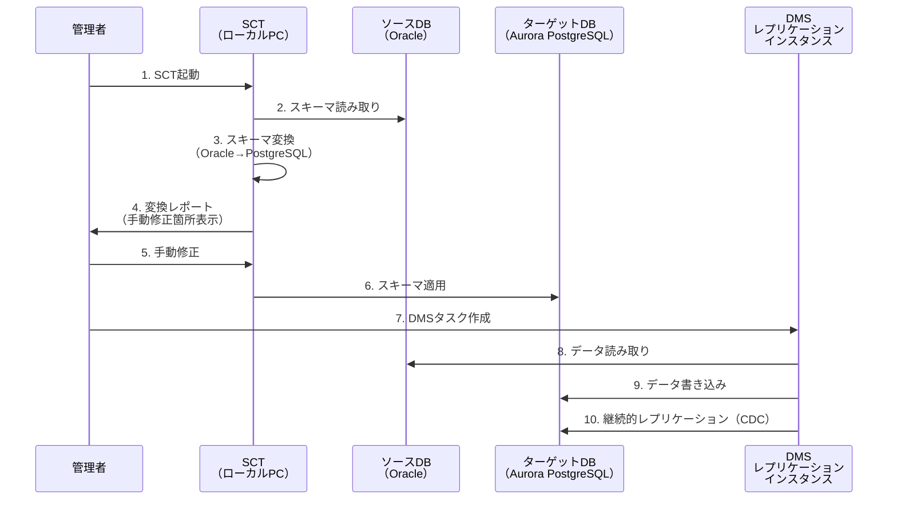
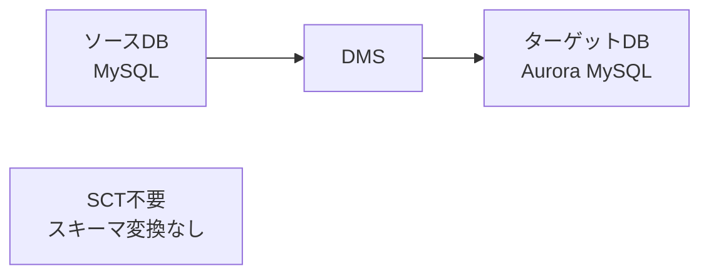
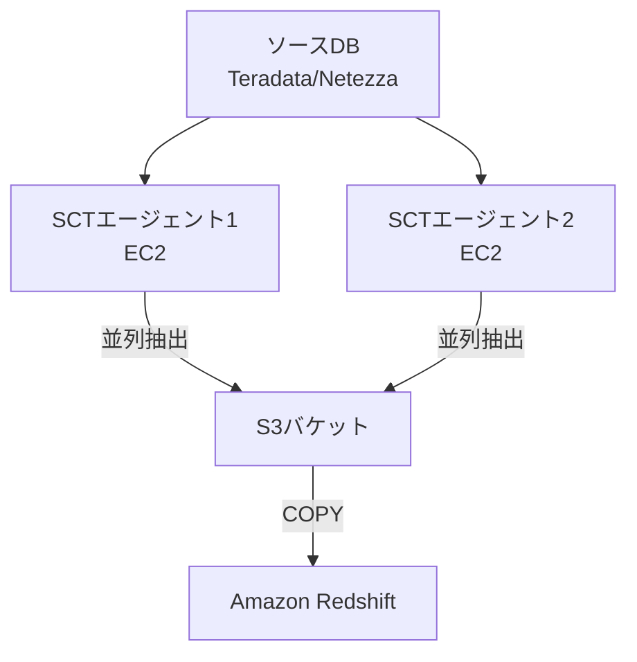
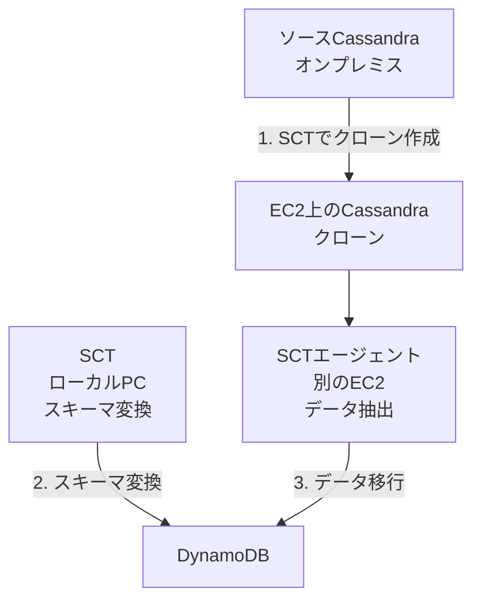
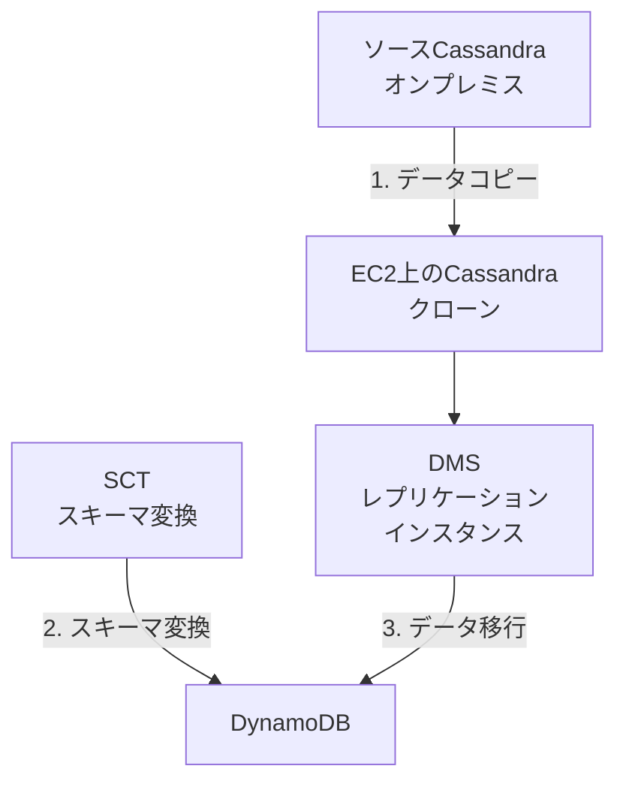

# データベース移行（SCT・DMS）

作成日: 2026-01-06

## 概要

AWSのデータベース移行は、AWS Schema Conversion Tool（SCT）とAWS Database Migration Service（DMS）という2つの異なる役割を持つツールを組み合わせて実行します。

### なぜ2つのツールが必要なのか

データベース移行には「**構造（スキーマ）**」と「**データ（レコード）**」という2つの要素があります:

1. **構造（スキーマ）**: テーブル定義、インデックス、ビュー、ストアドプロシージャなど
2. **データ（レコード）**: 実際に保存されている行データ

**SCT**はスキーマを変換し、**DMS**はデータを移行します。例えるなら、家を引っ越す時に「**設計図を描き直す作業（SCT）**」と「**家具を運ぶ作業（DMS）**」が必要なのと似ています。

### 異種移行と同種移行の違い

- **異種移行**（例: Oracle → PostgreSQL）: データベースエンジンが異なるため、スキーマの構文が違います。そのため**SCTで変換が必須**です
- **同種移行**（例: MySQL → Aurora MySQL）: 同じエンジンなので、スキーマはそのまま使えます。**SCT不要**で、DMSだけでスキーマもデータも移行できます

## SCT vs DMS比較

| 項目 | AWS SCT（Schema Conversion Tool） | AWS DMS（Database Migration Service） |
|---|---|---|
| **役割** | スキーマ・コード変換 | データ移行・レプリケーション |
| **実行場所** | ローカルPC（デスクトップアプリ） | AWSクラウド（レプリケーションインスタンス） |
| **変換対象** | スキーマ、ストアドプロシージャ、関数、トリガー | データ（テーブル、レコード） |
| **出力** | 変換済みSQLスクリプト | ターゲットDBへのデータ書き込み |
| **料金** | 無料 | レプリケーションインスタンス料金 + データ転送料 |
| **用途** | 異種移行のスキーマ変換 | 継続的レプリケーション、最小ダウンタイム移行 |

## 移行フロー

### 異種移行（例: Oracle → Aurora PostgreSQL）



### 同種移行（例: MySQL → Aurora MySQL）



| 移行タイプ | SCT | DMS | 例 |
|---|---|---|---|
| **異種移行** | ○必要 | ○必要 | Oracle → PostgreSQL、SQL Server → MySQL |
| **同種移行** | ×不要 | ○必要 | MySQL → Aurora MySQL、PostgreSQL → PostgreSQL |

## AWS SCT（Schema Conversion Tool）

### 概要

| 項目 | 内容 |
|---|---|
| **目的** | 異なるDBエンジン間のスキーマ・コード変換 |
| **実行環境** | ローカルPC（Windows/Mac/Linux） |
| **変換対象** | テーブル、インデックス、ビュー、ストアドプロシージャ、関数、トリガー |
| **料金** | 無料 |
| **出力** | 変換済みDDL、評価レポート |

### 主要機能

| 機能 | 説明 |
|---|---|
| **スキーマ変換** | ソースDBスキーマをターゲットDB形式に変換 |
| **評価レポート** | 変換の複雑度、手動修正必要箇所を表示 |
| **コード変換** | ストアドプロシージャ、関数の自動変換 |
| **データ抽出エージェント** | 大規模データウェアハウス移行（後述） |

### 変換対応パターン

| ソース | ターゲット例 |
|---|---|
| **Oracle** | Aurora PostgreSQL、PostgreSQL、MySQL |
| **SQL Server** | Aurora PostgreSQL、PostgreSQL、MySQL、Aurora MySQL |
| **MySQL** | Aurora PostgreSQL、PostgreSQL |
| **PostgreSQL** | Aurora MySQL、MySQL |
| **DB2** | PostgreSQL、MySQL |
| **Cassandra** | DynamoDB |
| **データウェアハウス** | Teradata、Netezza → Amazon Redshift |

### SCTエージェント（Data Extraction Agent）

#### SCTエージェントとは何か

通常のSCTはスキーマ変換だけを行いますが、**大規模なデータウェアハウス（数TB〜数PB）やCassandraクラスタ**を移行する場合、データ抽出も必要になります。ここで**SCTエージェント**が登場します。

SCTエージェントは、**ソースのデータベースからデータを抽出し、ターゲットにロードする専用プログラム**です。DMSではなくSCTエージェントを使う理由は、以下の最適化を活用できるためです:

- **並列処理**: 複数エージェントで並列抽出、高速化
- **大規模データ対応**: 数TB〜数PBのデータ移行に最適化
- **S3経由の転送**: データをS3経由で効率的に転送

#### 対応移行パターン

| 移行パターン | データ経路 |
|---|---|
| **データウェアハウス → Redshift** | ソースDWH（Teradata、Netezza等）→ エージェント → S3 → Redshift |
| **Cassandra → DynamoDB** | ソースCassandra → エージェント → ターゲットDynamoDB |

#### 概要

| 項目 | 内容 |
|---|---|
| **用途** | 大規模データウェアハウス（Teradata、Netezza等）→ Redshift、Cassandra → DynamoDB |
| **実行場所** | オンプレミス or EC2 |
| **役割** | データ抽出、S3アップロード（DWH移行）、DynamoDB書き込み（Cassandra移行） |
| **並列処理** | 複数エージェントで並列実行可能 |
| **DMSとの違い** | 大規模データに特化、並列性能、ソース特有の最適化 |

#### エージェント構成



| 項目 | 内容 |
|---|---|
| **並列化** | 複数エージェントで並列抽出、高速化 |
| **S3経由** | 大規模データをS3経由でRedshiftにロード |
| **圧縮** | データ圧縮してS3転送（帯域削減） |

### Cassandra → DynamoDB移行（SCT + SCTエージェント使用）

#### なぜEC2クローンが必要なのか - 詳細解説

Cassandra → DynamoDB移行で**なぜEC2にクローンを作成するのか**、これはSAP試験でも頻出の重要ポイントです。

**シナリオ**: オンプレミスにCassandraクラスタがあり、DynamoDBに移行したい場合を考えます。

##### 直接移行の問題点

オンプレミスCassandraから直接移行しようとすると、以下の問題があります:

1. **ネットワーク帯域の制約**: オンプレミス → AWS間のVPN/Direct Connect帯域が限られている（例: 1Gbps）ため、大量データ移行に時間がかかる
2. **本番環境への負荷**: 継続的にCassandraを読み取ることで、本番トラフィックに影響を与える
3. **データ整合性**: 移行中も本番が稼働していると、データが変わり続けて整合性確保が困難

##### EC2クローン経由の利点

そこで、**EC2にCassandraのクローン（コピー）を作成**してから移行します:

```
オンプレミスCassandra → [一度だけコピー] → EC2 Cassandra → [SCTエージェント] → DynamoDB
```

**メリット**:
- **本番環境への影響ゼロ**: EC2クローンから移行するため、本番Cassandraは通常運用のまま
- **高速転送**: EC2 → DynamoDBはAWS内部ネットワークで高速（10Gbps以上）
- **データ整合性**: クローン作成時点のスナップショットで移行、変更されない
- **テスト・検証**: EC2クローンで何度でもテスト移行できる

#### データ移行の2つの選択肢

Cassandra → DynamoDB移行には、**2つのデータ移行方法**があります:

| 方法 | ツール | 用途 |
|---|---|---|
| **DMSを使用** | AWS DMS | 標準的な移行、継続的レプリケーション（CDC）対応 |
| **SCTエージェントを使用** | SCT Data Extraction Agent | 大規模データ、並列処理による高速化 |

**試験での重要ポイント**: 試験問題では「**SCTでCassandraクラスタのクローンをEC2に作成し、別のEC2にインストールしたSCTデータ抽出エージェントを使用して移行**」という選択肢が正解になることがあります。

#### 背景

| 項目 | 内容 |
|---|---|
| **ソース** | オンプレミス or EC2上のCassandraクラスタ |
| **ターゲット** | Amazon DynamoDB |
| **課題** | Cassandra（NoSQL）→ DynamoDB（NoSQL）の移行 |
| **解決策** | SCTでスキーマ変換、EC2にCassandraクローンを作成、SCTエージェントまたはDMSでデータ移行 |

#### 移行パターン（試験頻出）

**パターン1: SCTエージェント使用（試験で推奨される方法）**



| ステップ | 内容 | 詳細 |
|---|---|---|
| **1. EC2にクローン作成** | SCTを使ってCassandraクラスタのクローンをEC2に作成 | nodetool snapshot等でバックアップ取得、EC2にリストア |
| **2. SCTでスキーマ変換** | Cassandraスキーマ → DynamoDBテーブル設計に変換 | カラムファミリー → テーブル、パーティションキー設計 |
| **3. SCTエージェントでデータ移行** | 別のEC2にSCTエージェントをインストール、EC2クローン → DynamoDB | 並列処理、大規模データに最適化 |
| **4. 検証** | データ整合性確認 | 行数比較、サンプルデータ検証 |

**パターン2: DMS使用（標準的な方法）**



| ステップ | 内容 | 詳細 |
|---|---|---|
| **1. EC2にクローン作成** | CassandraクラスタのクローンをEC2上に構築 | nodetool snapshot等でバックアップ取得、EC2にリストア |
| **2. SCTでスキーマ変換** | Cassandraスキーマ → DynamoDBテーブル設計に変換 | カラムファミリー → テーブル、パーティションキー設計 |
| **3. DMSでデータ移行** | EC2 Cassandra → DynamoDB | フルロードまたはフルロード+CDC |
| **4. 検証** | データ整合性確認 | 行数比較、サンプルデータ検証 |

#### 具体的な手順の説明

**ステップ1: EC2クローン作成**
- オンプレミスCassandraで`nodetool snapshot`を実行してスナップショット取得
- スナップショットをS3にアップロード（または Direct Connectで転送）
- EC2上にCassandraをインストールし、スナップショットからリストア
- これで「移行時点のデータ」が EC2に固定される

**ステップ2: SCTでスキーマ変換**
- CassandraのカラムファミリーをDynamoDBのテーブル設計に変換
- パーティションキー・ソートキーの設計（Cassandraのキー設計に基づく）
- SCTが変換レポートを出力（手動調整が必要な箇所を表示）

**ステップ3: DMSでデータ移行**
- DMSタスクを作成（ソース: EC2 Cassandra、ターゲット: DynamoDB）
- フルロードでEC2 Cassandra → DynamoDBへデータコピー
- AWS内部ネットワークで高速転送

**ステップ4: 検証**
- 行数が一致するか確認
- ランダムサンプリングでデータ内容を検証
- 問題なければアプリケーションをDynamoDBに切り替え

#### なぜEC2クローンが必要か

| 理由 | 説明 |
|---|---|
| **本番環境への影響回避** | 本番Cassandraへの負荷を避ける |
| **ネットワーク帯域** | オンプレミス → AWS間の帯域が限られる場合、EC2経由が高速 |
| **データ整合性** | スナップショット時点のデータで移行（本番への影響なし） |
| **テスト環境** | 移行前の検証が容易 |

## AWS DMS（Database Migration Service）

### 概要

| 項目 | 内容 |
|---|---|
| **目的** | データベース間のデータ移行・レプリケーション |
| **実行環境** | AWSクラウド（レプリケーションインスタンス） |
| **移行モード** | フルロード、CDC（Change Data Capture）、フルロード+CDC |
| **料金** | レプリケーションインスタンス料金（$0.036/時間〜） + データ転送料 |

### 移行モード

| モード | 説明 | 用途 |
|---|---|---|
| **フルロード** | 全データを一括移行 | 初期移行、ダウンタイム許容 |
| **CDC（継続的レプリケーション）** | 変更データのみ継続的に移行 | ほぼリアルタイム同期 |
| **フルロード + CDC** | 初期ロード後、CDCで継続的レプリケーション | 最小ダウンタイム移行（推奨） |

### レプリケーションインスタンス

| 項目 | 内容 |
|---|---|
| **役割** | ソースDBからデータ読み取り、ターゲットDBへ書き込み |
| **配置** | VPC内、ソース・ターゲットDBと通信可能なサブネット |
| **インスタンスタイプ** | dms.t3.medium 〜 dms.r5.24xlarge |
| **マルチAZ** | 対応（高可用性） |

### 対応データベース

#### ソース

| タイプ | データベース |
|---|---|
| **RDBMS** | Oracle、SQL Server、MySQL、PostgreSQL、MariaDB、Aurora、SAP ASE |
| **NoSQL** | MongoDB、DocumentDB |
| **データウェアハウス** | Amazon Redshift（ソースとしても可） |
| **その他** | S3、Amazon Kinesis Data Streams |

#### ターゲット

| タイプ | データベース |
|---|---|
| **RDBMS** | Aurora、RDS（MySQL、PostgreSQL、SQL Server等）、Redshift |
| **NoSQL** | DynamoDB、DocumentDB、MongoDB |
| **その他** | S3、Kinesis Data Streams、Elasticsearch、Neptune |

### CDC（Change Data Capture）

#### CDCとは何か - 詳細解説

**CDC（Change Data Capture）**は、データベースの変更をリアルタイムで検出し、別のデータベースに反映する技術です。

##### 仕組み

通常のデータ移行（フルロード）は「**今あるデータを全てコピー**」しますが、CDCは「**変更されたデータだけを継続的にコピー**」します。

DMSのCDCは、ソースDBの**トランザクションログ（バイナリログ）**を読み取ります:

```
ソースDB:
  INSERT INTO users VALUES (100, 'Alice') → バイナリログに記録
  UPDATE products SET price = 50 WHERE id = 5 → バイナリログに記録

DMS:
  バイナリログを監視
  → 変更を検出
  → ターゲットDBに同じ変更を適用
```

##### 最小ダウンタイム移行の流れ

CDCを使うと、**ほぼダウンタイムなし**で移行できます:

1. **フルロード**: 初期データを全てコピー（数時間〜数日）
2. **CDC開始**: フルロード中も発生した変更をキャッチアップ
3. **同期**: ソースとターゲットがほぼリアルタイムで同期される
4. **カットオーバー**: ソースへの書き込みを停止し、アプリをターゲットに切り替え（数秒〜数分のダウンタイム）

| 項目 | 内容 |
|---|---|
| **仕組み** | ソースDBのトランザクションログを読み取り変更を検出 |
| **レイテンシ** | 数秒〜数分（ほぼリアルタイム） |
| **用途** | ダウンタイム最小化、継続的レプリケーション |
| **制限** | ソースDBでバイナリログ等を有効化する必要あり |

#### CDC有効化の前提条件

| データベース | 必要な設定 |
|---|---|
| **MySQL** | `binlog_format = ROW`、バイナリログ有効化 |
| **PostgreSQL** | `wal_level = logical`、レプリケーションスロット |
| **Oracle** | アーカイブログモード、supplemental logging |
| **SQL Server** | CDC機能有効化、エージェントジョブ |

## SCT + DMS組み合わせパターン

### パターン1: 異種移行（Oracle → Aurora PostgreSQL）

| ステップ | ツール | 作業 |
|---|---|---|
| **1. スキーマ変換** | SCT | Oracleスキーマ → PostgreSQLスキーマに変換 |
| **2. スキーマ適用** | SCT | ターゲットDBにスキーマ作成 |
| **3. フルロード** | DMS | 全データ移行 |
| **4. CDC** | DMS | 継続的レプリケーション（カットオーバーまで） |
| **5. カットオーバー** | - | アプリケーション切り替え |

### パターン2: 同種移行（MySQL → Aurora MySQL）

| ステップ | ツール | 作業 |
|---|---|---|
| **1. フルロード** | DMS | 全データ移行（スキーマ含む） |
| **2. CDC** | DMS | 継続的レプリケーション |
| **3. カットオーバー** | - | アプリケーション切り替え |

### パターン3: データウェアハウス移行（Teradata → Redshift）

| ステップ | ツール | 作業 |
|---|---|---|
| **1. スキーマ変換** | SCT | Teradataスキーマ → Redshiftスキーマに変換 |
| **2. データ抽出** | SCTエージェント | 並列抽出、S3アップロード |
| **3. Redshiftロード** | Redshift COPY | S3 → Redshift |

### パターン4: Cassandra → DynamoDB移行

**方法A: SCTエージェント使用（試験頻出）**

| ステップ | ツール | 作業 |
|---|---|---|
| **1. EC2クローン作成** | SCT | CassandraクラスタをEC2にクローン |
| **2. スキーマ変換** | SCT | Cassandra → DynamoDBスキーマ変換 |
| **3. データ移行** | SCTエージェント（別のEC2） | EC2 Cassandra → DynamoDB（並列処理） |

**方法B: DMS使用**

| ステップ | ツール | 作業 |
|---|---|---|
| **1. EC2クローン作成** | 手動 | CassandraクラスタをEC2にクローン |
| **2. スキーマ変換** | SCT | Cassandra → DynamoDBスキーマ変換 |
| **3. データ移行** | DMS | EC2 Cassandra → DynamoDB |

## トラブルシューティング

### よくある問題

| 問題 | 原因 | 解決方法 |
|---|---|---|
| **DMS接続失敗** | セキュリティグループ、NACLの設定不足 | レプリケーションインスタンスからソース/ターゲットへの通信許可 |
| **CDC遅延** | レプリケーションインスタンスのスペック不足 | インスタンスタイプをスケールアップ |
| **スキーマ変換エラー** | SCTで自動変換できない構文 | 評価レポート確認、手動修正 |
| **データ型不一致** | ソース・ターゲット間のデータ型非互換 | SCTでマッピング設定、手動変換 |

## SAP試験の重要ポイント

### SCT（Schema Conversion Tool）
- **役割**: スキーマ・コード変換（**異種移行で必須**、同種移行では不要）
- **実行場所**: ローカルPC（デスクトップアプリ）
- **料金**: 無料
- **変換対象**: テーブル、インデックス、ストアドプロシージャ、関数、トリガー
- **SCTエージェント**: 大規模DWH移行（Teradata → Redshift）、**Cassandra → DynamoDB移行**で使用、並列処理、大規模データに最適化
- **Cassandra → DynamoDB**: **EC2にクローン作成が正解**（オンプレミスから直接移行しない理由: 本番影響回避、高速転送、データ整合性）
- **試験での重要ポイント**: 「SCTでCassandraクラスタのクローンをEC2に作成、別のEC2にSCTエージェントをインストールして移行」という選択肢が正解になることがある

### DMS（Database Migration Service）
- **役割**: データ移行・レプリケーション
- **実行環境**: AWSクラウド（レプリケーションインスタンス、VPC内）
- **料金**: レプリケーションインスタンス料金 + データ転送料
- **移行モード**: フルロード（全データ一括）、CDC（変更のみ継続的）、**フルロード+CDC（推奨、最小ダウンタイム）**
- **CDC仕組み**: トランザクションログ（バイナリログ）を読み取り、変更を検出して反映
- **CDC前提条件**: ソースDBでバイナリログ/WAL等を有効化する必要あり

### 移行パターン
- **異種移行**: SCT（スキーマ変換）+ DMS（データ移行）
- **同種移行**: DMS のみ（スキーマ変換不要）
- **DWH移行**: SCT + SCTエージェント（S3経由、並列処理）
- **Cassandra → DynamoDB**: EC2クローン + SCT + **SCTエージェント（試験頻出）** または DMS

### ベストプラクティス
- **最小ダウンタイム**: フルロード + CDC
- **大規模移行**: レプリケーションインスタンスのスケールアップ、並列タスク
- **検証**: 移行前後のデータ整合性確認（行数、チェックサム）
- **カットオーバー**: CDCレイテンシが最小の時点で実施

### ユースケース別推奨
- **Oracle → Aurora PostgreSQL**: SCT + DMS（フルロード+CDC）
- **MySQL → Aurora MySQL**: DMS のみ（フルロード+CDC）
- **Teradata → Redshift**: SCT + SCTエージェント（S3経由）
- **Cassandra → DynamoDB**: EC2クローン + SCT + **SCTエージェント（試験で推奨）** または DMS
- **継続的レプリケーション**: DMS CDC
