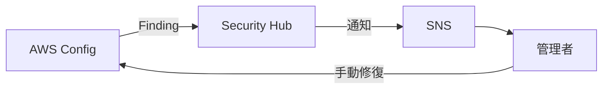
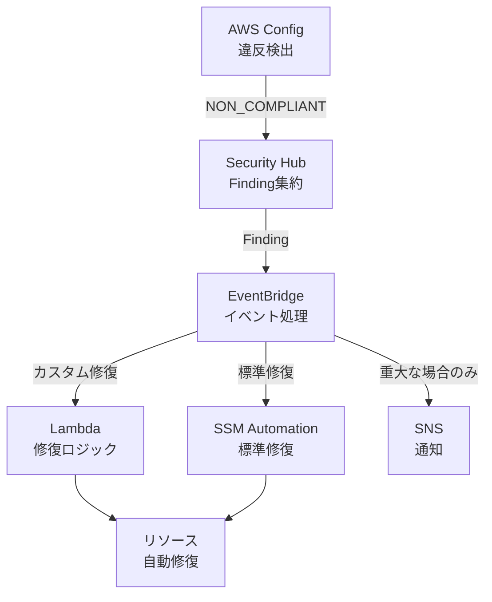
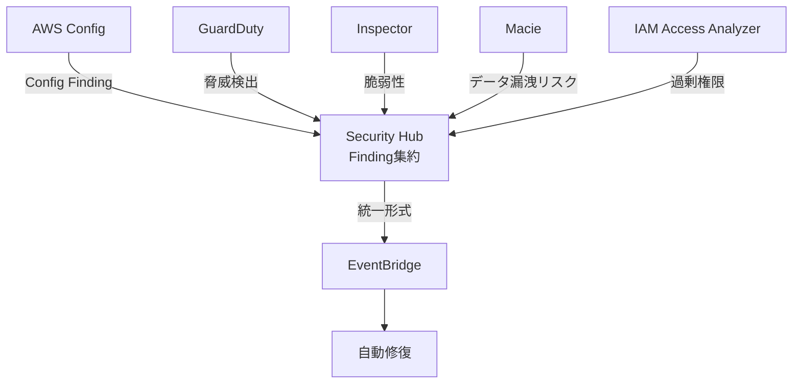
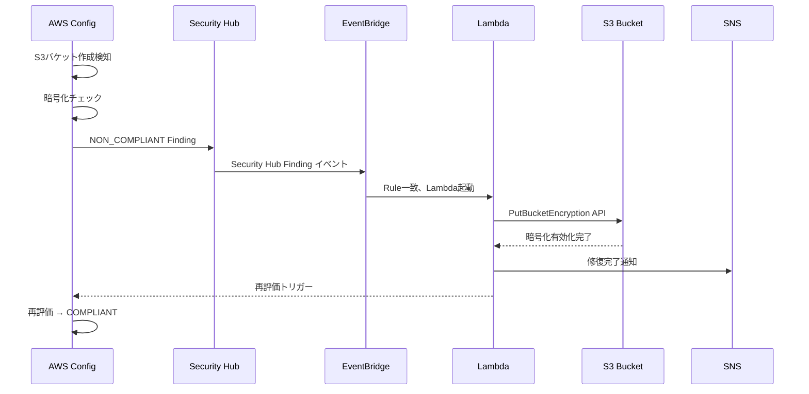
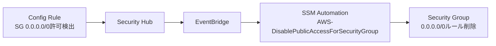
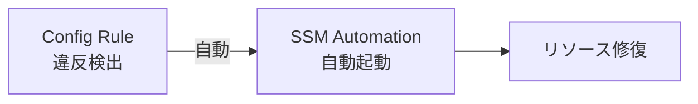
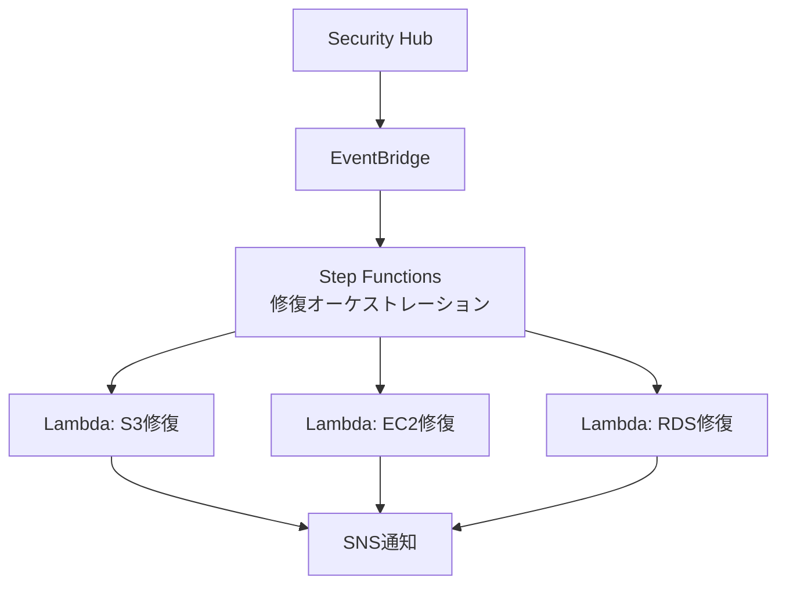

# Security Hub & Config 自動修復

作成日: 2026-01-06

## 概要

2024年以降のSAP試験では、Security HubとConfigによる**自動修復（Auto-remediation）**の設計が必須です。単に違反を検出するだけでなく、**EventBridge + Lambda**または**EventBridge + SSM Automation**を組み合わせて自動修復する統合設計が頻出します。

## 従来の検出のみ vs 自動修復

### 従来の検出のみ（2023年以前）



| 問題点 | 説明 |
|---|---|
| **手動作業** | 管理者が通知を見て、手動で修復する必要がある |
| **修復遅延** | 通知から修復まで数時間〜数日かかる |
| **スケールしない** | 大量の違反に対応できない |
| **ヒューマンエラー** | 修復ミスのリスク |

### 現在の自動修復（2024年以降推奨）



| メリット | 説明 |
|---|---|
| **自動化** | 検出から修復まで数秒〜数分で自動完了 |
| **スケール** | 数千のリソース違反に対応可能 |
| **一貫性** | 常に同じロジックで修復（ヒューマンエラーなし） |
| **監査証跡** | CloudTrail、CloudWatch Logsに自動記録 |

## Security Hub & Config の統合

### Security Hubの役割

Security Hubは、**複数のセキュリティサービスのFindingを集約**し、統一的な修復フローを実現します:



| サービス | 検出内容 | Security Hubでの処理 |
|---|---|---|
| **AWS Config** | 設定違反（S3暗号化なし等） | ASFF形式に変換、Severityを付与 |
| **GuardDuty** | 脅威検出（不正アクセス等） | 高Severity Finding として集約 |
| **Inspector** | 脆弱性（パッケージ脆弱性等） | CVSSスコアに基づきSeverity設定 |
| **Macie** | 機密データ検出 | データ分類に基づく処理 |
| **IAM Access Analyzer** | 過剰権限検出 | IAMポリシー修正の推奨 |

**ASFF (AWS Security Finding Format)**: Security HubでFindingを統一的に表現する標準フォーマット

### ConfigとSecurity Hubの使い分け

| 項目 | AWS Config | Security Hub |
|---|---|---|
| **検出範囲** | Config Rules配下のリソース | 複数セキュリティサービスのFinding |
| **修復トリガー** | Config Rule単位 | Finding単位（複数ソース） |
| **推奨ケース** | 単一サービスの修復 | 統合的なセキュリティ修復 |
| **EventBridgeイベント** | `aws.config` | `aws.securityhub` |

## 自動修復の実装パターン

### パターン1: EventBridge + Lambda（カスタム修復）

#### ユースケース: S3バケット暗号化なしを検出して自動修復



#### 実装手順

**1. Config Ruleの設定**

```yaml
ConfigRule:
  Name: s3-bucket-server-side-encryption-enabled
  Source:
    Owner: AWS
    SourceIdentifier: S3_BUCKET_SERVER_SIDE_ENCRYPTION_ENABLED
  Scope:
    ComplianceResourceTypes:
      - AWS::S3::Bucket
```

**2. Security Hub統合**

Security HubでConfig統合を有効化すると、Config RuleのFindingが自動的にSecurity Hubに送信されます。

**3. EventBridge Rule**

```json
{
  "source": ["aws.securityhub"],
  "detail-type": ["Security Hub Findings - Imported"],
  "detail": {
    "findings": {
      "ProductName": ["Config"],
      "Title": ["s3-bucket-server-side-encryption-enabled"],
      "Compliance": {
        "Status": ["FAILED"]
      }
    }
  }
}
```

**4. Lambda関数**

```python
import boto3
import json

s3 = boto3.client('s3')
sns = boto3.client('sns')
config = boto3.client('config')

def lambda_handler(event, context):
    # Extract bucket name from Security Hub Finding
    finding = event['detail']['findings'][0]
    bucket_name = finding['Resources'][0]['Id'].split(':')[-1]

    try:
        # Enable default encryption
        s3.put_bucket_encryption(
            Bucket=bucket_name,
            ServerSideEncryptionConfiguration={
                'Rules': [{
                    'ApplyServerSideEncryptionByDefault': {
                        'SSEAlgorithm': 'AES256'
                    },
                    'BucketKeyEnabled': True
                }]
            }
        )

        # Notify SNS
        sns.publish(
            TopicArn='arn:aws:sns:us-east-1:123456789012:security-remediation',
            Subject=f'Auto-remediation: S3 encryption enabled',
            Message=f'Bucket: {bucket_name}\nEncryption: AES256\nTimestamp: {context.invoked_function_arn}'
        )

        # Trigger Config re-evaluation
        config.start_config_rules_evaluation(
            ConfigRuleNames=['s3-bucket-server-side-encryption-enabled']
        )

        return {
            'statusCode': 200,
            'body': json.dumps(f'Encryption enabled for {bucket_name}')
        }

    except Exception as e:
        print(f'Error: {str(e)}')
        raise
```

**5. Lambda IAM Role**

```json
{
  "Version": "2012-10-17",
  "Statement": [
    {
      "Effect": "Allow",
      "Action": [
        "s3:PutEncryptionConfiguration",
        "s3:GetEncryptionConfiguration"
      ],
      "Resource": "arn:aws:s3:::*"
    },
    {
      "Effect": "Allow",
      "Action": [
        "sns:Publish"
      ],
      "Resource": "arn:aws:sns:us-east-1:123456789012:security-remediation"
    },
    {
      "Effect": "Allow",
      "Action": [
        "config:StartConfigRulesEvaluation"
      ],
      "Resource": "*"
    }
  ]
}
```

### パターン2: EventBridge + SSM Automation（標準修復）

#### ユースケース: パブリックEC2セキュリティグループを自動修正



#### 実装手順

**1. Config Rule**

```yaml
ConfigRule:
  Name: restricted-ssh
  Source:
    Owner: AWS
    SourceIdentifier: INCOMING_SSH_DISABLED
  Scope:
    ComplianceResourceTypes:
      - AWS::EC2::SecurityGroup
```

**2. EventBridge Rule**

```json
{
  "source": ["aws.securityhub"],
  "detail-type": ["Security Hub Findings - Imported"],
  "detail": {
    "findings": {
      "Title": ["restricted-ssh"],
      "Compliance": {
        "Status": ["FAILED"]
      }
    }
  }
}
```

**3. EventBridge Target: SSM Automation**

```yaml
Target:
  Arn: arn:aws:ssm:us-east-1:123456789012:automation-definition/AWS-DisablePublicAccessForSecurityGroup
  RoleArn: arn:aws:iam::123456789012:role/EventBridge-SSM-Role
  InputTransformer:
    InputPathsMap:
      resourceId: $.detail.findings[0].Resources[0].Id
    InputTemplate: |
      {
        "GroupId": ["<resourceId>"]
      }
```

**4. SSM Automation Document（AWS提供のプリセット）**

```yaml
# AWS-DisablePublicAccessForSecurityGroup
schemaVersion: '0.3'
description: Disable public access for Security Group
parameters:
  GroupId:
    type: String
    description: Security Group ID
mainSteps:
  - name: revokeIngressRules
    action: 'aws:executeScript'
    inputs:
      Runtime: python3.8
      Handler: revoke_public_ingress
      Script: |
        import boto3
        def revoke_public_ingress(events, context):
            ec2 = boto3.client('ec2')
            group_id = events['GroupId']
            # Revoke 0.0.0.0/0 ingress rules
            ec2.revoke_security_group_ingress(
                GroupId=group_id,
                IpPermissions=[{
                    'IpProtocol': 'tcp',
                    'FromPort': 22,
                    'ToPort': 22,
                    'IpRanges': [{'CidrIp': '0.0.0.0/0'}]
                }]
            )
```

### パターン3: Config直接修復（シンプル）

Config Ruleに**修復アクション**を直接設定する方法もあります:



**Config RuleでSSM Automationを直接指定**:

```yaml
ConfigRule:
  Name: s3-bucket-public-read-prohibited
  Source:
    Owner: AWS
    SourceIdentifier: S3_BUCKET_PUBLIC_READ_PROHIBITED
  Scope:
    ComplianceResourceTypes:
      - AWS::S3::Bucket
  RemediationConfiguration:
    TargetType: SSM_DOCUMENT
    TargetIdentifier: AWS-PublishSNSNotification
    Parameters:
      AutomationAssumeRole:
        StaticValue:
          Values:
            - arn:aws:iam::123456789012:role/ConfigRemediationRole
      TopicArn:
        StaticValue:
          Values:
            - arn:aws:sns:us-east-1:123456789012:config-remediation
      Message:
        StaticValue:
          Values:
            - S3 bucket has public read access
```

| パターン | メリット | デメリット |
|---|---|---|
| **Config直接修復** | シンプル、設定が容易 | Security Hub統合なし、単一Ruleのみ |
| **EventBridge + Lambda** | 柔軟、複雑なロジック可能 | コード開発が必要 |
| **EventBridge + SSM** | プリセット利用可能、コード不要 | 柔軟性は中程度 |

## Severity別の修復戦略

### Severity別フィルタリング

Security Hubでは、FindingにSeverity（重大度）が付与されます:

| Severity | 数値範囲 | ラベル | 推奨アクション |
|---|---|---|---|
| **CRITICAL** | 90-100 | CRITICAL | 即座に自動修復 + アラート |
| **HIGH** | 70-89 | HIGH | 自動修復 + 通知 |
| **MEDIUM** | 40-69 | MEDIUM | 自動修復（低優先度） |
| **LOW** | 1-39 | LOW | ログ記録のみ |
| **INFORMATIONAL** | 0 | INFORMATIONAL | 無視 |

### 実装例: Severity別のEventBridge Rule

**CRITICAL/HIGHのみ自動修復**:

```json
{
  "source": ["aws.securityhub"],
  "detail-type": ["Security Hub Findings - Imported"],
  "detail": {
    "findings": {
      "Severity": {
        "Label": ["CRITICAL", "HIGH"]
      },
      "Compliance": {
        "Status": ["FAILED"]
      }
    }
  }
}
```

**MEDIUMは通知のみ（自動修復なし）**:

```json
{
  "source": ["aws.securityhub"],
  "detail-type": ["Security Hub Findings - Imported"],
  "detail": {
    "findings": {
      "Severity": {
        "Label": ["MEDIUM"]
      }
    }
  }
}
```

## 複数リソースタイプの統合修復

### シナリオ: セキュリティベースラインの自動修復

複数のリソースタイプ（S3、EC2、RDS等）の違反を統一的に修復したい。



**Step Functions State Machine**:

```json
{
  "StartAt": "IdentifyResourceType",
  "States": {
    "IdentifyResourceType": {
      "Type": "Choice",
      "Choices": [
        {
          "Variable": "$.detail.findings[0].Resources[0].Type",
          "StringEquals": "AwsS3Bucket",
          "Next": "RemediateS3"
        },
        {
          "Variable": "$.detail.findings[0].Resources[0].Type",
          "StringEquals": "AwsEc2Instance",
          "Next": "RemediateEC2"
        },
        {
          "Variable": "$.detail.findings[0].Resources[0].Type",
          "StringEquals": "AwsRdsDbInstance",
          "Next": "RemediateRDS"
        }
      ],
      "Default": "NotifyUnsupportedType"
    },
    "RemediateS3": {
      "Type": "Task",
      "Resource": "arn:aws:lambda:us-east-1:123456789012:function:RemediateS3",
      "End": true
    },
    "RemediateEC2": {
      "Type": "Task",
      "Resource": "arn:aws:lambda:us-east-1:123456789012:function:RemediateEC2",
      "End": true
    },
    "RemediateRDS": {
      "Type": "Task",
      "Resource": "arn:aws:lambda:us-east-1:123456789012:function:RemediateRDS",
      "End": true
    },
    "NotifyUnsupportedType": {
      "Type": "Task",
      "Resource": "arn:aws:states:::sns:publish",
      "Parameters": {
        "TopicArn": "arn:aws:sns:us-east-1:123456789012:unsupported-remediation",
        "Message": "Unsupported resource type for auto-remediation"
      },
      "End": true
    }
  }
}
```

## モニタリングとトラブルシューティング

### CloudWatch Logsでの修復ログ

```python
import logging

logger = logging.getLogger()
logger.setLevel(logging.INFO)

def lambda_handler(event, context):
    logger.info(f'Remediation started: {json.dumps(event)}')

    bucket_name = extract_bucket_name(event)
    logger.info(f'Target bucket: {bucket_name}')

    try:
        enable_encryption(bucket_name)
        logger.info(f'Remediation successful: {bucket_name}')
    except Exception as e:
        logger.error(f'Remediation failed: {bucket_name}, Error: {str(e)}')
        raise
```

### CloudWatch Metrics

```python
import boto3

cloudwatch = boto3.client('cloudwatch')

def publish_metric(metric_name, value, unit='Count'):
    cloudwatch.put_metric_data(
        Namespace='SecurityRemediation',
        MetricData=[{
            'MetricName': metric_name,
            'Value': value,
            'Unit': unit
        }]
    )

# 使用例
publish_metric('RemediationSuccess', 1)
publish_metric('RemediationFailure', 1)
```

### CloudWatch Alarmで修復失敗を検知

```yaml
Alarm:
  AlarmName: RemediationFailureAlarm
  MetricName: RemediationFailure
  Namespace: SecurityRemediation
  Statistic: Sum
  Period: 300
  EvaluationPeriods: 1
  Threshold: 1
  ComparisonOperator: GreaterThanOrEqualToThreshold
  AlarmActions:
    - arn:aws:sns:us-east-1:123456789012:critical-alerts
```

## SAP試験の重要ポイント

### 自動修復の必須要素
- **検出**: AWS Config Rules、Security Hub Findings
- **トリガー**: EventBridge Rules（Severity、Compliance Statusでフィルタ）
- **修復**: Lambda（カスタム）またはSSM Automation（標準）
- **検証**: Config再評価、CloudWatch Logs/Metrics

### EventBridge + Lambda vs SSM Automation
- **Lambda**: 柔軟性高、複雑なロジック、コード開発必要
- **SSM Automation**: プリセット利用可能、標準的な修復、コード不要
- **推奨**: 標準的な修復はSSM、複雑な修復はLambda

### Security HubとConfigの統合
- **Security Hub**: 複数サービスのFinding集約、統一形式（ASFF）
- **Config**: リソース設定違反の検出、Config Rules
- **統合**: ConfigのFindingがSecurity Hubに自動送信、EventBridgeで統一的に修復

### Severity別修復戦略
- **CRITICAL/HIGH**: 即座に自動修復 + アラート
- **MEDIUM**: 自動修復（低優先度）
- **LOW/INFORMATIONAL**: ログ記録のみ

### よくある試験問題パターン
- 「S3バケット暗号化なしを検出して自動修復」→ Config + EventBridge + Lambda
- 「パブリックSGを自動修正」→ Config + EventBridge + SSM Automation
- 「複数リソースタイプを統一的に修復」→ Security Hub + EventBridge + Step Functions
- 「CRITICALのみ即座に修復、MEDIUMは通知のみ」→ EventBridge RuleでSeverityフィルタ
- 「修復失敗を検知してアラート」→ CloudWatch Logs/Metrics + Alarm

### 自動修復のベストプラクティス
- **段階的展開**: パイロットOU→全社展開
- **ドライラン**: 修復前に影響範囲を確認
- **ロールバック**: 修復失敗時のロールバック処理
- **監査証跡**: CloudTrail、CloudWatch Logsで記録
- **通知**: 重大な修復はSNS/Slackで通知
