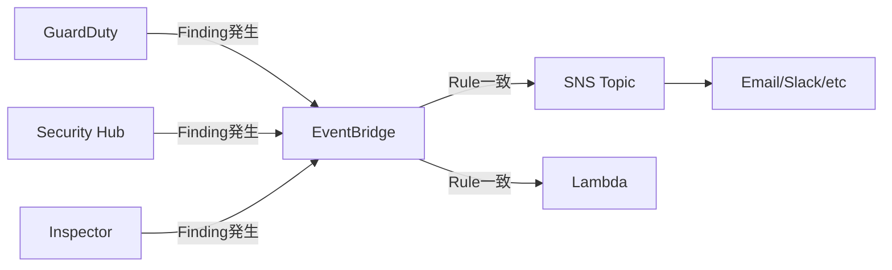
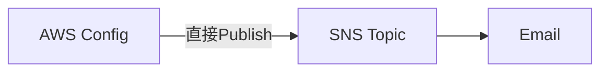
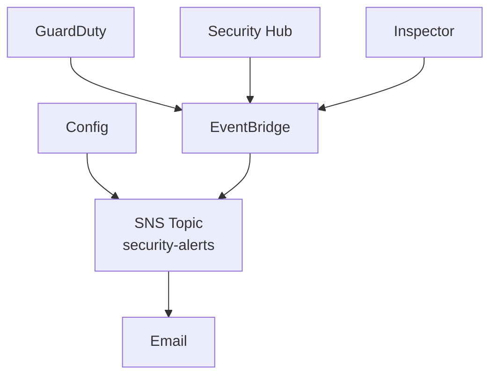
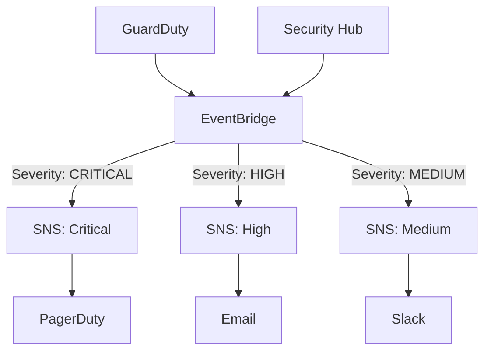
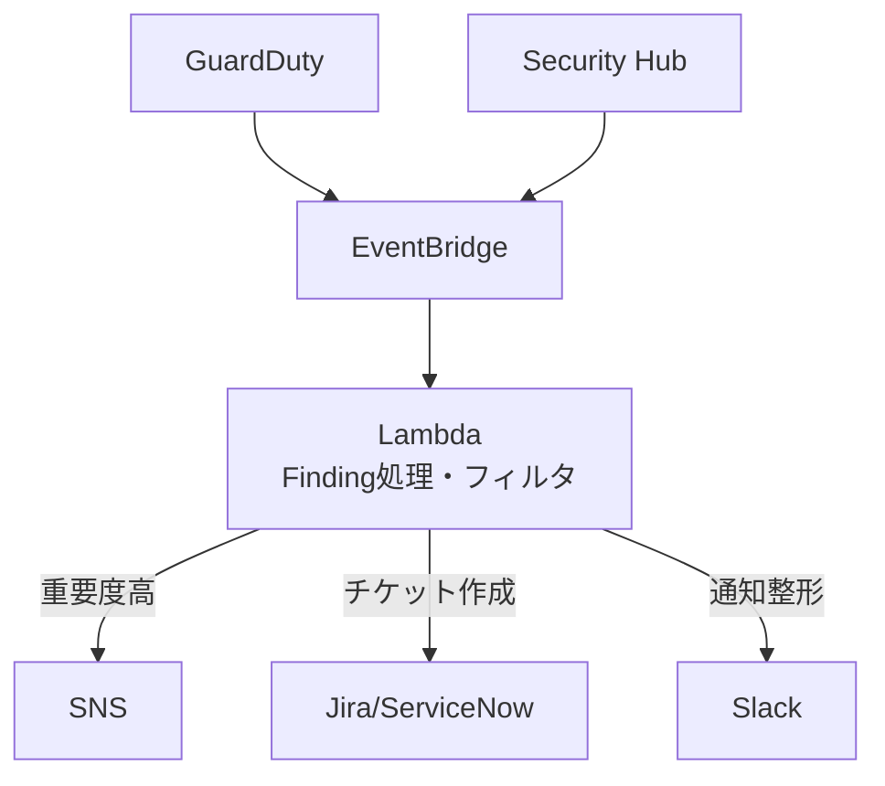

# AWSセキュリティサービスの通知機能

作成日: 2026-01-06

## 概要

AWSセキュリティサービス（Inspector、Security Hub、GuardDuty、Config等）の通知方法は、サービスによって異なります。**直接SNSに通知できるサービス**と、**EventBridge経由でのみ通知できるサービス**があり、SNSトピックポリシーの設定も異なります。

## 通知方法の比較

| サービス | 直接SNS | EventBridge | SNSポリシー Principal | 備考 |
|---|---|---|---|---|
| **GuardDuty** | × | ○必須 | `events.amazonaws.com` | EventBridge経由のみ |
| **Security Hub** | × | ○必須 | `events.amazonaws.com` | EventBridge経由のみ |
| **Inspector（v2）** | × | ○必須 | `events.amazonaws.com` | EventBridge経由のみ |
| **Config** | ○直接可 | ○可 | `config.amazonaws.com` | 両方対応、直接SNSが一般的 |
| **Macie** | × | ○必須 | `events.amazonaws.com` | EventBridge経由のみ |
| **CloudWatch Alarms** | ○直接可 | ○可 | `cloudwatch.amazonaws.com` | 両方対応 |
| **CloudTrail** | ○直接可 | ○可 | `cloudtrail.amazonaws.com` | 両方対応 |

## 通知アーキテクチャ

### パターン1: EventBridge経由（GuardDuty、Security Hub、Inspector）



**EventBridge Rule例**:

```json
{
  "source": ["aws.guardduty"],
  "detail-type": ["GuardDuty Finding"],
  "detail": {
    "severity": [7, 8, 9]
  }
}
```

**SNSトピックポリシー**:

```json
{
  "Version": "2012-10-17",
  "Statement": [{
    "Effect": "Allow",
    "Principal": {
      "Service": "events.amazonaws.com"
    },
    "Action": "SNS:Publish",
    "Resource": "arn:aws:sns:us-east-1:123456789012:security-alerts"
  }]
}
```

### パターン2: 直接SNS通知（Config）



**SNSトピックポリシー**:

```json
{
  "Version": "2012-10-17",
  "Statement": [{
    "Effect": "Allow",
    "Principal": {
      "Service": "config.amazonaws.com"
    },
    "Action": "SNS:Publish",
    "Resource": "arn:aws:sns:us-east-1:123456789012:config-alerts"
  }]
}
```

## サービス別詳細

### GuardDuty

| 項目 | 内容 |
|---|---|
| **通知方法** | EventBridge経由のみ |
| **イベントソース** | `aws.guardduty` |
| **イベントタイプ** | `GuardDuty Finding` |
| **フィルタリング** | EventBridge RuleでSeverity（0-9）、Finding Type等でフィルタ可能 |
| **リアルタイム性** | 検出後15分以内（通常数分） |

#### EventBridge Rule設定例

**高Severity（7-9）のFindingのみ通知**:

```json
{
  "source": ["aws.guardduty"],
  "detail-type": ["GuardDuty Finding"],
  "detail": {
    "severity": [
      {"numeric": [">=", 7]}
    ]
  }
}
```

**特定のFinding Typeのみ**:

```json
{
  "source": ["aws.guardduty"],
  "detail-type": ["GuardDuty Finding"],
  "detail": {
    "type": ["UnauthorizedAccess:EC2/SSHBruteForce"]
  }
}
```

### Security Hub

| 項目 | 内容 |
|---|---|
| **通知方法** | EventBridge経由のみ |
| **イベントソース** | `aws.securityhub` |
| **イベントタイプ** | `Security Hub Findings - Imported`, `Security Hub Insight Results` |
| **フィルタリング** | EventBridge RuleでSeverity、Compliance Status、Workflow Status等でフィルタ |
| **集約** | 複数サービスのFindingを集約して通知可能 |

#### EventBridge Rule設定例

**CRITICALまたはHIGHのFindingのみ**:

```json
{
  "source": ["aws.securityhub"],
  "detail-type": ["Security Hub Findings - Imported"],
  "detail": {
    "findings": {
      "Severity": {
        "Label": ["CRITICAL", "HIGH"]
      }
    }
  }
}
```

**特定のコンプライアンス違反**:

```json
{
  "source": ["aws.securityhub"],
  "detail-type": ["Security Hub Findings - Imported"],
  "detail": {
    "findings": {
      "Compliance": {
        "Status": ["FAILED"]
      },
      "ProductFields": {
        "StandardsGuideArn": [{"prefix": "arn:aws:securityhub:::ruleset/cis-aws-foundations-benchmark"}]
      }
    }
  }
}
```

### Inspector（v2）

| 項目 | 内容 |
|---|---|
| **通知方法** | EventBridge経由のみ |
| **イベントソース** | `aws.inspector2` |
| **イベントタイプ** | `Inspector2 Finding` |
| **スキャン対象** | EC2、ECR、Lambda |
| **フィルタリング** | EventBridge RuleでSeverity、Finding Type（パッケージ脆弱性、ネットワーク到達性）でフィルタ |

#### EventBridge Rule設定例

**CRITICALまたはHIGHの脆弱性**:

```json
{
  "source": ["aws.inspector2"],
  "detail-type": ["Inspector2 Finding"],
  "detail": {
    "severity": ["CRITICAL", "HIGH"]
  }
}
```

### AWS Config

| 項目 | 内容 |
|---|---|
| **通知方法** | 直接SNS、EventBridge両方対応 |
| **直接SNS** | Config設定時にSNSトピックを指定 |
| **EventBridge** | `aws.config`イベントソースで通知可能 |
| **通知内容** | 設定変更、コンプライアンス違反 |
| **推奨** | 直接SNS通知が一般的（シンプル） |

#### 直接SNS設定

Config Recorderの設定でSNSトピックを指定:

```bash
aws configservice put-delivery-channel \
  --delivery-channel name=default,s3BucketName=config-bucket,snsTopicARN=arn:aws:sns:us-east-1:123456789012:config-alerts
```

#### EventBridge経由

```json
{
  "source": ["aws.config"],
  "detail-type": ["Config Rules Compliance Change"],
  "detail": {
    "newEvaluationResult": {
      "complianceType": ["NON_COMPLIANT"]
    }
  }
}
```

### Macie

| 項目 | 内容 |
|---|---|
| **通知方法** | EventBridge経由のみ |
| **イベントソース** | `aws.macie` |
| **イベントタイプ** | `Macie Finding` |
| **検出内容** | S3バケットの機密データ、ポリシー違反 |

## SNSトピックポリシーの設定

### EventBridge経由の場合

**重要**: EventBridge経由でSNSに通知する場合、PrincipalはEventBridge（`events.amazonaws.com`）を指定する必要があります。

```json
{
  "Version": "2012-10-17",
  "Statement": [{
    "Sid": "AllowEventBridgePublish",
    "Effect": "Allow",
    "Principal": {
      "Service": "events.amazonaws.com"
    },
    "Action": "SNS:Publish",
    "Resource": "arn:aws:sns:us-east-1:123456789012:security-alerts",
    "Condition": {
      "StringEquals": {
        "aws:SourceAccount": "123456789012"
      }
    }
  }]
}
```

### 直接SNS通知の場合（Config）

```json
{
  "Version": "2012-10-17",
  "Statement": [{
    "Sid": "AllowConfigPublish",
    "Effect": "Allow",
    "Principal": {
      "Service": "config.amazonaws.com"
    },
    "Action": "SNS:Publish",
    "Resource": "arn:aws:sns:us-east-1:123456789012:config-alerts"
  }]
}
```

### 複数サービス対応（EventBridge + Config）

```json
{
  "Version": "2012-10-17",
  "Statement": [
    {
      "Sid": "AllowEventBridgePublish",
      "Effect": "Allow",
      "Principal": {
        "Service": "events.amazonaws.com"
      },
      "Action": "SNS:Publish",
      "Resource": "arn:aws:sns:us-east-1:123456789012:all-alerts"
    },
    {
      "Sid": "AllowConfigPublish",
      "Effect": "Allow",
      "Principal": {
        "Service": "config.amazonaws.com"
      },
      "Action": "SNS:Publish",
      "Resource": "arn:aws:sns:us-east-1:123456789012:all-alerts"
    }
  ]
}
```

## 通知フローの設計パターン

### パターン1: 単一SNSトピック（シンプル）



| メリット | デメリット |
|---|---|
| シンプルな構成 | Severityでフィルタしづらい |
| 1つのSNSサブスクリプションで管理 | 大量の通知が来る可能性 |

### パターン2: Severity別SNSトピック（推奨）



| メリット | デメリット |
|---|---|
| Severityごとに通知先を変更可能 | EventBridge Ruleが複数必要 |
| CRITICALは即座にPagerDuty等に通知 | SNSトピックが複数 |
| ノイズ削減 | - |

### パターン3: Lambda処理後に通知（高度）



| メリット | デメリット |
|---|---|
| 柔軟なフィルタリング・加工 | Lambda開発・運用コスト |
| 複数の通知先に異なる形式で送信 | 遅延が発生する可能性 |
| チケット自動作成等の連携 | - |

## よくある設定ミス

| 問題 | 原因 | 解決方法 |
|---|---|---|
| **GuardDutyの通知が届かない** | SNSポリシーのPrincipalが`guardduty.amazonaws.com` | `events.amazonaws.com`に変更（EventBridge経由のため） |
| **Security Hubの通知が届かない** | 直接SNS通知を試みている | EventBridge経由に変更 |
| **Config以外の通知が届かない** | SNSポリシーが`config.amazonaws.com`のみ | `events.amazonaws.com`を追加 |
| **EventBridge Ruleが発火しない** | イベントパターンのフィルタが厳しすぎる | `detail`セクションを確認、AWSドキュメント参照 |
| **大量の通知が来る** | Severityフィルタなし | EventBridge RuleでSeverity ≥ 7等でフィルタ |

## SAP試験の重要ポイント

### 通知方法の違い
- **GuardDuty、Security Hub、Inspector**: EventBridge経由のみ（直接SNS不可）
- **Config**: 直接SNS、EventBridge両方可能（直接SNSが一般的）
- **CloudTrail、CloudWatch Alarms**: 両方可能

### SNSトピックポリシー
- **EventBridge経由**: `"Service": "events.amazonaws.com"`
- **Config直接**: `"Service": "config.amazonaws.com"`
- **GuardDutyから直接SNS**: 不可（EventBridge必須）

### EventBridge Rule
- **イベントソース**: `aws.guardduty`, `aws.securityhub`, `aws.inspector2`, `aws.config`
- **フィルタリング**: Severity、Finding Type、Compliance Status等でフィルタ可能
- **複数ターゲット**: 1つのRuleから複数のSNS、Lambda、SQS等に送信可能

### ベストプラクティス
- **Severity別通知**: CRITICAL/HIGHは即座に通知、MEDIUM以下はSlack等
- **Security Hub集約**: 複数サービスのFindingをSecurity Hubで集約してから通知
- **EventBridge Rule最適化**: 不要な通知を減らすため、適切なフィルタリング
- **SNSポリシー最小権限**: `aws:SourceAccount`条件で特定アカウントのみ許可

### よくある試験問題パターン
- 「GuardDutyのFindingをSNSで通知したい」→ EventBridge経由が必須
- 「SNSポリシーを設定したが通知が届かない」→ Principalが間違っている（`events.amazonaws.com`が必要）
- 「ConfigとGuardDutyを同一SNSに通知」→ SNSポリシーに両方のPrincipal（`config.amazonaws.com`と`events.amazonaws.com`）が必要
- 「CRITICALのみ通知したい」→ EventBridge RuleでSeverityフィルタ
