# AWS RTO（復旧時間）まとめ

作成日: 2026-01-07

## 概要

RTO（Recovery Time Objective：目標復旧時間）は、障害発生から復旧までの許容時間です。AWS SAP試験では、**各サービスの復旧時間の違い**を理解し、ビジネス要件に応じた適切な復旧戦略を選択することが求められます。

## RDS（Relational Database Service）

### RDSリードレプリカの昇格

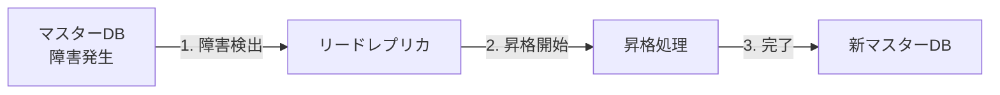

| 項目 | 内容 |
|---|---|
| **復旧時間（RTO）** | **数分（通常2-5分）** |
| **データロス（RPO）** | ほぼゼロ（レプリケーション遅延分のみ、通常数秒） |
| **手動/自動** | **手動操作が必要**（AWS CLIまたはコンソールで昇格） |
| **エンドポイント変更** | 必要（アプリケーション側でエンドポイント変更） |
| **用途** | 可用性向上、DR（Disaster Recovery） |

**昇格コマンド**:

```bash
aws rds promote-read-replica \
  --db-instance-identifier myreadreplica
```

**重要ポイント**:
- リードレプリカは昇格後、**独立したRDSインスタンス**になる
- 昇格中は**書き込み不可**（数分間のダウンタイム発生）
- Multi-AZと異なり**自動フェイルオーバーなし**、手動操作が必要

### RDS Multi-AZフェイルオーバー

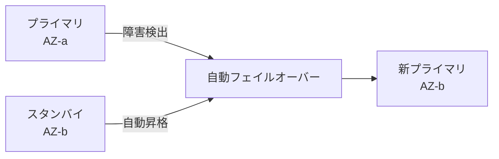

| 項目 | 内容 |
|---|---|
| **復旧時間（RTO）** | **1-2分（自動）** |
| **データロス（RPO）** | ゼロ（同期レプリケーション） |
| **手動/自動** | **完全自動**（RDSが自動検出・フェイルオーバー） |
| **エンドポイント変更** | 不要（DNSが自動的にスタンバイを向く） |
| **用途** | 高可用性（HA）、計画メンテナンス |

**重要ポイント**:
- フェイルオーバー中、エンドポイントは変わらないが**一時的に接続不可**（1-2分）
- **同期レプリケーション**のためデータロスなし
- リードレプリカと異なり**スタンバイは読み取り不可**

### RDSスナップショットからの復元

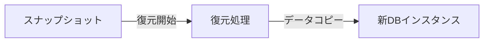

| 項目 | 内容 |
|---|---|
| **復旧時間（RTO）** | **数十分〜数時間**（データサイズ依存） |
| **データロス（RPO）** | スナップショット取得時点までのデータは保持、以降は消失 |
| **手動/自動** | 手動（復元操作が必要） |
| **エンドポイント変更** | 必要（新しいDBインスタンスが作成される） |
| **用途** | バックアップからの復元、災害復旧 |

**復元時間の目安**:

| データサイズ | 復元時間 |
|---|---|
| 10GB | 10-15分 |
| 100GB | 30-60分 |
| 1TB | 数時間 |

**重要ポイント**:
- 新しいDBインスタンスが作成されるため、**元のインスタンスは残る**
- パラメータグループ、セキュリティグループ等は手動で再設定が必要
- 自動バックアップは**最大35日間保持**可能

### RDSポイントインタイムリカバリ（PITR）

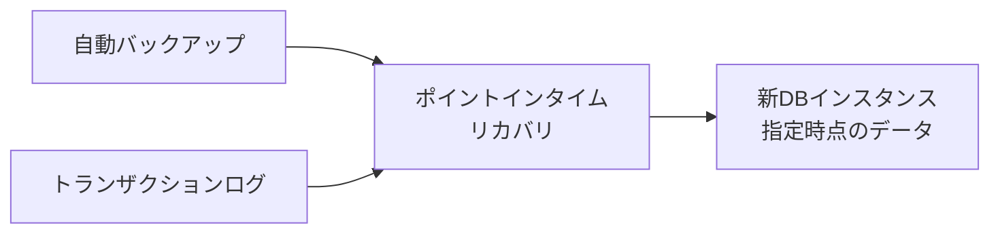

| 項目 | 内容 |
|---|---|
| **復旧時間（RTO）** | **数十分〜数時間**（データサイズ依存） |
| **データロス（RPO）** | **最大5分**（トランザクションログバックアップ間隔） |
| **復元可能時間** | 最大35日前までの**任意の秒単位**の時点 |
| **手動/自動** | 手動（復元操作が必要） |
| **用途** | 誤操作からの復旧、特定時点へのロールバック |

**復元コマンド**:

```bash
aws rds restore-db-instance-to-point-in-time \
  --source-db-instance-identifier mydb \
  --target-db-instance-identifier mydb-restored \
  --restore-time 2026-01-07T10:30:00Z
```

**重要ポイント**:
- スナップショットと異なり、**秒単位で復元時点を指定可能**
- トランザクションログを使用するため、**RPOは最大5分**
- 自動バックアップが有効（デフォルト）の場合のみ使用可能

## Amazon Aurora

### Auroraリードレプリカの昇格

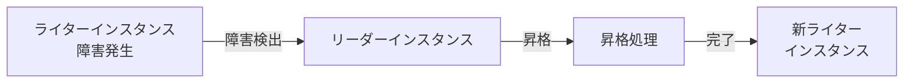

| 項目 | 内容 |
|---|---|
| **復旧時間（RTO）** | **30秒以内（自動）** |
| **データロス（RPO）** | ゼロ（共有ストレージ） |
| **手動/自動** | **完全自動**（同一クラスタ内のリーダーが自動昇格） |
| **エンドポイント変更** | 不要（クラスターエンドポイントが自動的に新ライターを向く） |
| **用途** | 高可用性（HA）、自動フェイルオーバー |

**重要ポイント**:
- RDSリードレプリカと異なり**自動フェイルオーバー**（Aurora独自機能）
- **共有ストレージアーキテクチャ**のためデータロスなし
- 複数リーダーがある場合、**優先度（Tier）に基づいて昇格**

### Aurora Multi-Masterフェイルオーバー

| 項目 | 内容 |
|---|---|
| **復旧時間（RTO）** | **ほぼゼロ（数秒）** |
| **データロス（RPO）** | ゼロ |
| **手動/自動** | 完全自動（アプリケーションが自動で別のマスターに接続） |
| **用途** | 書き込み可用性最大化、複数リージョンでの書き込み |

**重要ポイント**:
- すべてのインスタンスが**書き込み可能**
- 1つのマスター障害でも、他のマスターが継続して書き込み処理

### Auroraスナップショットからの復元

| 項目 | 内容 |
|---|---|
| **復旧時間（RTO）** | **数分〜数十分**（RDSより高速） |
| **データロス（RPO）** | スナップショット取得時点まで |
| **用途** | バックアップからの復元、クローン作成 |

**重要ポイント**:
- Auroraは**共有ストレージ**のため、RDSより復元が高速
- データベースクローン機能を使えば**数分で複製可能**

### Auroraポイントインタイムリカバリ（PITR）

| 項目 | 内容 |
|---|---|
| **復旧時間（RTO）** | **数分〜数十分**（RDSより高速） |
| **データロス（RPO）** | **最大5分** |
| **復元可能時間** | 最大35日前までの任意の秒単位の時点 |
| **用途** | 誤操作からの復旧 |

### Auroraバックトラック（MySQL互換のみ）

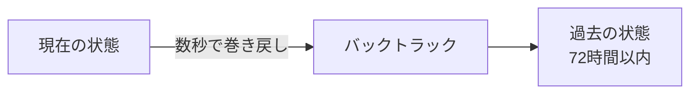

| 項目 | 内容 |
|---|---|
| **復旧時間（RTO）** | **数秒**（最速） |
| **データロス（RPO）** | バックトラック先の時点まで |
| **復元可能時間** | 最大72時間前まで |
| **新インスタンス作成** | 不要（同じクラスタをその場で巻き戻し） |
| **用途** | 誤操作の即座のロールバック |

**重要ポイント**:
- **新しいクラスタを作成せず**、既存クラスタをその場で巻き戻す
- **非常に高速**（数秒）、RTO最小化に最適
- Aurora MySQL互換のみ（PostgreSQL非対応）

### Aurora Global Database（クロスリージョンDR）

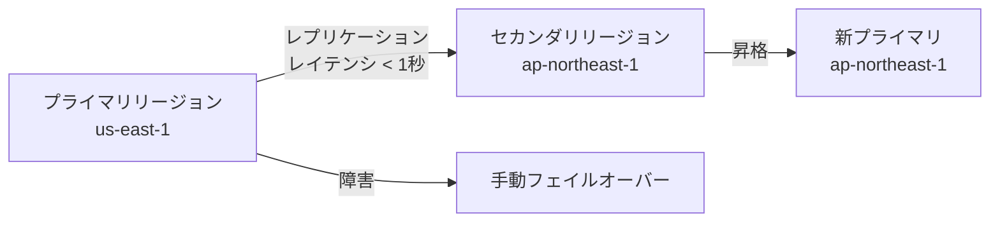

| 項目 | 内容 |
|---|---|
| **復旧時間（RTO）** | **1分未満**（手動昇格） |
| **データロス（RPO）** | **1秒未満**（レプリケーション遅延） |
| **手動/自動** | 手動（セカンダリリージョンへの昇格操作が必要） |
| **レプリケーション遅延** | 通常1秒未満 |
| **用途** | クロスリージョンDR、グローバル分散 |

**重要ポイント**:
- 専用のレプリケーション基盤により**低レイテンシ**（通常1秒未満）
- セカンダリリージョンは**読み取り可能**（最大16リーダー）
- 昇格後、元のプライマリが復旧しても**自動的に元に戻らない**（手動で戻す必要あり）

## DynamoDB

### DynamoDBポイントインタイムリカバリ（PITR）

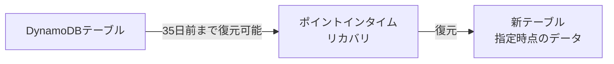

| 項目 | 内容 |
|---|---|
| **復旧時間（RTO）** | **数分〜数十分**（テーブルサイズ依存） |
| **データロス（RPO）** | **最大5分** |
| **復元可能時間** | 最大35日前までの任意の秒単位の時点 |
| **手動/自動** | 手動（復元操作が必要） |
| **新テーブル作成** | 必要（新しいテーブル名で作成） |

**復元時間の目安**:

| テーブルサイズ | 復元時間 |
|---|---|
| 1GB | 5-10分 |
| 10GB | 10-20分 |
| 100GB | 30-60分 |

**重要ポイント**:
- PITR有効化が必要（デフォルトは無効）
- 新しいテーブル名で復元されるため、**アプリケーション側の変更が必要**
- グローバルセカンダリインデックス（GSI）も一緒に復元される

### DynamoDBオンデマンドバックアップからの復元

| 項目 | 内容 |
|---|---|
| **復旧時間（RTO）** | **数分〜数十分**（テーブルサイズ依存） |
| **データロス（RPO）** | バックアップ取得時点まで |
| **手動/自動** | 手動（バックアップ取得・復元操作が必要） |
| **新テーブル作成** | 必要 |

### DynamoDB Global Tablesフェイルオーバー

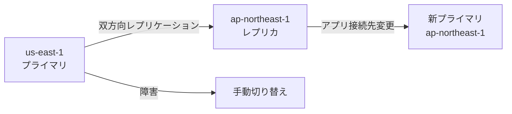

| 項目 | 内容 |
|---|---|
| **復旧時間（RTO）** | **数秒〜数分**（アプリケーション切り替え時間） |
| **データロス（RPO）** | **数秒**（レプリケーション遅延） |
| **手動/自動** | 手動（アプリケーション側で接続先リージョンを変更） |
| **レプリケーション遅延** | 通常1秒未満 |
| **用途** | マルチリージョンDR、グローバル分散 |

**重要ポイント**:
- すべてのリージョンが**書き込み可能**（マルチマスター）
- 障害時、**アプリケーション側で接続先リージョンを変更**するだけ
- 競合解決は**Last Writer Wins**（最後の書き込みが優先）

## Amazon S3

### S3バージョニングからの復元

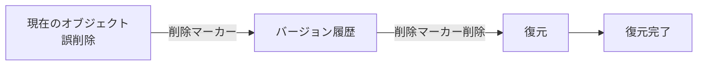

| 項目 | 内容 |
|---|---|
| **復旧時間（RTO）** | **数秒〜数分**（即座に復元可能） |
| **データロス（RPO）** | ゼロ（すべてのバージョンが保持される） |
| **手動/自動** | 手動（削除マーカーを削除、または特定バージョンをコピー） |
| **用途** | 誤削除からの復旧、バージョン管理 |

**重要ポイント**:
- バージョニング有効時、削除は**削除マーカー**の追加（実際の削除ではない）
- 削除マーカーを削除すれば**即座に復元**
- すべてのバージョンが保持されるため**ストレージコスト増加**に注意

### S3クロスリージョンレプリケーション（CRR）

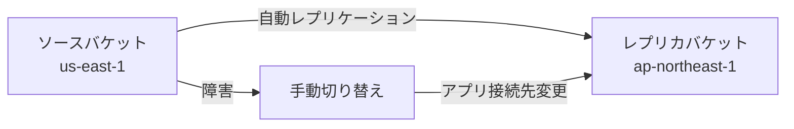

| 項目 | 内容 |
|---|---|
| **復旧時間（RTO）** | **数秒〜数分**（アプリケーション切り替え時間） |
| **データロス（RPO）** | 数秒〜数分（レプリケーション遅延、通常15分以内に99.99%のオブジェクトがレプリケート） |
| **手動/自動** | レプリケーションは自動、切り替えは手動 |
| **用途** | マルチリージョンDR、コンプライアンス |

## EBS（Elastic Block Store）

### EBSスナップショットからの復元

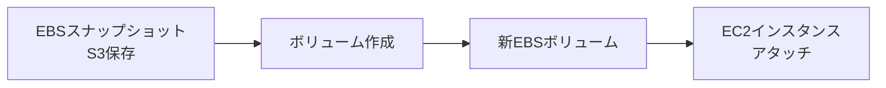

| 項目 | 内容 |
|---|---|
| **復旧時間（RTO）** | **数分〜数十分**（ボリュームサイズ依存） |
| **データロス（RPO）** | スナップショット取得時点まで |
| **手動/自動** | 手動（スナップショット取得・復元操作が必要） |
| **Fast Snapshot Restore（FSR）** | 有効化すると**即座に利用可能**（追加料金） |

**復元時間の目安**:

| ボリュームサイズ | 通常復元時間 | FSR有効時 |
|---|---|---|
| 100GB | 10-20分 | 数秒（即座） |
| 1TB | 数時間（初回アクセス時に遅延） | 数秒（即座） |

**重要ポイント**:
- 通常、復元されたボリュームは**初回アクセス時に遅延**が発生（Lazy Loading）
- **Fast Snapshot Restore（FSR）**を有効化すると即座に利用可能（追加料金）
- スナップショットは**増分バックアップ**（初回以降は変更分のみ）

## EC2インスタンスリカバリ

### EC2自動復旧（Auto Recovery）

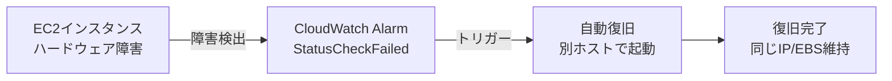

| 項目 | 内容 |
|---|---|
| **復旧時間（RTO）** | **数分**（インスタンス再起動時間） |
| **データロス（RPO）** | ゼロ（EBSデータは保持） |
| **手動/自動** | 完全自動（CloudWatch Alarmで設定） |
| **保持される項目** | インスタンスID、プライベートIP、Elastic IP、EBS |
| **用途** | ハードウェア障害からの自動復旧 |

**重要ポイント**:
- **ハードウェア障害のみ**対応（OS障害、アプリ障害は非対応）
- インスタンスストア（Ephemeral Storage）は**消失**
- EBS最適化インスタンス、VPC内インスタンスのみ対応

### EC2 AMIからの復元

| 項目 | 内容 |
|---|---|
| **復旧時間（RTO）** | **数分〜数十分**（AMIサイズ、起動時間依存） |
| **データロス（RPO）** | AMI取得時点まで |
| **手動/自動** | 手動（AMI作成・インスタンス起動が必要） |
| **用途** | インスタンス全体のバックアップ・復元 |

## RTO/RPO比較表

### RDS vs Aurora

| 復旧方法 | サービス | RTO | RPO | 自動/手動 |
|---|---|---|---|---|
| **Multi-AZフェイルオーバー** | RDS | 1-2分 | ゼロ | 自動 |
| **リードレプリカ昇格** | RDS | 2-5分 | 数秒 | 手動 |
| **スナップショット復元** | RDS | 数十分〜数時間 | スナップショット時点 | 手動 |
| **PITR** | RDS | 数十分〜数時間 | 最大5分 | 手動 |
| **リーダー自動昇格** | Aurora | **30秒以内** | ゼロ | 自動 |
| **Multi-Master** | Aurora | **数秒** | ゼロ | 自動 |
| **バックトラック** | Aurora | **数秒** | バックトラック先時点 | 手動 |
| **Global Database** | Aurora | 1分未満 | 1秒未満 | 手動 |

### DynamoDB vs S3

| 復旧方法 | サービス | RTO | RPO | 自動/手動 |
|---|---|---|---|---|
| **PITR** | DynamoDB | 数分〜数十分 | 最大5分 | 手動 |
| **Global Tables** | DynamoDB | 数秒〜数分 | 数秒 | 手動 |
| **バージョニング復元** | S3 | 数秒〜数分 | ゼロ | 手動 |
| **CRR** | S3 | 数秒〜数分 | 数秒〜数分 | 手動 |

### EBS vs EC2

| 復旧方法 | サービス | RTO | RPO | 自動/手動 |
|---|---|---|---|---|
| **スナップショット復元** | EBS | 数分〜数十分 | スナップショット時点 | 手動 |
| **FSR有効化** | EBS | 数秒 | スナップショット時点 | 手動 |
| **Auto Recovery** | EC2 | 数分 | ゼロ | 自動 |
| **AMI復元** | EC2 | 数分〜数十分 | AMI取得時点 | 手動 |

## ベストプラクティス

### RTO最小化（高可用性重視）

| 要件 | 推奨サービス・構成 | RTO |
|---|---|---|
| **データベース（同一リージョン）** | Aurora（リーダー自動昇格） | 30秒以内 |
| **データベース（クロスリージョン）** | Aurora Global Database | 1分未満 |
| **NoSQL（マルチリージョン）** | DynamoDB Global Tables | 数秒〜数分 |
| **オブジェクトストレージ** | S3（CRR + アプリ切り替え） | 数秒〜数分 |
| **EC2** | Auto Scaling + Multi-AZ | 数分 |

### RPO最小化（データロス最小化）

| 要件 | 推奨サービス・構成 | RPO |
|---|---|---|
| **データベース** | Aurora Multi-AZ（同期レプリケーション） | ゼロ |
| **データベース（クロスリージョン）** | Aurora Global Database | 1秒未満 |
| **NoSQL** | DynamoDB Global Tables | 数秒 |
| **オブジェクトストレージ** | S3（バージョニング有効） | ゼロ |
| **ブロックストレージ** | EBS（頻繁なスナップショット + FSR） | スナップショット間隔 |

### コスト最適化（DR目的）

| 要件 | 推奨サービス・構成 | トレードオフ |
|---|---|---|
| **データベース** | RDS（日次スナップショット + PITR） | RTO: 数時間、RPO: 最大5分 |
| **NoSQL** | DynamoDB（日次オンデマンドバックアップ） | RTO: 数十分、RPO: 日次 |
| **オブジェクトストレージ** | S3（バージョニング + ライフサイクル） | ストレージコスト増加 |
| **ブロックストレージ** | EBS（スナップショットスケジュール、FSRなし） | RTO: 数十分、初回アクセス遅延 |

## SAP試験の重要ポイント

### RTO比較（試験頻出）
- **最速（数秒）**: Aurora Multi-Master、Aurora バックトラック、DynamoDB Global Tables（アプリ切り替え）
- **高速（30秒〜1分）**: Aurora リーダー自動昇格、RDS Multi-AZ、Aurora Global Database
- **中速（数分）**: RDS リードレプリカ昇格、EC2 Auto Recovery、EBS FSR
- **低速（数十分〜数時間）**: RDS/Aurora スナップショット復元、PITR

### RPO比較（試験頻出）
- **ゼロ**: RDS/Aurora Multi-AZ（同期レプリケーション）、Aurora Multi-Master、S3バージョニング
- **1秒未満**: Aurora Global Database
- **数秒**: DynamoDB Global Tables、RDS リードレプリカ（レプリケーション遅延）
- **最大5分**: RDS/Aurora/DynamoDB PITR（トランザクションログバックアップ間隔）
- **日次〜週次**: スナップショット/オンデマンドバックアップ

### 自動 vs 手動（試験頻出）
- **完全自動フェイルオーバー**: RDS Multi-AZ、Aurora リーダー自動昇格、Aurora Multi-Master、EC2 Auto Recovery
- **手動操作が必要**: RDS リードレプリカ昇格、Aurora Global Database昇格、DynamoDB Global Tables切り替え、スナップショット復元、PITR

### よくある試験問題パターン
- 「RTO 1分以内、RPOゼロが必要」→ Aurora（リーダー自動昇格）、RDS Multi-AZ
- 「クロスリージョンDR、RTO 1分以内」→ Aurora Global Database
- 「誤操作から数秒で復旧」→ Aurora バックトラック（MySQL互換のみ）、S3バージョニング
- 「RDSリードレプリカ昇格のRTOは？」→ 数分（試験では「30秒以内」は誤り、Auroraリーダー自動昇格と混同しないこと）
- 「Multi-AZフェイルオーバー中、エンドポイント変更が必要か？」→ 不要（DNSが自動更新）
- 「リードレプリカ昇格は自動か？」→ 手動（RDS）、自動（Aurora）
- 「DynamoDB PITRのRPOは？」→ 最大5分
- 「EBS復元を最速にするには？」→ Fast Snapshot Restore（FSR）有効化
- 「Aurora Global Databaseのレプリケーション遅延は？」→ 通常1秒未満
- 「RDS PITR復元時、元のインスタンスは削除されるか？」→ されない（新しいインスタンスが作成される）

### エンドポイント変更の有無（試験頻出）

| 復旧方法 | エンドポイント変更 | 理由 |
|---|---|---|
| **RDS Multi-AZ** | 不要 | DNSが自動でスタンバイを向く |
| **RDS リードレプリカ昇格** | 必要 | 新しい独立したインスタンスになる |
| **Aurora リーダー自動昇格** | 不要 | クラスターエンドポイントが新ライターを向く |
| **スナップショット/PITR復元** | 必要 | 新しいインスタンス/テーブルが作成される |

### データ共有ストレージ（試験頻出）
- **Aurora**: ライター・リーダーが**同一ストレージを共有**、昇格時にデータコピー不要、RTO最小化
- **RDS**: プライマリ・スタンバイは**別々のストレージ**、同期レプリケーションでデータ一致を保証
